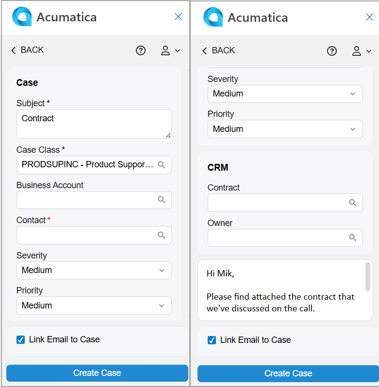

# Acumatica Add-In for Outlook: Case Management {#_80325631-a9f8-4f0c-b369-07aae9c9c311 .concept}

Customer requests often arrive by email. Through the Acumatica add-in for Outlook, you can start working on them right away by creating cases based on these emails or by linking these emails to existing cases or other related records.

**Tip:** If the add-in isn’t already open, click the Acumatica button on the toolbar to open the add-in panel.

When you open an email with the Acumatica add-in running, it tries to find related cases on the [Cases](CR_30_60_00.md) \(CR306000\) form. That is, it searches for cases whose contact or business account contains an email address matching the one selected in the filter box on the Related Records form of the Acumatica add-in.

If matching cases are found, they appear in the **Cases** section of the Related Records form. You can:

-   Link the email to a related case to keep all related emails together in one place. For details, see [Acumatica Add-In for Outlook: Email Activity Management](OU_AddIn_Email_Activity_Management.md).
-   Review the case by clicking its name, which is a link. The record opens on the [Cases](CR_30_60_00.md) form of your Acumatica ERP instance in a new browser tab.
-   Quickly create a related case and link it to the email, as described in the next section.

## Case Creation { .section}

If no related cases have been found in Acumatica ERP, you can create a case with the email address selected in the Filter box of the Related Records form. Click **Add Case** in the **Cases** section—either directly or through the More menu.

The Case form opens \(see below\), and the following boxes may be filled in automatically:

-   **Subject**: The email subject
-   **Business Account**: The name of the existing business account that has the same email address as the address specified in the filter box; otherwise, the box is empty
-   **Contact**: The name of the existing contact that contains the same email address as the address specified in the filter box; otherwise, the box is empty
-   **Description**: The email message's body
-   **Link Email to Case**: Selected

After you click **Create Case**, the form you go to depends on the state of the **Link Email to Case** check box:

-   If the check box is cleared, you return to the Related Records form. The system refreshes the **Cases** section and shows the newly created case.
-   If the check box is selected, you go to the Email Activity form. The system fills in the **Related Entity** box with the case you created and selects *Case* in the **Related Entity Type** box. The email is linked to the newly created case in Acumatica ERP. For details, see [Acumatica Add-In for Outlook: Email Activity Management](OU_AddIn_Email_Activity_Management.md).

## Access Rights { .section}

Users with the following user roles have the *Delete* access rights to the Case form:

-   *AcumaticaSupport*
-   *Administrator*
-   *CR Support Admin*
-   *CR Support Representative*

**Parent topic:**[Add-In for Outlook: Modern UI](../UserGuide/OU_OU_ModernUI.md)

