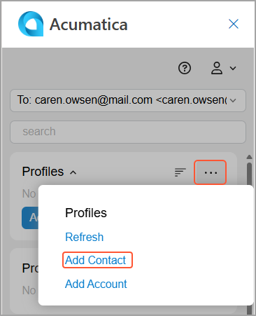
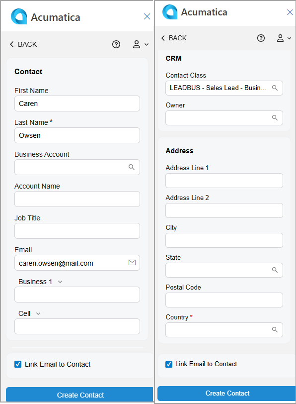

# Acumatica Add-In for Outlook: Contact Management {#_9e0fd9f1-acd4-4f92-9eeb-4067e6d22fd2 .concept}

With the Acumatica add-in for Outlook, you can easily find any related contacts in Acumatica ERP and create new ones related to an email you’re viewing.

**Tip:** If the add-in isn’t already open, click the Acumatica button on the toolbar to open the add-in panel.

When you open an email with the Acumatica add-in running, it tries to find related contacts on the [Contacts](CR_30_20_00.md) \(CR302000\) form. That is, it searches for contacts whose email addresses match the one selected in the Filter box on the Related Records form of the Acumatica add-in. You can search by the sender’s address or by a recipient’s address. For details about the filter box, see [Acumatica Add-In for Outlook: General Information](OU_AddIn_General_Info.md).

If matching contacts are found, they appear in the **Profiles** section of the Related Records form. You can:

-   Select a related contact to quickly link the email to it. For details, see [Acumatica Add-In for Outlook: Email Activity Management](OU_AddIn_Email_Activity_Management.md).
-   Click a contact’s name \(which is a link\) to review the contact. The record opens on the [Contacts](CR_30_20_00.md) form of your Acumatica ERP instance.
-   Quickly create a related contact and link it to the email, as described in the next section.

## Contact Creation { .section}

To create a contact with the email address selected in the Filter box of the Related Records form, click **Add Contact** in the **Profiles** section—either directly or through the More menu.

The Contact form opens \(see below\), and the following boxes may be filled in automatically:

-   **Email**: The email address selected in the filter box.
-   **First Name**: The first word of the email address if it consists of two or more parts separated by spaces \(for example, *Mill Gibson &lt;mill.gibson.mail.com&gt;*\); otherwise, the box is empty.
-   **Last Name**: The second word of the email address if it consists of two or more parts separated by spaces \(for example, *Mill Gibson &lt;mill.gibson.mail.com&gt;*\). If a last name can’t be derived, the email address selected in the Filter box is inserted.
-   **Link Email to Contact**: Selected.

After you click **Create Contact**, the form you go to depends on the state of the **Link Email to Contact** check box:

-   If it’s cleared, you return to the Related Records form. The system refreshes the **Profiles** section and shows the newly created contact.
-   If it’s selected, you go to the Email Activity form. The system fills in the **Related Contact** and **Related Entity** boxes with the new contact and inserts *Contact* in the **Related Entity Type** box. The email is linked to the newly created contact in Acumatica ERP. For details, see [Acumatica Add-In for Outlook: Email Activity Management](OU_AddIn_Email_Activity_Management.md).

## Access Rights { .section}

Users with the following user roles have the *Delete* access rights to the Contact form:

-   *AcumaticaSupport*
-   *Administrator*
-   *CR Marketing Manager*
-   *CR Sales &amp; Marketing Admin*
-   *CR Sales Representative*
-   *CR Support Admin*
-   *CR Support Representative*
-   *Customer Data Manager*
-   *Vendor Data Manager*

**Parent topic:**[Add-In for Outlook: Modern UI](../UserGuide/OU_OU_ModernUI.md)

