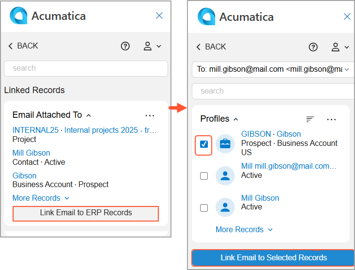
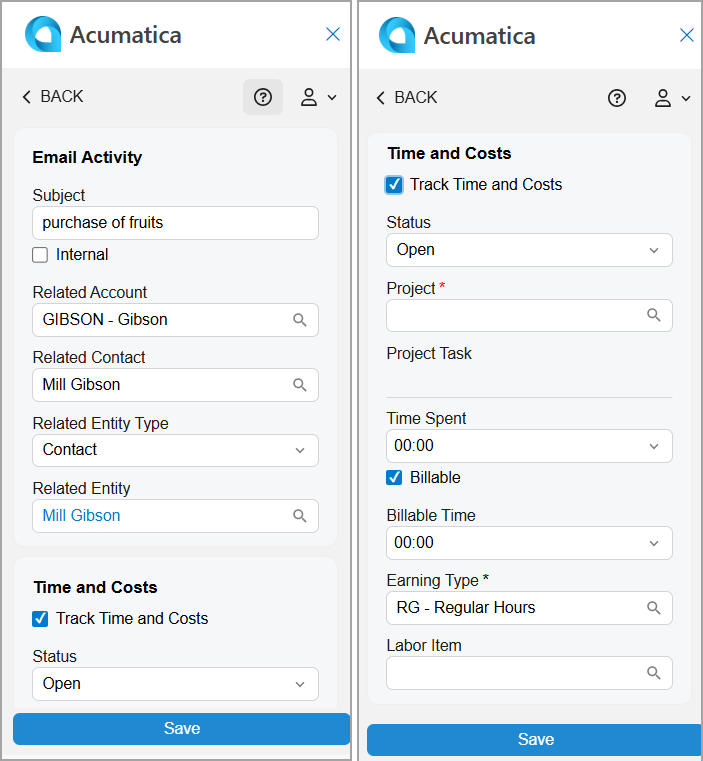
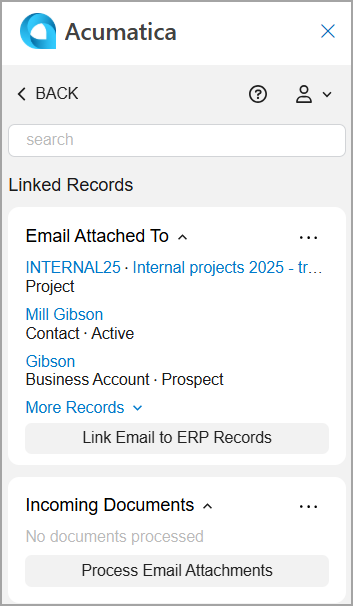
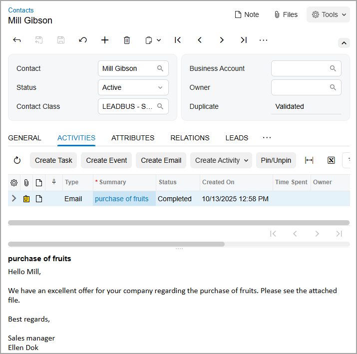

# Acumatica Add-In for Outlook: Email Activity Management {#_d77a1211-70f4-4c1c-a85d-52cdf1d0a24e .concept}

Keeping all communication with customers or partners in one place helps keep your work organized and transparent. The Acumatica add-in for Outlook lets you easily store email correspondence along with the relevant records in Acumatica ERP.

While viewing an email in Outlook, you click the Acumatica on the toolbar to open the add-in panel. From there, you can link the email to one or more records on the Related Records form. The same email can be saved multiple times, if needed.

## Linking an Email to Records { .section}

You use the Related Records form of the Acumatica add-in panel to link the email you're viewing to records. On this form, select one or more records and click **Link Email to Selected Records**; the Email Activity form opens.

If the Linked Records form is initially displayed on the add-in panel, click **Link Email to ERP Records** to open the Related Records form. Then you can link the email, as shown below.

**Tip:** You can select only one record of each type in the **Profiles** group and only one record from any other group of records at a time.

## Finishing Email Activity Creation { .section}

To finish the process of linking records to the email, you finish creating the email activity on the Email Activity form \(see below\). Depending on the type of record you selected on the Related Records form, the following boxes of the email activity may be filled in automatically:

-   **Subject**: The email message's subject.
-   **Related Account**: The business account name if a business account was selected in the **Profiles** group of records.
-   **Related Contact**: The contact name if a contact was selected in the **Profiles** group of records.
-   **Related Entity Type**: The type of entity to which the email will be linked. If both a contact record and a business account record were selected in the **Profiles** group of records, the *Contact* entity type is selected by default. If both a record from the **Profiles** group and a record from another group were selected, the type of record from the other group will be used.
-   **Related Entity**: The entity \(record\) of the selected type to which the email will be linked.
-   **Status**: *Open* if the **Track Time and Costs** check box is selected; otherwise, it's *Completed*.

**Important:** The **Track Time and Costs** check box is now available only for outgoing emails.

After you save the email activity, the add-in automatically returns you to the Linked Records form. All records to which the email has been linked are displayed in the **Email Attached To** section \(see below\).

In Acumatica ERP, the saved email activity appears on the **Activities** tab of the data entry form for the record selected in the **Related Entity** box, as shown below. Any email attachments are saved as files and linked to the email activity. The activity’s status is changed to *Completed*, and **Completed On** is populated with the current date and time.

## Access Rights { .section}

Internal employees with the following user roles have the *Delete* access rights to the Email Activity form:

-   *AcumaticaSupport*
-   *Administrator*
-   *CR Marketing Manager*
-   *CR Sales &amp; Marketing Admin*
-   *CR Sales Representative*
-   *CR Support Admin*
-   *CR Support Representative*

**Parent topic:**[Add-In for Outlook: Modern UI](../UserGuide/OU_OU_ModernUI.md)

