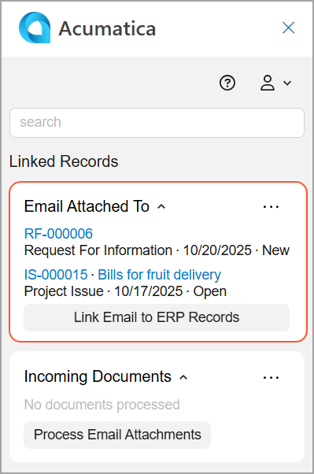
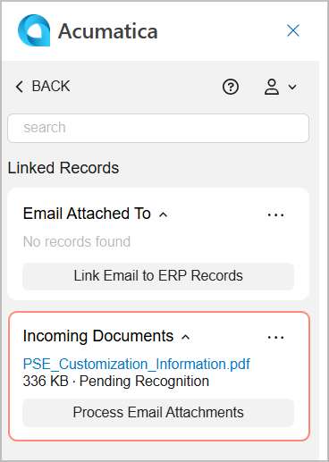
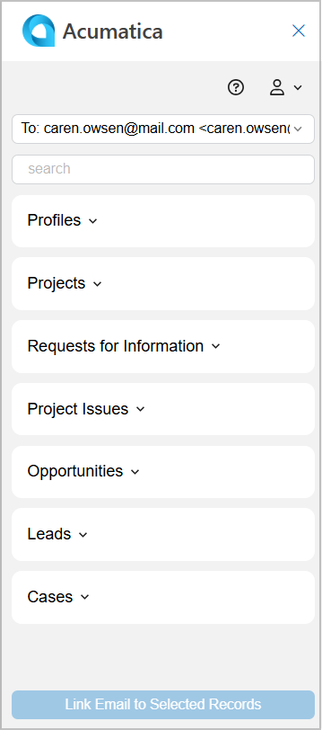
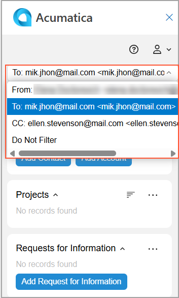
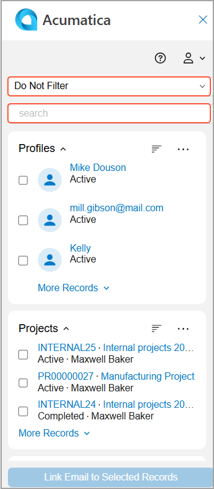
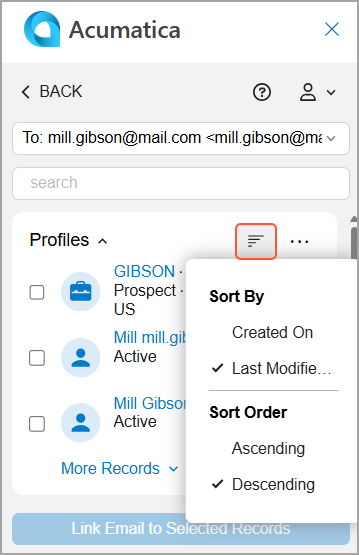
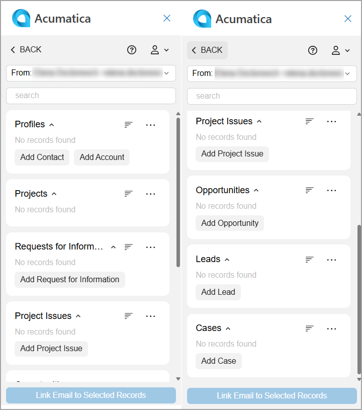
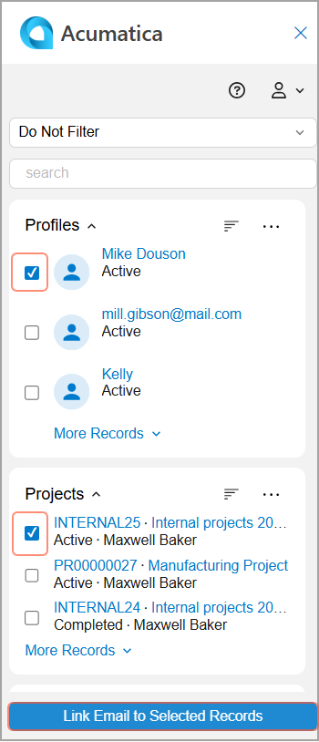

# Acumatica Add-In for Outlook: General Information {#_77c48535-2411-42a7-a311-c2fa943ca7dc .concept}

The Acumatica add-in for Outlook works with open incoming and sent email in your Outlook mailbox. It searches Acumatica ERP for leads, contacts, and business accounts that correspond to the sender and recipient addresses in the emails. It also searches for documents and profiles to which the email has been linked.

You start using the Acumatica add-in by opening an email and clicking the Acumatica button on the toolbar to open the add-in panel. \(For details about how to pin the button, see [Acumatica Add-In for Outlook: To Install the Acumatica Add-In](OU_Install_AddIn_ModernUI.md).\)

Depending on whether the email has already been linked to a record in Acumatica ERP, one of the following forms will be shown first on the add-in panel:

-   Linked Records: Shows records \(profiles and documents\) linked to the email or its attachments. You see this form first if the email has already been linked to a record in Acumatica ERP.
-   Related Records: Displays records that contain the same email address as the opened email sender or one of the recipients. You see this form first if the email hasn't already been linked to a record in Acumatica ERP.

## Viewing Linked Records { .section}

The Linked Records form shows the records in Acumatica ERP to which the opened email has already been linked. If you click the link to the record in the **Email Attached To** section, the system opens it in your browser.

If the **Email Attached To** section shows no linked records or you want to link the email to other records, click **Link Email to ERP Records** to go to the Related Records form and select records to which the email will be linked.

In the **Incoming Documents** section \(shown below\), you can see the attached documents that have already been submitted to Acumatica ERP for recognition.

The section is available if the *AP Document Recognition Service* feature is enabled on the [Enable/Disable Features](CS_10_00_00.md) \(CS100000\) form and the attached document is in a recognizable format, such as PDF.

For details, see [Acumatica Add-In for Outlook: Incoming Document Management](OU_AddIn_Incoming_Documents_Management.md).

## Working with Related Records { .section}

You can use the Related Records form to review and create records in Acumatica ERP that are related to the current email. You can also select records to which you want to link the email.

**Record Groups**

On the form, records are grouped by type \(see below\).

**Filtering, Searching, and Sorting Records**

At the top of the form, use the Filter box to select the email address to match \(see below\). By default, the *From* address is selected. The system shows any records in Acumatica ERP with this email address.

If you select *Do Not Filter*, all Acumatica ERP records will be shown in each group of records \(see below\).

**Note:** The *Do Not Filter* option can be useful if you want to link the email to a project or another record that doesn’t contain any email address from the open email.

To find a particular record, use the Search box.

You can also use sorting options to work with records more easily. Click **Sort** \(shown below\) to select one of the available sorting options.

**Creation and Linking of Records**

You can create a new record based on the selected email address or the content of the message. To do this, click the corresponding button, such as **Add Opportunity** or **Add Contact**, in the groups of records \(see below\).

To link the email to a record or multiple records, first select the unlabeled check box for each needed record. Then click **Link Email to Selected Records** at the bottom of the form \(see below\). The system opens the Email Activity form in the add-in panel. For details, see [Acumatica Add-In for Outlook: Email Activity Management](OU_AddIn_Email_Activity_Management.md).

You can also use the Related Records form as a starting point to modify records. Click a record's link and the system opens that record on the corresponding data entry form in Acumatica ERP.

## Access Rights { .section}

The following user roles have the *Delete* and *Read* access rights to the Related Records and Linked Records forms.

|User Role|Access Rights|
|---------|-------------|
|*AcumaticaSupport*|*Delete*|
|*Administrator*|
|*AP Admin*|
|*AP Clerk*|
|*AR Admin*|
|*AP Clerk*|
|*CR Marketing Manager*|
|*CR Sales &amp; Marketing Admin*|
|*CR Sales Representative*|
|*CR Support Admin*|
|*CR Support Representative*|
|*Customer Data Manager*|
|*PO Admin*|
|*PO Buyer*|
|*PO Clerk*|
|*PO Manager*|
|*Project Accountant*|
|*SO Admin*|
|*SO Clerk*|
|*SO Manager*|
|*Vendor Data Manager*|
|*AP Viewer*|*Read*|
|*AR Viewer*|
|*CR Viewer*|
|*PO Viewer*|
|*SO Viewer*|

**Parent topic:**[Add-In for Outlook: Modern UI](../UserGuide/OU_OU_ModernUI.md)

