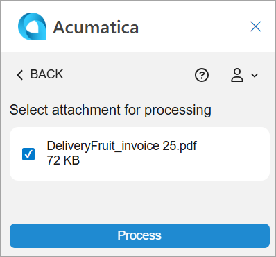
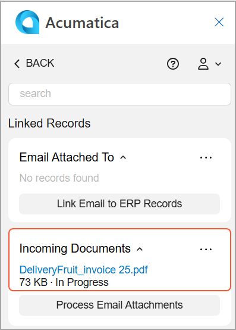

# Acumatica Add-In for Outlook: Incoming Document Management {#_3459fbcc-5d7e-4a34-a65c-0f2e77e62792 .concept}

Emails may include attachments, such as vendor bills. If the attached files are in a recognizable format, such as PDF, they can be submitted for recognition in Acumatica ERP if the *AP Document Recognition Service* feature is enabled on the [Enable/Disable Features](CS_10_00_00.md) \(CS100000\) form. Once the documents are recognized, they can be used to create the corresponding records in the system.

When you open an email with attachments while the Acumatica add-in for Outlook is running, it tries to find related documents on the [Incoming Documents](AP_30_11_10.md) \(AP301110\) form. That is, it searches for recognized incoming documents that have a link to the currently open email.

If any matching documents are found in Acumatica ERP, they appear in the **Incoming Documents** section of the Linked Records form. You can click any incoming document’s name \(which is a link\) to open the document on the [Incoming Documents](AP_30_11_10.md) form of your Acumatica ERP instance.

If the incoming document is assigned to a vendor, its name is also displayed next to the document's name, which is a link. You can click the link to open the vendor on the [Vendors](AP_30_30_00.md) \(AP303000\) form.

## Attachment Recognition { .section}

To recognize an email attachment that hasn't been recognized yet in Acumatica ERP, you click **Process Email Attachments** on the Linked Records form. On the Attachment Selection form, which opens \(see below\), you select the document you want to submit for recognition and click **Process**.

You return to the Linked Records form, which refreshes and shows the recognized document in the **Incoming Documents** section \(see below\).

**Tip:** If the document doesn't appear in the section, click **Refresh** on the More menu.

## Access Rights { .section}

Users with the following user roles have the *Delete* access rights to the Attachment Selection form:

-   *AcumaticaSupport*
-   *Administrator*
-   *AP Admin*
-   *AP Clerk*

**Parent topic:**[Add-In for Outlook: Modern UI](../UserGuide/OU_OU_ModernUI.md)

