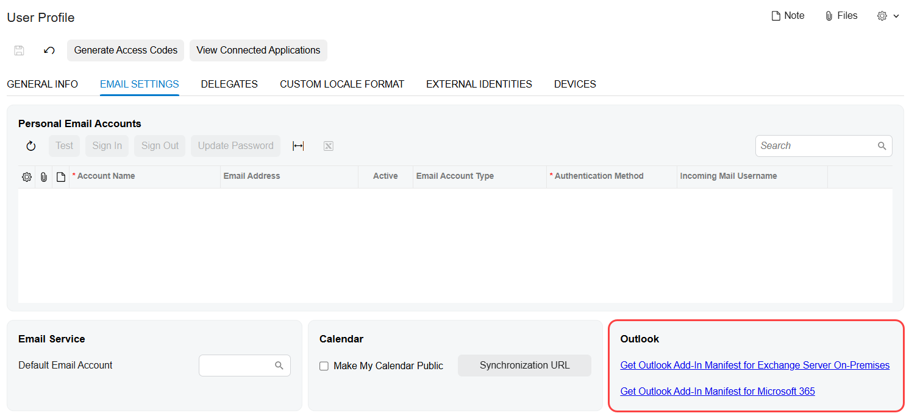
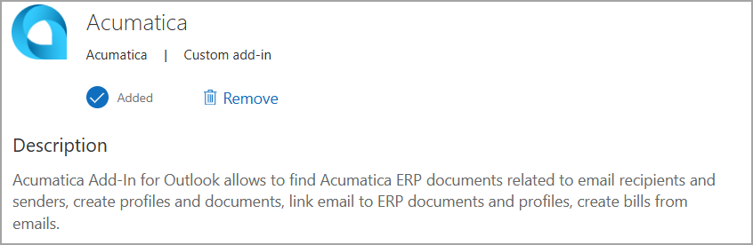

# Acumatica Add-In for Outlook: Add-In Installation {#_f096a979-3f80-4f4c-90ec-320c923a6f3e .concept}

To install the Acumatica add-in for Outlook, you must use a manifest file that contains all deployment instructions. The system generates this file individually for each user.

## Prerequisite Settings { .section}

The system generates a manifest file based on the interface of the Acumatica add-in, which is specified on the [Site Preferences](SM_20_05_05.md) \(SM200505\) form. In the **Outlook Add-In UI** box, one of the following options is inserted by default \(you can change it\):

-   Modern UI: Selected if the system has just been installed and *Modern* is selected in the **Default UI** box of the [Site Preferences](SM_20_05_05.md) form.
-   Classic UI: Selected if one of the following conditions is met:
    -   The system has just been upgraded from Acumatica ERP 2026 R1 or an earlier version.
    -   The system has just been installed, and *Classic* is selected in the **Default UI** box of the [Site Preferences](SM_20_05_05.md) form.

## Downloading of the Manifest File { .section}

Before you begin installing the add-in, sign in to your Acumatica ERP instance. Then on the **Email Settings** tab of the [User Profile](SM_20_30_10.md) \(SM203010\) form, click the link \(see below\) to download the needed add-in manifest file:

-   *Get Outlook Add-In Manifest for Exchange Server On-Premises*: Use this link if you use Exchange Server on-premises.
-   *Get Outlook Add-In Manifest for Microsoft 365*: Use this link if you use a Microsoft 365 subscription. The Microsoft 365 manifest comes prefilled with all the necessary Microsoft Entra identifiers—no extra configuration needed.

**Attention:**

The *Get Outlook Add-In Manifest for Exchange Server On-Premises* link appears only if the *Outlook Integration* feature is enabled on the [Enable/Disable Features](CS_10_00_00.md) \(CS100000\) form.

The *Get Outlook Add-In Manifest for Microsoft 365* link appears if all of the following conditions are met:

-   The *Outlook Integration* and *OpenID Connect* features are enabled on the [Enable/Disable Features](CS_10_00_00.md) form.
-   The **Use Provider for Sign-In to Acumatica Add-In for Outlook** check box is selected for the OpenID provider on the [OpenID Providers](SM_30_30_20.md) \(SM303020\) form.

The system names the downloaded manifest file based on the add-in interface specified on the [Site Preferences](SM_20_05_05.md) \(SM200505\) form:

-   If you click the *Get Outlook Add-In Manifest for Exchange Server On-Premises* link: `OutlookAddinManifestModernUI` or `OutlookAddinManifest` \(for the Classic UI\)
-   If you click the *Get Outlook Add-In Manifest for Microsoft 365* link: `OutlookAddinManifestMicrosoft365ModernUI` or `OutlookAddinManifestMicrosoft365` \(for the Classic UI\)

## Customization of the Manifest File { .section}

To customize the ribbon button that will appear on your Outlook client, you can edit the values of the following parameters in the downloaded manifest file:

-   `DisplayName`: The company name to be displayed. By default, *Acumatica* is displayed.
-   `Description`: The description for the company to be displayed. By default, the following description is displayed.

    

-   `SupportUrl`: An external link to an image file with the company logo. By default, the *[https://www.acumatica.com/support](https://www.acumatica.com/support)* link is used.

**Tip:** You can modify the manifest file at any time after the add-in has been installed, but you’ll have to update the add-in for the changes to take effect. For details on how to update the add-in, see [Acumatica Add-In for Outlook: To Update the Acumatica Add-In](OU__how_To_Update_AddIn.md).

**Parent topic:**[Add-In for Outlook: Modern UI](../UserGuide/OU_OU_ModernUI.md)

