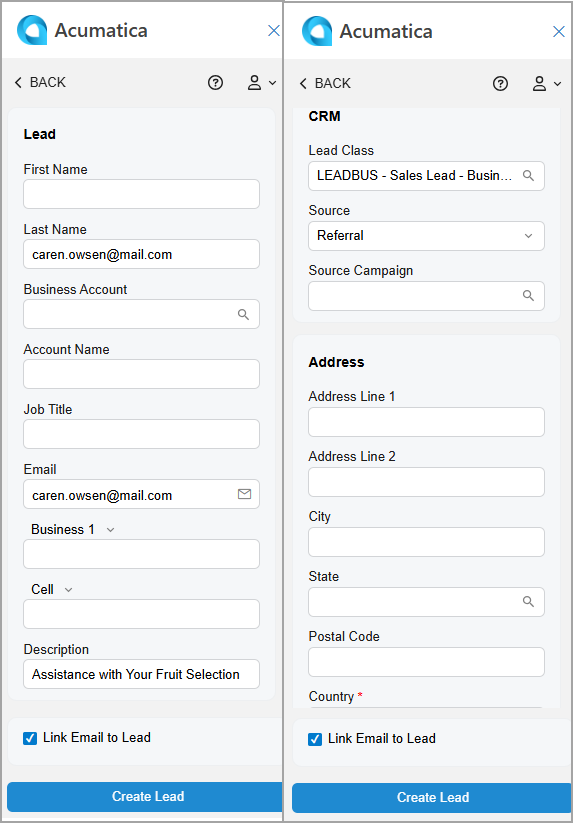

# Acumatica Add-In for Outlook: Lead Management {#_e472f5d2-592d-4d46-9653-69d016937faf .concept}

With the Acumatica add-in for Outlook, you can easily convert any email from a potential customer into a lead and save it in Acumatica ERP.

**Tip:** If the add-in isn’t already open, click the Acumatica button on the toolbar to open the add-in panel.

When you open an email with the Acumatica add-in running, it tries to find related leads on the [Leads](CR_30_10_00.md) \(CR301000\) form. That is, it looks for leads whose email addresses match the one selected in the Filter box on the Related Records form of the Acumatica add-in.

If matching leads are found, they appear in the **Leads** section of the Related Records form. You can:

-   Link the email to the related lead to keep all important communication details in one place. For details, see [Acumatica Add-In for Outlook: Email Activity Management](OU_AddIn_Email_Activity_Management.md).
-   Review the lead by clicking its name, which is a link. The record opens on the [Leads](CR_30_10_00.md) form in your Acumatica ERP instance.
-   Quickly create a related lead and link it to the email, as described in the next section.

## Lead Creation { .section}

To create a lead with the email address selected in the Filter box of the Related Records form, click **Add Lead** in the **Leads** section—either directly or through the More menu.

The Lead form opens \(see below\), and the following boxes may be filled in automatically:

-   **First Name**: The first word of the email address if it consists of two or more parts separated by spaces \(for example, *Mill Gibson &lt;mill.gibson.mail.com&gt;*\); otherwise, the box is empty.
-   **Last Name**: The second word of the email address if it consists of two or more parts separated by spaces \(for example, *Mill Gibson &lt;mill.gibson.mail.com&gt;*\). If a last name can’t be derived, the email address selected in the filter box is inserted.
-   **Business Account**: The name of the existing related business account that has the same email address as the address specified in the filter box; otherwise, the box is empty.
-   **Email**: The email address selected in the filter box.
-   **Description**: The email subject.
-   **Link Email to Lead**: Selected.

After you click **Create Lead**, the form you go to depends on the state of the **Link Email to Lead** check box:

-   If it’s cleared, you return to the Related Records form. The system refreshes the **Leads** section and shows the newly created lead.
-   If it’s selected, you go to the Email Activity form. The system fills in the **Related Account** and **Related Entity** boxes with the lead you created and selects *Lead* in the **Related Entity Type** box. For details, see [Acumatica Add-In for Outlook: Email Activity Management](OU_AddIn_Email_Activity_Management.md). The email is linked to the newly created lead in Acumatica ERP.

## Access Rights { .section}

Users with the following user roles have the *Delete* access rights to the Lead form:

-   *AcumaticaSupport*
-   *Administrator*
-   *CR Marketing Manager*
-   *CR Sales &amp; Marketing Admin*
-   *CR Sales Representative*
-   *CR Support Admin*
-   *CR Support Representative*

**Parent topic:**[Add-In for Outlook: Modern UI](../UserGuide/OU_OU_ModernUI.md)

