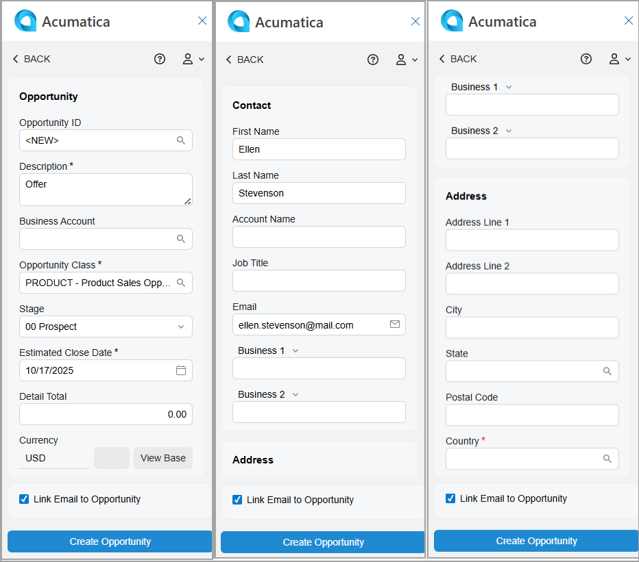

# Acumatica Add-In for Outlook: Opportunity Management {#_80f98eba-0694-46c6-9003-5d1f00807159 .concept}

When you communicate with a potential or existing customer in Outlook and realize that an email may lead to a new deal, you can easily use this email to create an opportunity in Acumatica ERP by using the Acumatica add-in for Outlook. You can also link the email to an existing opportunity.

**Tip:** If the add-in isn’t already open, click the Acumatica button on the toolbar to open the add-in panel.

When you open an email with the Acumatica add-in running, it tries to find related opportunities on the [Opportunities](CR_30_40_00.md) \(CR304000\) form. That is, it searches for opportunities whose email addresses match the one selected in the filter box on the Related Records form of the Acumatica add-in.

If matching opportunities are found, they appear in the **Opportunities** section of the Related Records form. You can:

-   Link the email to the related opportunity record. For details, see [Acumatica Add-In for Outlook: Email Activity Management](OU_AddIn_Email_Activity_Management.md).
-   Review the opportunity by clicking its name, which is a link. The record opens on the [Opportunities](CR_30_40_00.md) form in your Acumatica ERP instance.
-   Quickly create a related opportunity and link it to the email, as described in the next section.

## Opportunity Creation { .section}

To create an opportunity with the email address selected in the Filter box of the Related Records form, click **Add Opportunity** in the **Opportunities** section—either directly or through the More menu.

The Opportunity form opens \(see below\), and the following boxes may be filled in automatically:

-   **Description**: The email subject.
-   **Business Account**: The name of the existing related business account with the same email address as the address specified in the filter box; otherwise, the box is empty.
-   **First Name** \(**Contact** section\): The first word of the email address if it consists of two or more parts separated by spaces \(for example, *Mill Gibson &lt;mill.gibson.mail.com&gt;*\); otherwise, the box is empty.
-   **Last Name** \(**Contact** section\): The second word of the email address if it consists of two or more parts separated by spaces \(for example, *Mill Gibson &lt;mill.gibson.mail.com&gt;*\). If a last name can’t be derived, the email address selected in the filter box is inserted.
-   **Email** \(**Contact** section\): The email address selected in the filter box.
-   **Link Email to Opportunity**: Selected.

After you click **Create Opportunity**, the form you go to depends on the state of the **Link Email to Opportunity** check box:

-   If the check box is cleared, you return to the Related Records form. The system refreshes the **Opportunities** section and shows the newly created opportunity.
-   If the check box is selected, you go to the Email Activity form. The system fills in the **Related Entity** box with a new opportunity and selects *Opportunity* in the **Related Entity Type** box. For details, see [Acumatica Add-In for Outlook: Email Activity Management](OU_AddIn_Email_Activity_Management.md). The email is linked to the newly created opportunity in Acumatica ERP.

## Access Rights { .section}

Users with the following user roles have the *Delete* access rights to the Opportunity form:

-   *AcumaticaSupport*
-   *Administrator*
-   *CR Marketing Manager*
-   *CR Sales &amp; Marketing Admin*
-   *CR Sales Representative*

**Parent topic:**[Add-In for Outlook: Modern UI](../UserGuide/OU_OU_ModernUI.md)

