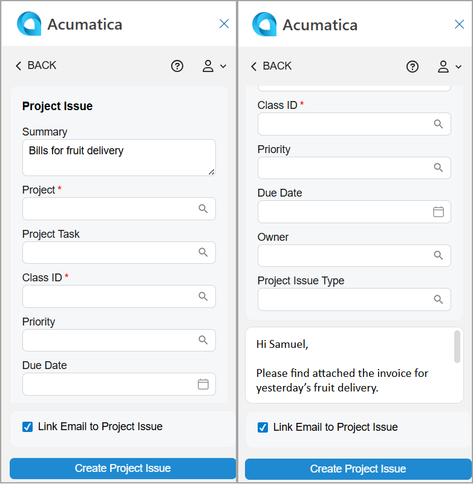

# Acumatica Add-In for Outlook: Project Issue Management {#_574f9aaa-f614-4631-abf7-b81407a01cc2 .concept}

An email in your Outlook mailbox may contain information that’s important for a project in Acumatica ERP, and you may want to save this information in issues related to this project. You can quickly do this on the Related Records form of the Acumatica add-in for Outlook if the *Construction Project Management* feature is enabled on the [Enable/Disable Features](CS_10_00_00.md) \(CS100000\) form.

**Tip:** If the add-in isn’t already open, click the Acumatica button on the toolbar to open the add-in panel.

When you open an email with the Acumatica add-in running, it tries to find related project issues on the [Project Issue](PJ_30_20_00.md) \(PJ302000\) form. That is, it searches for issues associated with projects whose contact has the same email address as the one selected in the Filter box on the Related Records form.

Matching project issues appear in the **Project Issues** section of the Related Records form. You can:

-   Select a related project issue to quickly link the email to it. For details, see [Acumatica Add-In for Outlook: Email Activity Management](OU_AddIn_Email_Activity_Management.md).
-   Click an issue’s name \(which is a link\) to review it. The record opens on the [Project Issue](PJ_30_20_00.md) form in your Acumatica ERP instance.
-   Open a project related to the issue on the [Projects](PM_30_10_00.md) \(PM301000\) form.
-   Quickly create a project issue and link the email to it, as described in the next section.

## Project Issue Creation { .section}

To create a project issue with the email address selected in the filter box of the Related Records form, click **Add Project Issue** in the **Project Issues** section—either directly or through the More menu.

The Project Issue form opens \(see below\), and the following boxes may be filled in automatically:

-   **Summary**: The email subject
-   Text area: The email message's body
-   **Link Email to Project Issue**: Selected

After you click **Create Project Issue**, the form you go to depends on the state of the **Link Email to Project Issue** check box:

-   If it’s cleared and the project associated with the project issue is related to the email address selected in the Filter box, you return to the Related Records form. The system refreshes the **Project Issues** section and shows the newly created project issue.
-   If the check box is cleared and the project associated with the project issue is not related to the email address selected in the Filter box, you return to the Linked Records form. The system shows the newly created project issue in the **Email Attached To** section.
-   If the check box is selected, you go to the Email Activity form. The system fills in the **Related Entity** box with the project issue you created and selects *Project Issue* in the **Related Entity Type** box. For details, see [Acumatica Add-In for Outlook: Email Activity Management](OU_AddIn_Email_Activity_Management.md). The email is linked to the newly created project issue in Acumatica ERP.

**Parent topic:**[Add-In for Outlook: Modern UI](../UserGuide/OU_OU_ModernUI.md)

