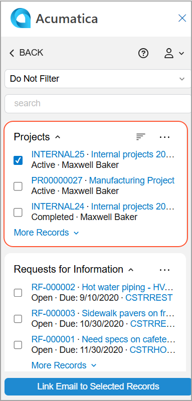

# Acumatica Add-In for Outlook: Project Management {#_5ca537a6-8ff5-43e0-aff3-9fa1e9f75a28 .concept}

If you receive an email related to a project in your Outlook mailbox, you may want to save the email in Acumatica ERP so that it’s displayed on the **Activities** tab of the [Projects](PM_30_10_00.md) \(PM301000\) form for this project. With the Acumatica add-in for Outlook, you can easily find the related project on the Related Records form of the Acumatica add-in if the *Projects* feature is enabled on the [Enable/Disable Features](CS_10_00_00.md) \(CS100000\) form.

**Tip:** If the add-in isn’t already open, click the Acumatica button on the toolbar to open the add-in panel.

When you open an email with the Acumatica add-in running, it tries to find related projects on the [Projects](PM_30_10_00.md) form. That is, it searches for projects with an email address matching the one selected in the filter box on the Related Records form of the Acumatica add-in.

If matching projects are found, they appear in the **Projects** section of the Related Records form. You can click a project’s name \(which is a link\) to review it. The record opens on the [Projects](PM_30_10_00.md) form of your Acumatica ERP instance.

If no matching projects are found, select *Do Not Filter* in the Filter box, search for the project, and link the email to it \(see below\). For details, see [Acumatica Add-In for Outlook: Email Activity Management](OU_AddIn_Email_Activity_Management.md).

**Parent topic:**[Add-In for Outlook: Modern UI](../UserGuide/OU_OU_ModernUI.md)

