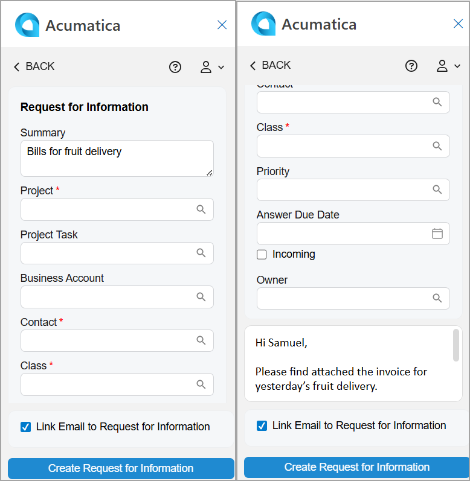

# Acumatica Add-In for Outlook: Requests for Information Management {#_5ecd8514-2421-491f-8f10-a9ab2ad36397 .concept}

Emails in your Outlook mailbox may contain information you want to save as requests for information \(RFIs\) in Acumatica ERP. You can quickly do this on the Related Records form of the Acumatica add-in if the *Construction Project Management* feature is enabled on the [Enable/Disable Features](CS_10_00_00.md) \(CS100000\) form.

**Tip:** If the add-in isn’t already open, click the Acumatica button on the toolbar to open the add-in panel.

When you open an email with the Acumatica add-in running, it tries to find related RFIs on the [Request for Information](PJ_30_10_00.md) \(PJ301000\) form. That is, it searches for RFIs whose contact has the same email address as the one selected in the filter box on the Related Records form.

If matching RFIs are found, they appear in the **Request for Information** section of the Related Records form. You can:

-   Select a related RFI to quickly link the email to it. For details, see [Acumatica Add-In for Outlook: Email Activity Management](OU_AddIn_Email_Activity_Management.md).
-   Click an RFI’s name \(which is a link\) to review it. The record opens on the [Request for Information](PJ_30_10_00.md) form in your Acumatica ERP instance.
-   Open a project related to the RFI on the [Projects](PM_30_10_00.md) \(PM301000\) form.
-   Quickly create an RFI and link the email to it, as described in the next section.

## Creation of a Request for Information { .section}

To create an RFI based on the email address selected in the filter box of the Related Records form, click **Add Request for Information** in the **Requests for Information** section—either directly in the section or through the More menu.

The Request for Information form opens \(see below\), and the following boxes may be filled in automatically:

-   **Summary**: The email subject
-   **Contact**: The name of the existing contact whose email address matches the sender's email address; otherwise, the box is empty
-   Text area: The email message's body
-   **Link Email to Request for Information**: Selected

After you click **Create Request for Information**, the form you go to depends on the state of the **Link Email to Request for Information** check box:

-   If the check box is cleared and the project associated with the request is related to the email address selected in the Filter box, you return to the Related Records form. The system refreshes the **Requests for Information** section and shows the newly created request.
-   If the check box is cleared and the project associated with the request is not related to the email address selected in the filter box, you return to the Linked Records form. The system shows the newly created request in the **Email Attached To** section.
-   If the check box is selected, you go to the Email Activity form. The system fills in the **Related Entity** box with the RFI you created and selects *Request for Information* in the **Related Entity Type** box. For details, see [Acumatica Add-In for Outlook: Email Activity Management](OU_AddIn_Email_Activity_Management.md). The email is linked to the newly created request in Acumatica ERP.

**Parent topic:**[Add-In for Outlook: Modern UI](../UserGuide/OU_OU_ModernUI.md)

