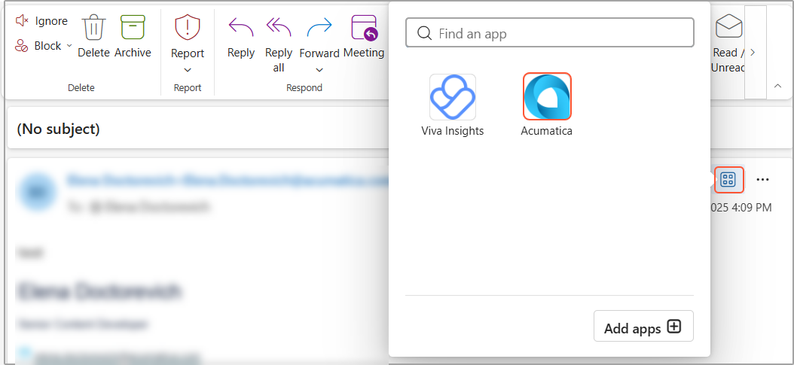

# Acumatica Add-In for Outlook: To Install the Acumatica Add-In {#_a07bcc08-a065-4005-baa2-37892f3cca01 .task}

The instructions below describe how you install the Acumatica add-in and prepare it for use.

## To Install the Add-In {#section_qhv_lhh_khc .section}

To install the add-in, you need to sign in to your mailbox in Outlook on the web and upload the add-in manifest. Do the following:

1.  Click [this link](https://aka.ms/olksideload) to open the **Add-Ins for Outlook** dialog box.
2.  In a navigation pane, select **My add-ins**.
3.  In the **Custom Add-ins** section, select **Add a custom add-in**, and then click **Add from File**.
4.  Specify the location of the add-in manifest file, and then click **Open** to confirm the selection.
5.  In the warning dialog box, click **Install** to install the add-in.
6.  Close the **Add-Ins for Outlook** dialog box.

## To Prepare the Add-In {#section_zrm_hhh_khc .section}

After installing the add-in, do the following to prepare it for first use:

1.  Refresh the browser page and clear your cookies; for example, press Ctrl and click the **Reload this page** button in your browser. If you’re using the desktop version of Outlook, close all its windows and open it again.
2.  Open any email and click the More Apps icon on the ribbon toolbar or in the upper-right corner of the email. In the list of apps, you’ll see the Acumatica button \(as shown below\).

    

    The button is available both in the desktop client and in Outlook on the web.

3.  Pin the button to the toolbar by right-clicking it and selecting **Pin** from the drop-down menu.
4.  Click this button to run the add-in. The Acumatica add-in panel opens. For details, see [Acumatica Add-In for Outlook: Getting Started with the Add-In](OU_Introductory_Form.md).

**Parent topic:**[Add-In for Outlook: Modern UI](../UserGuide/OU_OU_ModernUI.md)

