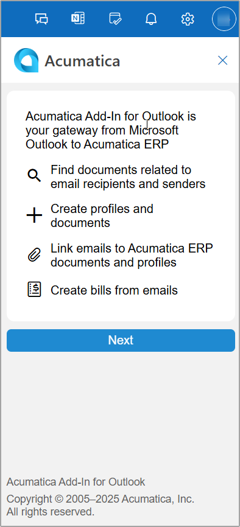

# Acumatica Add-In for Outlook: Getting Started with the Add-In {#_b37f347c-37f6-4e47-8ee6-786637753995 .concept}

When you run the Acumatica add-in for Outlook on your device for the first time, the Acumatica add-in panel opens on the right side of the screen and displays the introductory form \(see below\).

**Note:** This form appears in both Outlook on the Web and Outlook Client for Windows. If you use Outlook on the Web, the introductory form appears again after you clear your browser's cookies. In the Outlook Client for Windows, the introductory form also reappears if you remove and then install again the add-in.

This introductory form provides a brief overview of the add-in’s functionality. Click **Next** to continue. On the sign-in form, which opens, you sign in by using your Acumatica ERP credentials.

## Signing In { .section}

To confirm your identity when using the Acumatica add-in, you provide your Acumatica ERP credentials to sign in to your Acumatica ERP instance. On the Sign-In page, which opens when you run the add-in, do the following:

1.  In the **Select a tenant** box, select the company to which you want to sign in.

    Note that this box is available only if multiple companies are registered in your Acumatica ERP instance.

2.  In the **Username** and **Password** boxes, type your credentials, respectively.
3.  Click **Sign In**.

    This grants the add-in access to your Acumatica ERP instance. You don’t have to enter your credentials during each subsequent run of the add-in unless you previously signed out.

    **Note:** The incorrect configuration of Exchange Server may cause an error during your sign-in attempt if the system receives an empty identity token from Exchange. If this happens, your system administrator should [update the Exchange Server OAuth configuration](https://docs.microsoft.com/ru-ru/archive/blogs/stephen_griffin/mail-apps-and-oauth-aka-your-mail-app-is-busted) so that a valid certificate is used in the process.

**Parent topic:**[Add-In for Outlook: Modern UI](../UserGuide/OU_OU_ModernUI.md)

