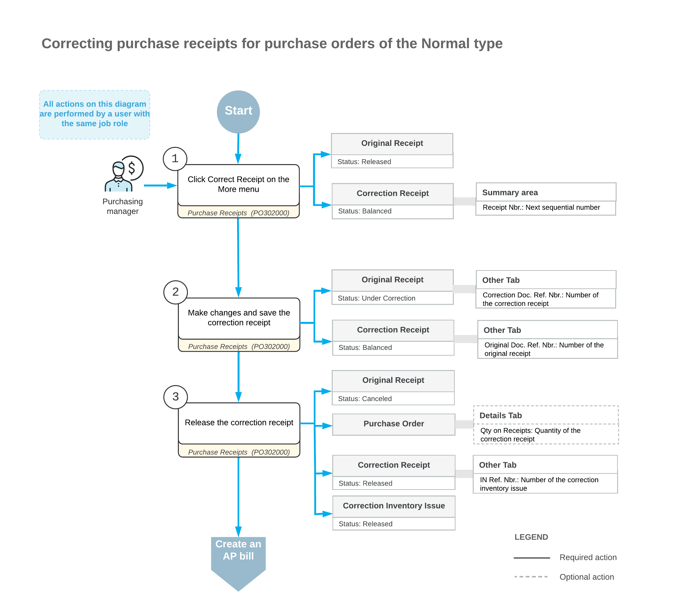

# Purchase Receipt Correction: General Information {#_6957edbd-52a0-42c9-87d8-eb6426f13e77 .concept}

In Acumatica ERP, you can modify released purchase receipts created for normal and drop-ship purchase orders—that is, purchase orders of the *Normal* and *Drop-Ship* types.

**Important:** Receipt correction is unavailable if the *Service Management* feature is enabled on the [Enable/Disable Features](CS_10_00_00.md) \(CS100000\) form. If your company wants to enable this feature, we highly recommend first verifying that there are no unreleased correction receipts in the system.

This topic focuses on the correction of normal purchase receipts. For details on purchase receipt correction for drop-ship purchase orders, see [Purchase Receipt Correction: Correction of Receipts for Drop-Ship Purchase Orders](OrderMgmt_Correction_of_a_Purchase_Receipt_for_a_Drop_Ship_Purchase_Orders.md).

## Learning Objectives { .section}

In this chapter, you will learn how to do the following:

-   Find out whether a purchase receipt can be corrected
-   Create and release a correction purchase receipt
-   Identify which lines of a correction purchase receipt have been changed
-   Check whether a purchase receipt can be canceled
-   Cancel a purchase receipt

## Applicable Scenarios { .section}

You correct a purchase receipt if an error was made in its lines during processing. For example, an incorrect item quantity, lot or serial number, or expiration date was specified.

## Correction of a Purchase Receipt { .section}

You can correct a purchase receipt for a normal purchase order on the [Purchase Receipts](PO_30_20_00.md) \(PO302000\) form if this receipt has the *Released* status. \(If the *Manufacturing* feature is enabled on the [Enable/Disable Features](CS_10_00_00.md) form, none of the receipt lines must be linked to production order materials.\) While viewing the purchase receipt, you click **Correct Receipt** on the More menu. The system checks whether the purchase receipt meets all the requirements for correction. \(See [Requirements for the Original Purchase Receipt](#_76ed007a-2cf9-4532-8e57-f89f1f0d5c42).\)

If the purchase receipt meets all requirements, the system creates a new purchase receipt with the next sequential number.

**Tip:** For simplicity, we use *correction receipt* to describe the newly created purchase receipt and *original receipt* for the purchase receipt in which you clicked **Correct Receipt**.

In the original receipt, the system inserts the number of the correction receipt as a clickable link in the **Correction Doc. Ref. Nbr.** box on the **Other** tab of the [Purchase Receipts](PO_30_20_00.md) form. Similarly, the correction receipt displays the original receipt number as a clickable link in the **Original Doc. Ref. Nbr.** box on the same tab.

The system copies all data from the original receipt to the correction receipt on the [Purchase Receipts](PO_30_20_00.md) form, and you can update the correction receipt. When you save the correction receipt for the first time, the system assigns the *Under Correction* status to the original receipt.

If you update a purchase receipt line on the **Details** tab, the system automatically selects the **Corrected** check box in this line. If you change the date or currency exchange rate in the Summary area, the system automatically selects the **Corrected** check box in all lines of the purchase receipt. This column is hidden by default. For more information about what you can change in the correction receipt, see [Editable Details and Settings of the Correction Purchase Receipt](#_2bcc3391-a41a-4c9f-9957-8898b01ea11a).

To complete the correction process, you click **Release** on the More menu for the correction receipt. This causes the system to validate the state of inventory, as described in [Purchase Receipt Correction: Inventory Validation](OrderMgmt_Inventory_Validation.md).

## Results of Releasing the Correction Receipt { .section}

On successful inventory validation, the system generates a correction inventory issue for the correction receipt. You can find its link in the **IN Ref. Nbr.** box on the **Other** tab of the [Purchase Receipts](PO_30_20_00.md) form. This issue is released automatically, regardless of the state of the **Release IN Documents Automatically** check box on the [Purchase Orders Preferences](PO_10_10_00.md) \(PO101000\) form. For details on this inventory issue, see [Purchase Receipt Correction: Correction Inventory Issue](OrderMgmt_Correction_Inventory_Issue.md).

When the correction inventory issue is released, the system assigns the *Released* status to the correction receipt and the *Canceled* status to the original receipt.

Also, for each line of the correction receipt that has changes in the **Receipt Qty.** column on the [Purchase Receipts](PO_30_20_00.md) form, the system updates the **Qty. On Receipts** value on the **Details** tab of the [Purchase Orders](PO_30_10_00.md) \(PO301000\) form for the related purchase order. The system changes the purchase order based on whether the line’s corrected receipt quantity has increased or decreased:

-   If the line quantity has decreased, the system reopens the corresponding purchase order line if it has already been completed. That is, it clears the **Completed** check box for the line on the **Details** tab. If the purchase order had the *Completed* status but now has at least one reopened line, the purchase order's status becomes *Open*.
-   If the line quantity has increased and the full quantity of the item has been received, the system selects the **Completed** check box in the corresponding purchase order line. If all lines of the purchase order are now completed, the purchase order's status becomes *Completed*.

Also, if the purchase order has a related sales order with lines marked for purchase, the system updates the lines' allocated quantities in this sales order. You can view the updated quantities in the **Line Details** dialog box of the [Sales Orders](SO_30_10_00.md) \(SO301000\) form.

## Workflow of the Correction of a Purchase Receipt {#section_vv2_1y4_y4b .section}

The following diagram illustrates the workflow related to the correction of a purchase receipt for a normal purchase order.

## Requirements for the Original Purchase Receipt {#_76ed007a-2cf9-4532-8e57-f89f1f0d5c42 .section}

On the [Purchase Receipts](PO_30_20_00.md) \(PO302000\) form, you can correct a purchase receipt for a normal purchase order only if the receipt meets all of these requirements:

-   It has at least one line of the *Goods for IN*, *Non-Stock for IN*, *Service*, or *Freight* type.
-   It has no related AP bills, except for those that have been fully reversed.
-   It has no unreleased inventory adjustments linked to its related documents.
-   The related inventory receipt has been released.
-   It contains no lines of the *Goods for RP*, *Goods for Project*, or *Non Stock for Project* type.
-   No landed cost documents have been applied to it.
-   No putaway transfers have been prepared for it
-   It does not have related unreleased purchase returns.
-   Its stock is not locked due to a physical inventory count.
-   Its related purchase order has no related AP bills, except for those that have been fully reversed. The system checks the purchase order if it has the **Allow AP Bill Before Receipt** check box selected on the **Other** tab of the [Purchase Orders](PO_30_10_00.md) \(PO301000\) form.

## Editable Details and Settings of the Correction Purchase Receipt {#_2bcc3391-a41a-4c9f-9957-8898b01ea11a .section}

In a correction receipt for a normal purchase order, you can update the following elements in the Summary area of the [Purchase Receipts](PO_30_20_00.md) \(PO302000\) form:

-   The **Date** box
-   The **Create AP Bill** check box
-   The **Vendor Ref.** box
-   The **Workgroup** box
-   The **Owner** box

You can also update the exchange rate in this area if both of following conditions are met:

-   The vendor has the **Enable Rate Override** check box selected on the **Financial** tab of the [Vendors](AP_30_30_00.md) \(AP303000\) form.
-   The **Allow Changing Currency Rate on Receipt** check box is selected on the [Purchase Orders Preferences](PO_10_10_00.md) \(PO101000\) form.

In a line of the correction receipt, you can edit the values in the following columns of the **Details** tab:

-   **Warehouse**
-   **Location**
-   **Transaction Descr.**
-   **UOM**
-   **Receipt Qty.**
-   **Expiration Date**
-   **Lot/Serial Nbr.**
-   **Unit Cost**
-   **Ext. Cost**
-   **Account** \(only if the line is a non-stock item\)
-   **Subaccount** \(only if the line is a non-stock item\)
-   **Accrual Account**
-   **Accrual Sub.**

**Attention:** You can't correct a line with a non-stock kit.

During the correction, if you accidentally make changes to a line on the **Details** tab, you can click **Cancel** for this line on the table toolbar. The system will discard all changes and revert the line to its original state at the time of document creation. Also, it will clear the **Corrected** check box in the line. Note that if the **Corrected** check box in the line is selected due to the change of **Date** or **Exchange Rate** in the Summary area, it will remain selected.

## Restrictions Applied to the Original and Correction Receipts { .section}

While an original receipt has the *Under Correction* status, you can't do the following:

-   Create an associated AP bill on the [Purchase Receipts](PO_30_20_00.md) \(PO302000\) form
-   Add it to an AP bill on the [Bills and Adjustments](AP_30_10_00.md) \(AP301000\) form
-   Recognize it on the [Incoming Documents](AP_30_11_00.md) \(AP301100\) form
-   Create a related purchase return on the [Purchase Receipts](PO_30_20_00.md) form
-   Apply it to a landed cost document on the [Purchase Receipts](PO_30_20_00.md) or [Landed Costs](PO_30_30_00.md) \(PO303000\) form
-   Process putaway transfers for it on the [Receive and Put Away](PO_30_20_20.md) \(PO302020\) form

In a correction receipt, you can't add lines or delete lines that were copied from the original receipt. If a line in the original receipt was added by mistake, you can specify *0* in the **Receipt Qty.** column for the corresponding line in the correction receipt. This prevents the line from being included in any AP bills or landed cost documents during the processing of the correction receipt.

**Parent topic:**[Correcting Purchase Receipts](../UserGuide/OrderMgmt_Correcting_Purchase_Receipt_Mapref.md)

