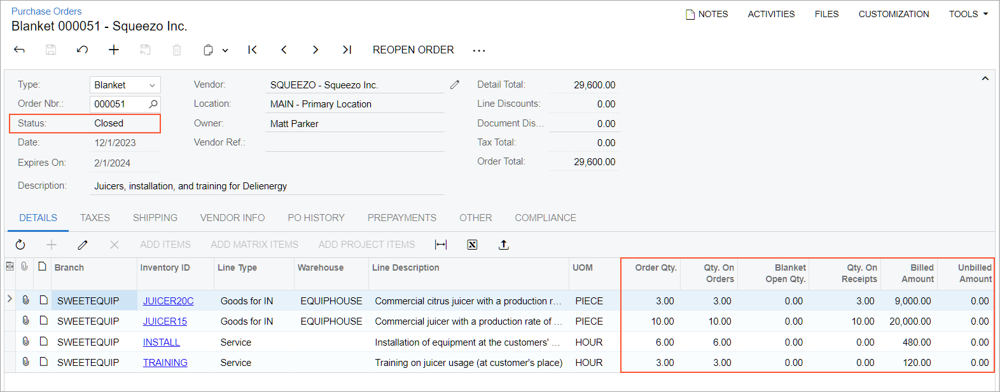
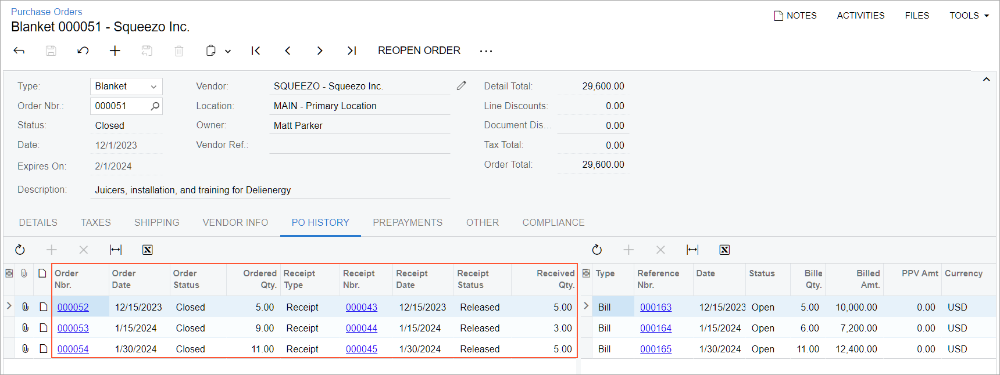

# Blanket Purchase Orders: Process Activity {#_cf4b37e8-b880-455b-aa89-76d081921d4c .task}

The following activity demonstrates how to process a blanket purchase order.

**Attention:** This activity is based on the *U100* dataset. If you are using another dataset or if any system settings have been changed in *U100*, these changes can affect the workflow of the activity and the results of the processing. To avoid issues, restore the *U100* dataset to its initial state.

## Story { .section}

Suppose that you are Matt Parker, a purchasing manager in the SweetLife Fruits &amp; Jams company. SweetLife's customer, Delicious Energy restaurant, has ordered juicers as well as installation and training services. SweetLife does not have much free space for juicers in its warehouses, and you asked the vendor to deliver the juicers in portions, so that you have time to move this juicers to the customer's place where they should be installed. On December 1, 2025 you have finalized a contract with the Squeezo Inc. vendor, which will provide the juicers and services to the customer. According to the contract, the vendor will supply the juicers as follows:

-   Five juicers without installation and training services on December 15, 2025
-   Five juicers without installation and training services and one citrus juicer with installation and training services on January 5, 2026. \(The vendor will be able to deliver only two *JUICER15* juicers for this purchase order. The vendor can deliver the other three juicers later this month. You will need to process the documents in the system accordingly.\)
-   Two citrus juicers with installation and training services on January 30, 2026

The purchased juicers will be delivered to the company's Wholesale warehouse. As the purchasing manager, you need to create a blanket purchase order, create and process its child orders, process purchase receipts, and create bills that should be paid to the vendor for the received juicers and services.

## Configuration Overview {#section_tz4_djx_cnb .section}

In the *U100* dataset, the following tasks have been performed to support this activity:

-   On the [Enable/Disable Features](CS_10_00_00.md) \(CS100000\) form, the following features have been enabled:
    -   *Inventory and Order Management*, which provides the standard functionality of inventory and order management
    -   *Inventory*, which gives you the ability to maintain stock items by using forms related to the inventory functionality and to create and process sales and purchase documents that include stock items
    -   *Blanket and Standard Purchase Orders*, which gives you the ability to create and process these types of purchase orders
-   On the [Purchase Orders Preferences](PO_10_10_00.md) \(PO101000\) form, the following settings have been specified:
    -   The **Release IN Documents Automatically** check box has been selected, which causes the system to automatically release inventory receipts generated on release of purchase receipts.
    -   The **Release AP Documents Automatically** check box, which causes the system to automatically release accounts payable bills generated on release of purchase receipts.
-   On the [Vendors](AP_30_30_00.md) \(AP303000\) form, the *SQUEEZO \(Squeezo Inc.\)* vendor has been created.
-   On the [Stock Items](IN_20_25_00.md) \(IN202500\) form, the *JUICER15* and *JUICER20C* stock items have been created.
-   On the [Non-Stock Items](IN_20_20_00.md) \(IN202000\) form, the *INSTALL* and *TRAINING* non-stock items of the *Service* type have been created. For both stock items, in the **Close PO Line** box on the **General** tab, *By Amount* has been selected.

## Process Overview { .section}

In this activity, you will create a blanket purchase order on the [Purchase Orders](PO_30_10_00.md) \(PO301000\) form. Then you will create three child orders on the same form and add items from the blanket purchase order to the child orders. For each child order, you will create and release a purchase receipt on the [Purchase Receipts](PO_30_20_00.md) \(PO302000\) form. Also, for each child order, you will create and release an AP bill on the [Bills and Adjustments](AP_30_10_00.md) \(AP301000\) form. Finally, you will return to the [Purchase Orders](PO_30_10_00.md) form and review the blanket purchase order to make sure that it is closed.

## System Preparation { .section}

Before you start processing a blanket purchase order, do the following:

1.  Launch the Acumatica ERP website with the *U100* dataset preloaded and sign in as purchasing manager Matt Parker by using the *parker* username and the *123* password.
2.  In the info area, in the upper-right corner of the top pane of the Acumatica ERP screen, make sure that the business date in your system is set to *12/1/2025*. If a different date is displayed, click the Business Date menu button, and select *12/1/2025* on the calendar.
3.  On the Company and Branch Selection menu, in the top pane of the Acumatica ERP screen, select the *Service and Equipment Sales Center* branch.

## Step 1: Creating a Blanket Purchase Order { .section}

To create a blanket purchase order, do the following:

1.  On the [Purchase Orders](PO_30_10_00.md) \(PO301000\) form, add a new record.
2.  In the Summary area, specify the following settings:
    -   **Type**: *Blanket*
    -   **Vendor**: *SQUEEZO*
    -   **Date**: *12/1/2025*
    -   **Expires On**: *2/1/2026*
    -   **Description**: `Juicers, installation, and training for Delienergy`
3.  On the form toolbar, click **Save**.
4.  On the table toolbar of the **Details** tab, click **Add Row**.
5.  Specify the following settings for this row:
    -   **Branch**: *SWEETEQUIP*
    -   **Inventory ID**: *JUICER20C*
    -   **Warehouse**: *EQUIPHOUSE*
    -   **Order Qty.**: `3`
6.  On the table toolbar, click **Add Row**.
7.  Specify the following settings for this row:
    -   **Branch**: *SWEETEQUIP*
    -   **Inventory ID**: *JUICER15*
    -   **Warehouse**: *EQUIPHOUSE*
    -   **Order Qty.**: `10`
8.  On the table toolbar, click **Add Row**.
9.  Specify the following settings for this row:
    -   **Branch**: *SWEETEQUIP*
    -   **Inventory ID**: *INSTALL*
    -   **Order Qty.**: `6`
    -   **Project**: *X - Non-Project Code*
10. On the table toolbar, click **Add Row**.
11. Specify the following settings for this row:
    -   **Branch**: *SWEETEQUIP*
    -   **Inventory ID**: *TRAINING*
    -   **Order Qty.**: `3`
    -   **Project**: *X - Non-Project Code*
12. On the form toolbar, click **Remove Hold**.

## Step 2: Creating the First Child Order { .section}

To create the first child order for the blanket purchase order, do the following:

1.  In the top pane of the Acumatica ERP screen, click the Business Date menu button, and select *12/15/2025* on the calendar.
2.  On the [Purchase Orders](PO_30_10_00.md) \(PO301000\) form, add a new record.
3.  In the Summary area, specify the following settings:
    -   **Type**: *Normal*
    -   **Vendor**: *SQUEEZO*
    -   **Date**: *12/15/2025*
    -   **Promised On**: *12/15/2025*
    -   **Description**: `Purchase of juicers for Delienergy, stage 1`
4.  On the table toolbar of the **Details** tab, click **Add Blanket PO Line**.
5.  In the **Add Purchase Order Line** dialog box, which opens, do the following:
    1.  In the **Order Nbr.** box, select the number of the blanket purchase order that you have created earlier in this activity.
    2.  In the table, select the unlabeled check box in the line with the *JUICER15* item.
    3.  At the bottom of the dialog box, click **Save**, which closes the dialog box, adds the line to the **Details** tab, and returns you to the current form.

        In the **Blanket PO Nbr.** column, make sure that the link to the blanket purchase order has been inserted.

6.  In the **Inventory ID** column of the only line, type `5` in the **Order Qty.** column.
7.  On the form toolbar, click **Remove Hold**.

## Step 3: Processing the First Child Order { .section}

To process the first child order, do the following:

1.  While you are still viewing the *Purchase of juicers for Delienergy, stage 1* purchase order on the [Purchase Orders](PO_30_10_00.md) \(PO301000\) form, on the form toolbar, click **Enter PO Receipt**. The system prepares the purchase receipt for the selected purchase order and opens it on the [Purchase Receipts](PO_30_20_00.md) \(PO302000\) form. Review the detail line of the prepared purchase receipt. Notice that both in the **Ordered Qty.** column and in the **Receipt Qty.** column, *5* is specified.
2.  In the Summary area, select the **Create Bill** check box. This will cause the system to automatically create an accounts payable bill on release of the purchase receipt.
3.  On the form toolbar, click **Release**. Wait for the system to complete the operation.
4.  On the **Billing** tab, notice that the line with the AP bill has been added. Review the detail line of the generated AP bill. Make sure that the bill has the *Open* status.
5.  On the **Other** tab, click the **IN Ref. Nbr.** link. The inventory receipt opens on the [Receipts](IN_30_10_00.md) \(IN301000\) form in a pop-up window. Make sure that the inventory receipt has the *Released* status.
6.  Close the window with the inventory receipt.
7.  On the **Orders** tab of the [Purchase Receipts](PO_30_20_00.md) form, to which you return, make sure that the purchase order that you have just processed has the *Closed* status.
8.  Open the *Juicers, installation, and training for Delienergy* blanket purchase order on the [Purchase Orders](PO_30_10_00.md) \(PO301000\) form.
9.  On the **Details** tab, in the line with *JUICER15*, make sure that the following quantities are specified:
    -   **Qty. On Orders**: *5*
    -   **Blanket Open Qty.**: *5*
    -   **Qty. On Receipts**: *5*

## Step 4: Creating the Second Child Order { .section}

To create the second child order for the blanket purchase order, do the following:

1.  In the top pane of the Acumatica ERP screen, click the Business Date menu button, and select *1/5/2026* on the calendar.
2.  On the [Purchase Orders](PO_30_10_00.md) \(PO301000\) form, add a new record.
3.  In the Summary area, specify the following settings:
    -   **Type**: *Normal*
    -   **Vendor**: *SQUEEZO*
    -   **Date**: *1/5/2026*
    -   **Description**: `Purchase of juicers for Delienergy, stage 2`
4.  On the table toolbar of the **Details** tab, click **Add Blanket PO Line**.
5.  In the **Add Purchase Order Line** dialog box, which opens, do the following:
    1.  In the **Order Nbr.** box, select the number of the blanket purchase order that you have created earlier in this activity.
    2.  In the table, select the unlabeled check boxes in the lines that have the following items:
        -   *JUICER20C*
        -   *JUICER15*
        -   *INSTALL*
        -   *TRAINING*
    3.  Click **Save**, which closes the dialog box, adds the lines to the **Details** tab, and returns you to the current form.
6.  In the **Order Qty.** column, specify item quantities as follows:
    -   In the line that has *JUICER20C* in the **Inventory ID** column, type `1`.
    -   In the line that has *JUICER15* in the **Inventory ID** column, make sure that *5* is specified.
    -   In the line that has *INSTALL* in the **Inventory ID** column, type `2`.
    -   In the line that has *TRAINING* in the **Inventory ID** column, type `1`.
7.  On the form toolbar, click **Save**.

    In the **Order Total** box of the Summary area, make sure that *13,200.00* is specified.

8.  On the form toolbar, click **Remove Hold**.

## Step 5: Processing the Second Child Order { .section}

Suppose that the vendor can deliver only two *JUICER15* juicers for this purchase order. The vendor can deliver the other three juicers later this month.

To process the second child order, do the following:

1.  While you are still viewing the *Purchase of juicers for Delienergy, stage 2* child order on the [Purchase Orders](PO_30_10_00.md) \(PO301000\) form, on the form toolbar, click **Enter PO Receipt**. The system prepares the purchase receipt for the selected purchase order and opens it on the [Purchase Receipts](PO_30_20_00.md) \(PO302000\) form. Review the detail lines of the purchase receipt.
2.  In the Summary area, make sure that the **Create Bill** check box is cleared.
3.  On the **Details** tab, in the line that has *JUICER15* in the **Inventory ID** column, type `2` in the **Receipt Qty.** column.
4.  On the form toolbar, click **Save**.
5.  In the line with the *JUICER15* item, select the **Complete PO Line** check box. With this check box selected, the line of the related child order will be completed, and the in the **Qty. On Orders** and **Blanket Open Qty.** will be recalculated.
6.  On the form toolbar, click **Release**. Wait for the system to complete the operation.
7.  On the **Other** tab, click the **IN Ref. Nbr.** link. The inventory receipt opens on the [Receipts](IN_30_10_00.md) \(IN301000\) form in a pop-up window. Make sure that the inventory receipt has two *JUICER15* items and the *Released* status. Close the window with the inventory receipt.
8.  On the form toolbar of the [Purchase Receipts](PO_30_20_00.md) form, click **Enter AP Bill**. The system generates an accounts payable bill to the vendor and shows the created bill on the [Bills and Adjustments](AP_30_10_00.md) \(AP301000\) form. Make sure that the quantity of the *JUICER15* item is *2*. Notice that the bill has only the two lines with the juicers, but does not have the other two lines with the services. Because the purchase receipt does not have any lines with the services, the related bill does not have them either.
9.  On the table toolbar of the **Details** tab, click **Add PO Line**.
10. In the **Add PO Line** dialog box, which opens, do the following:
    1.  In the **Order Nbr.** box, select the number of the child order dated *1/5/2026*, which you are processing in this step.
    2.  In the table, select the unlabeled check boxes in the lines that have the following items:
        -   *INSTALL*
        -   *TRAINING*
    3.  At the bottom of the dialog box, click **Add &amp; Close**, which closes the dialog box and adds the lines to the **Details** tab.
11. On the form toolbar, click **Remove Hold** to assign the bill the *Balanced* status.
12. Click **Release**. Make sure that the bill has the *Open* status.
13. On the **Details** tab, in the **PO Number** column, click the link in any line to open the related purchase order. On the [Purchase Orders](PO_30_10_00.md) form, which opens, make sure that the status of the purchase order is *Closed*. \(Only two juicers out of five have been received from the vendor, but the purchase order line has been completed earlier in this step.\)
14. In the child order that you are currently viewing on the [Purchase Orders](PO_30_10_00.md) form, in the **Blanket PO Nbr.** column, click the link in any line to open the blanket purchase order.
15. On the **Details** tab, review item quantities as follows:
    -   In the line with the *JUICER15* item, make sure that the following quantities are specified:
        -   **Qty. On Orders**: *7*. Both child orders that you have created earlier in this activity had five *JUICER15* items each, but for the second child order, the vendor can deliver only two items instead of five.
        -   **Blanket Open Qty.**: *3*.
        -   **Qty. On Receipts**: *7*. The purchase receipt for the second child order has only two *JUICER15* items. You will process the receipt of the remaining three *JUICER15* items further in this activity.
    -   In the line with the *JUICER20* item, make sure that the following quantities are specified:
        -   **Qty. On Orders**: *1*
        -   **Blanket Open Qty.**: *2*
        -   **Qty. On Receipts**: *1*

## Step 6: Creating the Last Child Order { .section}

To create the last child order for the blanket purchase order, do the following:

1.  In the top pane of the Acumatica ERP screen, click the Business Date menu button, and select *1/30/2026* on the calendar.
2.  On the [Purchase Orders](PO_30_10_00.md) \(PO301000\) form, add a new record.
3.  In the Summary area, specify the following settings:
    -   **Type**: *Normal*
    -   **Vendor**: *SQUEEZO*
    -   **Date**: *1/30/2026*
    -   **Promised On**: *1/30/2026*
    -   **Description**: `Purchase of juicers for Delienergy, stage 3`
4.  On the table toolbar of the **Details** tab, click **Add Blanket PO Line**.
5.  In the **Add Purchase Order Line** dialog box, which opens, do the following:
    1.  In the **Order Nbr.** box, select the number of the blanket purchase order that you have created earlier in this activity.
    2.  In the table, select the unlabeled check boxes in the lines that have the following items:
        -   *JUICER20C*
        -   *JUICER15*
        -   *INSTALL*
        -   *TRAINING*
    3.  At the bottom of the dialog box, click **Save**, which closes the dialog box, adds the lines to the **Details** tab, and returns you to the current form.
6.  In the **Order Qty.** column, make sure that the following item quantities are specified:
    -   In the line with the *JUICER20C* item, *2*
    -   In the line with the *JUICER15* item, *3*
    -   In the line with the *INSTALL* item, *4*
    -   In the line with the *TRAINING* item, *2*
7.  On the form toolbar, click **Remove Hold**.

## Step 7: Processing the Last Child Order { .section}

Suppose that the vendor can now supply the remaining three *JUICER15* items that had not been received for the second child order. In this step, you will process the last child order and the receipt of the three *JUICER15* items.

To process the last child order, do the following:

1.  While you are still viewing the *Purchase of juicers for Delienergy, stage 3* child order on the [Purchase Orders](PO_30_10_00.md) \(PO301000\) form, on the form toolbar, click **Enter PO Receipt**. The system prepares the purchase receipt for the selected purchase order and opens it on the [Purchase Receipts](PO_30_20_00.md) \(PO302000\) form. Review the detail lines of the purchase receipt. In the line with the *JUICER15* item, make sure that *3* is specified in the **Receipt Qty.** column.
2.  In the Summary area, make sure that the **Create Bill** check box is cleared.
3.  On the form toolbar, click **Release**. Wait for the system to complete the operation.
4.  On the **Other** tab, click the link in the **IN Ref. Nbr.** box. The inventory receipt opens on the [Receipts](IN_30_10_00.md) \(IN301000\) form in a pop-up window. Review the settings of the generated inventory receipt. Make sure that it has the *Released* status and the *JUICER20C* and *JUICER15* items. Close the window with the inventory receipt.
5.  On the form toolbar of the [Purchase Receipts](PO_30_20_00.md) form to which you return, click **Enter AP Bill**. The system generates an accounts payable bill for the vendor and shows the created bill on the [Bills and Adjustments](AP_30_10_00.md) \(AP301000\) form. Make sure that the quantity of the *JUICER15* item is *3*. Notice that the bill currently has only two lines with the items, but it does not have the other two lines with the services.
6.  On the table toolbar of the **Details** tab, click **Add PO Line**.
7.  In the **Add PO Line** dialog box, which opens, do the following:
    1.  In the **Order Nbr.** box, select the number of the child order dated *1/30/2026*, which you have been processing in this step.
    2.  In the table, select the unlabeled check boxes in the lines that have the following inventory IDs:
        -   *INSTALL*
        -   *TRAINING*
    3.  Click **Add &amp; Close**, which closes the dialog box and adds the lines to the **Details** tab.
8.  On the form toolbar, click **Remove Hold**.
9.  Click **Release**. Make sure that the bill has the *Open* status.
10. On the [Purchase Orders](PO_30_10_00.md) form, open the blanket purchase order with the *Juicers, installation, and training for Delienergy* description. Notice that the order has now the *Closed* status.
11. Review the quantities in the **Qty. On Orders** and **Qty. On Receipts** columns. In the **Blanket Open Qty.** column, make sure that *0* is specified for all lines. In the **Billed Amount** column, the sum of the amounts equals the **Order Total** amount. The **Unbilled Amount** is *0* \(see the following screenshot\). This indicates that the full quantity of all lines of the order has been processed and all the order amount has been billed.

    

12. Open the **PO History** tab. Notice that the left table shows the numbers, dates, and statuses of the child orders of the selected blanket order, as well as the ordered and received quantities. You could click the link in the **Order Nbr.** column of any row to open the needed child order in a pop-up window.

    

You have processed the blanket purchase order and the related child orders.

**Parent topic:**[Processing Blanket Purchase Orders](../UserGuide/OrderMgmt_Blanket_Purchase_Orders_Mapref.md)

