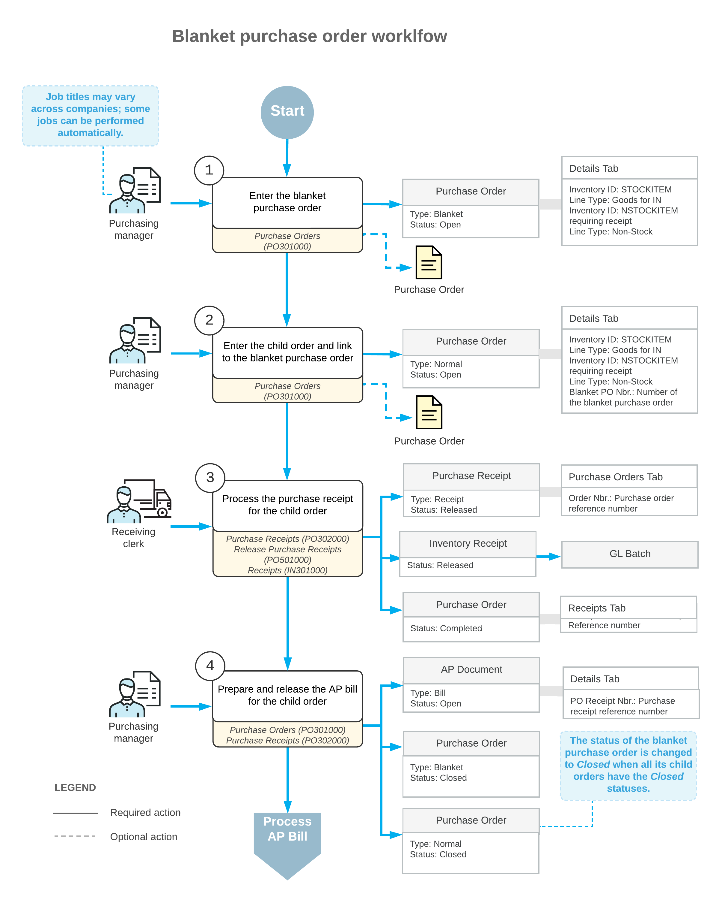

# Blanket Purchase Orders: General Information {#_4c127748-0b9d-42b7-bd93-c1def61a002f .concept}

In Acumatica ERP, a blanket purchase order is an order whose items are not directly fulfilled or billed. It contains a large item quantity that you enter to reflect your company's plans to buy this quantity over a period of time. A blanket purchase order has child orders, which are the linked purchase orders that include item quantities from the blanket order. The blanket purchase order is a parent order for the linked child orders. The items in the child orders are received and billed.

## Learning Objectives { .section}

In this chapter, you will do the following:

-   Become familiar with the general settings of a blanket purchase order and its child orders
-   Create a blanket purchase order
-   Create child orders for the blanket purchase order
-   Process the blanket purchase order to completion

## Applicable Scenarios { .section}

You process blanket purchase orders in the following cases:

-   You need to record the planned purchases of large quantities of items from the same vendor over a specified period of time.
-   A vendor offers considerable volume discounts or the specified goods are not always available from the vendor, and you want to ensure their availability when they are needed.

## Blanket Purchase Orders { .section}

To create a blanket purchase order in Acumatica ERP, you select *Blanket* in the **Type** box of the [Purchase Orders](PO_30_10_00.md) \(PO301000\) form. In the **Expires On** box of the Summary area, you can specify an expiration date after which a child order can no longer be linked to the blanket purchase order.

On the **Details** tab, you add the needed items and the quantity that you plan to buy over a period of time. You can add both stock items and non-stock items to a blanket purchase order.

You also use the [Purchase Orders](PO_30_10_00.md) form to create multiple child orders for a blanket purchase order, which are purchase orders of the *Normal* or *Drop-Ship* type. On the **Details** tab, you link a child order to the blanket purchase order that has the *Open* status in either of the following ways:

-   By clicking the **Add Blanket PO Line** button on the table toolbar, and in the **Add Purchase Order Line** dialog box, which opens, selecting the blanket purchase order, then selecting the needed lines, and clicking **Save**
-   By clicking the **Add Blanket PO** button on the table toolbar, and in the **Add Purchase Order** dialog box, which opens, selecting the needed blanket purchase order, and clicking **Save**

When you add the needed order lines by using either of the dialog boxes, the unit costs and open item quantities are copied from the blanket order to the child order. After making any needed changes to the unit costs and item quantities, you save the child order. When a child order is linked to a blanket purchase order, these orders' item settings on the **Details** tab are affected as follows:

-   In each line of the blanket order, the **Blanket Open Qty.** quantity of each item is reduced by the quantity specified for the item in this child order.
-   In each line of a child order, the link to the blanket purchase order is inserted in the **Blanket PO Nbr.** column.

## Tracking of Received Items' Quantities and Related Documents { .section}

When you are viewing a blanket purchase order on the [Purchase Orders](PO_30_10_00.md) \(PO301000\) form, you can track the quantity of items received at warehouses by doing the following:

-   On the **Details** tab, by viewing item quantities in the **Qty. on Orders**, **Blanket Open Qty.**, and **Qty. on Receipts** columns.
-   On the **PO History** tab, in the left table, you can view the information about the blanket order’s child orders and their related purchase receipts and returns. In the right table, you can view the information about the AP bills and debit adjustments created for child orders and related purchase receipts or returns.

## Processing of a Blanket Purchase Order { .section}

To process a blanket purchase order, you perform the following general steps:

1.  You create a blanket purchase order on the [Purchase Orders](PO_30_10_00.md) \(PO301000\) form. The blanket purchase order contains the full quantity of items to be included in and fulfilled through the associated child orders.
2.  Also on the [Purchase Orders](PO_30_10_00.md) form, you create the needed child orders at the time of the blanket purchase order's creation or at some later time. You link each child order to the blanket purchase order.
3.  You create and process the purchase receipts for the stock items as they are received in a warehouse. You use the child order on the [Purchase Orders](PO_30_10_00.md) form as a starting point for creating the associated purchase receipt. You release the purchase receipts on the [Purchase Receipts](PO_30_20_00.md) \(PO302000\) form. This causes the corresponding inventory receipt transaction to be generated on the [Receipts](IN_30_10_00.md) \(IN301000\) form with the date and posting period of the purchase receipt. As a result, the system updates the inventory on hand with the quantity and cost of the received items and generates a batch of GL transactions to update account balances.

    When the entire quantity of items included in a blanket order has been purchased and received through child orders—that is, each child order has the *Completed* status, and each purchase receipt linked to each child order has the *Released* status—the system changes the blanket order's status to *Completed*.

4.  For each child order, you create and process an AP bill on the [Bills and Adjustments](AP_30_10_00.md) \(AP301000\) form.

    When the AP bill linked to each child order has the *Open* status, and each child order has the *Closed* status, the blanket order's status is changed to *Closed*.

## Workflow of the Processing of Blanket Purchase Orders {#section_vv2_1y4_y4b .section}

The general workflow of processing of a blanket purchase order involves the steps and generated documents shown in the following diagram.

**Parent topic:**[Processing Blanket Purchase Orders](../UserGuide/OrderMgmt_Blanket_Purchase_Orders_Mapref.md)

