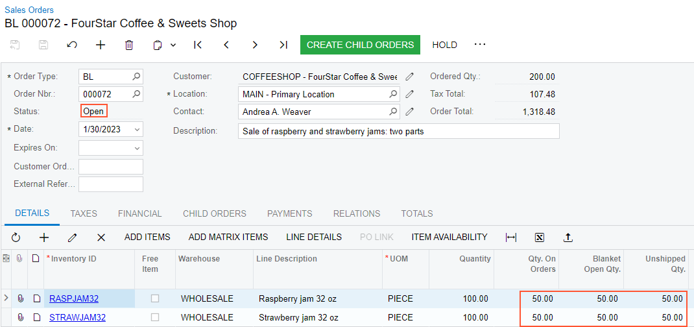
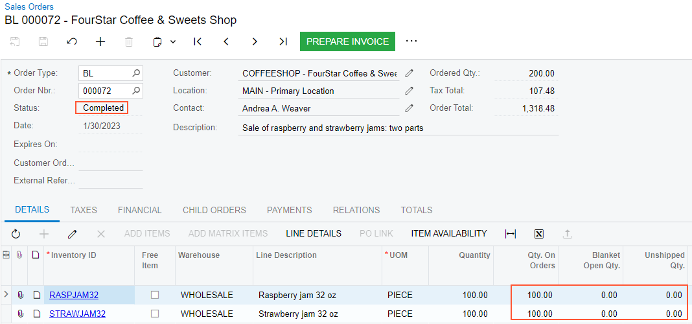

# Blanket Sales Orders: Process Activity {#_02923216-a744-45bd-bedf-2fd920363784 .task}

The following activity will walk you through the processing of a blanket sales order.

## Story { .section}

Suppose that you are Grace Norman, a sales manager of the SweetLife Fruits &amp; Jams company. On January 30, 2026, the GoodFood One Restaurant wholesale customer has ordered 200 jars of kiwi and banana jams, each in 32-ounce jars, from the main office of SweetLife, where you are employed. The ordered jams are stored in the warehouse of the SweetLife’s main office. The manager of the GoodFood One Restaurant wants to split the purchase into two parts:

-   The sale of half of the goods should be processed now.
-   The sale of the rest of the goods must be processed in July of the current year.

You need to enter and process the appropriate documents.

## Configuration Overview {#section_tz4_djx_cnb .section}

In the *U100* dataset, the following tasks have been performed to support this activity:

-   On the [Enable/Disable Features](CS_10_00_00.md) \(CS100000\) form, the following features have been enabled:
    -   *Inventory and Order Management*, which provides the standard functionality of inventory and order management
    -   *Inventory*, which gives you the ability to maintain stock items by using forms related to the inventory functionality and to create and process sales and purchase documents that include stock items
-   On the [Order Types](SO_20_10_00.md) \(SO201000\) form, the *SO* order type has been configured and activated.
-   On the [Customers](AR_30_30_00.md) \(AR303000\) form, the *GOODFOOD \(GoodFood One Restaurant\)* customer has been defined.
-   On the [Stock Items](IN_20_25_00.md) \(IN202500\) form, the *RASPJAM32* and *STRAWJAM32* stock items have been defined.
-   On the [Warehouses](IN_20_40_00.md) \(IN204000\) form, the *WHOLESALE* warehouse, which has been defined. In this warehouse, sufficient quantities of the *RASPJAM32* and *STRAWJAM32* items are on hand.

## System Preparation { .section}

Before you begin processing sales with blanket orders, do the following:

1.  Sign in to the system as the sales manager by using the *norman* username and the provided password.
2.  In the info area at the upper-right corner of the top pane of the Acumatica ERP screen, make sure that the business date is set to *1/30/2026*. If a different date is displayed, click the Business Date menu button and select *1/30/2026* from the calendar. For simplicity, you'll create and process all documents in this activity using this business date.
3.  On the Company and Branch Selection menu, in the top pane of the Acumatica ERP screen, make sure the *SweetLife Head Office and Wholesale Center* branch is selected.
4.  As a prerequisite activity, configure and activate the *BL* order type, as described in [Sales Order Types: To Activate the BL Order Type](../ImplementationGuide/config_Sales_Order_Types_To_Activate_BL_Order_Type.md)

## Step 1: Creating a Blanket Sales Order { .section}

To create a blanket sales order, do the following:

1.  On the [Sales Orders](SO_30_10_00.md) \(SO301000\) form, add a new record.
2.  In the Summary area, specify the following settings:
    -   **Order Type**: *BL*
    -   **Customer**: *COFFEESHOP*
    -   **Description**: `Sale of raspberry and strawberry jams: two parts`
3.  On the **Details** tab, add rows with the settings shown in the following table.

    |Inventory ID|Warehouse|Quantity|Unit Price|
    |------------|---------|--------|----------|
    |*RASPJAM32*|*WHOLESALE*|`100`|`7.47`|
    |*STRAWJAM32*|*WHOLESALE*|`100`|`4.64`|

4.  On the form toolbar, click **Save**.

## Step 2: Creating the Line Splits for Child Sales Orders { .section}

To create line splits for the generation of child orders, do the following:

1.  While you are still viewing the blanket sales order on the [Sales Orders](SO_30_10_00.md) form, click the line with the *RASPJAM32* item, and click **Line Details** on the table toolbar.
2.  In the **Line Details** dialog box, which opens, specify `50` in the **Quantity** column.

    The system automatically creates another line split with the remaining quantity of the item.

3.  In the new line created by the system, specify *7/3/2026* in the **Sched. Order Date** column.
4.  Click **OK** to close the **Line Details** dialog box.
5.  Select the line with the *STRAWJAM32* item, and repeat the actions in Instructions 1—4.
6.  On the form toolbar, click **Save**.

## Step 3: Processing the First Child Order { .section}

To generate a child order for the first line split, do the following:

1.  While you are still viewing the blanket sales order on the [Sales Orders](SO_30_10_00.md) \(SO301000\) form, click **Create Child Orders** on the form toolbar.

    The system creates a child order with the *SO* type for the first line split with the current business date and opens it on the same form.

2.  On the form toolbar, click **Quick Process**.
3.  In the **Process Order** dialog box, which opens, select the **Release Invoice** check box in the **Invoicing** section.
4.  Click **OK** to start processing the child sales order.

    The system opens the **Processing Results** dialog box and processes the child order to completion.

5.  Click **OK** to close the **Processing Results** dialog box.
6.  Notice that the child order has the *Completed* status, which means that the order has been processed to completion.
7.  In the line with the *RASPJAM32* item, click the link in the **Blanket SO Ref. Nbr.** column.

    The system opens the blanket sales order on the same form in a new browser window.

8.  Review the quantity in the **Qty. on Orders** and **Blanket Open Qty.** columns for both lines. The quantity is *50* in both columns, which means that half of the items have been transferred to the child sales order and the other half is still on the blanket sales order \(as shown in the following screenshot\). The blanket sales order has the *Open* status, which means that the processing of the order is not complete.

    

## Step 4: Processing the Second Child Order {#section_pgq_ksp_rvb .section}

To process the second child order, do the following:

1.  Close the browser window with the blanket sales order.
2.  In the info area, in the upper-right corner of the top pane of the Acumatica ERP screen, click the Business Date menu button, and select *7/3/2026* from the calendar.
3.  On the [Sales Orders](SO_30_10_00.md) \(SO301000\) form, open the blanket sales order that you have created in Step 1.
4.  On the form toolbar, click **Create Child Orders**.

    The system creates a child order with the *SO* type and opens it on the same form.

5.  On the form toolbar, click **Quick Process**.
6.  In the **Process Order** dialog box, which opens, select the **Release Invoice** check box in the **Invoicing** section.
7.  Click **OK** to start processing the child sales order.

    The system opens the **Processing Results** dialog box and processes the child order to completion.

8.  Click **OK** to close the **Processing Results** dialog box.
9.  In the line with the *RASPJAM32* item, click the link in the **Blanket SO Ref. Nbr.** column.

    The system opens the blanket sales order on the same form in a new browser window.

10. Review the quantity in the **Qty. on Orders** and **Blanket Open Qty.** columns for both lines. The quantity is *200* in the **Qty. on Orders** column, which means that all items have been transferred to the child sales orders. The quantity in the **Blanket Open Qty.** column is *0*, which means that there are no items left in the blanket sales order \(as shown in the following screenshot\). The blanket sales order has the *Completed* status, which means that the processing of the order is complete.

    

**Parent topic:**[Processing Blanket Sales Orders](../UserGuide/OrderMgmt_Blanket_Sales_Orders_Mapref.md)

