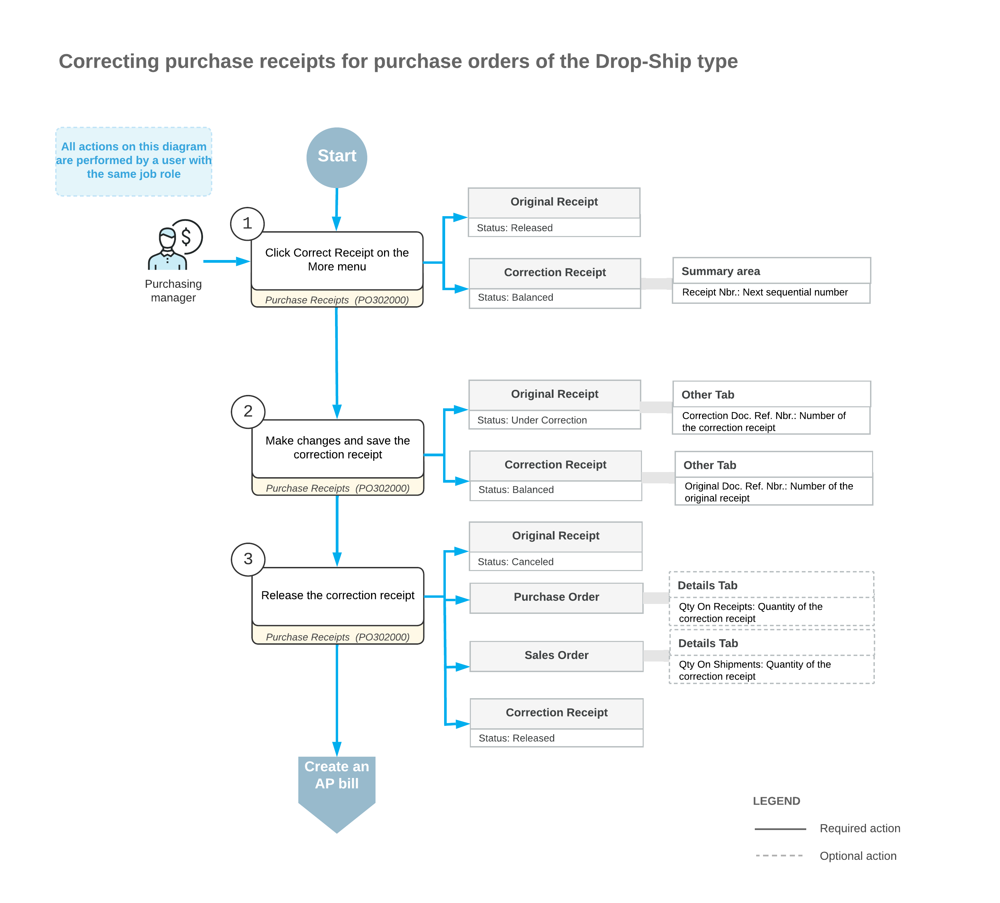

# Purchase Receipt Correction: Correction of Receipts for Drop-Ship Purchase Orders {#_698d340d-14de-4a94-9d08-860519b7917f .concept}

This topic explains how you can correct a released purchase receipt for a drop-ship purchase order—that is, a purchase order of the *Drop-Ship* type.

**Important:** Receipt correction is unavailable if the *Service Management* feature is enabled on the [Enable/Disable Features](CS_10_00_00.md) \(CS100000\) form or if the *Manufacturing* feature is enabled and at least one receipt line is linked to a production order material. If your company wants to enable one of these features, we highly recommend first verifying that there are no unreleased correction receipts in the system.

On the [Purchase Receipts](PO_30_20_00.md) \(PO302000\) form, you can correct a purchase receipt related to a drop-ship purchase order if this receipt has the *Released* status. While viewing the purchase receipt, you click **Correct Receipt** on the More menu. The system checks whether the purchase receipt meets all the requirements for correction \(as described in [Requirements for the Original Purchase Receipt](#_33d5967d-733a-4341-93af-fdc4fd1bf8af)\).

If the purchase receipt meets all requirements, the system creates a new purchase receipt with the next sequential number.

**Tip:** For simplicity, we use *correction receipt* to describe the newly created purchase receipt and *original receipt* for the purchase receipt in which you clicked **Correct Receipt**.

In the original receipt, the system inserts the number of the correction receipt as a clickable link in the **Correction Doc. Ref. Nbr.** box on the **Other** tab of the [Purchase Receipts](PO_30_20_00.md) form. Similarly, the correction receipt displays the original receipt number as a clickable link in the **Original Doc. Ref. Nbr.** box on the same tab.

The system copies all data from the original receipt to the correction receipt on the [Purchase Receipts](PO_30_20_00.md) form, and you can update the correction receipt. When you save the correction receipt for the first time, the system assigns the *Under Correction* status to the original receipt.

If you update a purchase receipt line on the **Details** tab, the system automatically selects the **Corrected** check box in this line. If you change the date or currency exchange rate in the Summary area, the system automatically selects the **Corrected** check box in all lines of the purchase receipt. This column is hidden by default. For more information about what you can change in the correction receipt, see [Editable Details and Settings of the Correction Purchase Receipt](#_45f38a04-96f6-45ce-b30a-671b241c18bc).

To complete the correction process, you click **Release** on the More menu. The system assigns the *Released* status to the correction receipt and the *Canceled* status to the original receipt.

## Results of Releasing the Correction Receipt { .section}

If the receipt quantity of a correction receipt line changes on the [Purchase Receipts](PO_30_20_00.md) \(PO302000\) form, the system does the following:

-   Updates the **Qty. On Receipts** column in the detail line of the related purchase order on the [Purchase Orders](PO_30_10_00.md) \(PO301000\) form
-   Updates the **Qty. On Shipments** and **Open Qty.** columns in the detail line of the related sales order on the [Sales Orders](SO_30_10_00.md) \(SO301000\) form

For each correction receipt line with a changed quantity, the system also changes the related purchase order and sales order based on whether the line's corrected receipt quantity has increased or decreased:

-   If the line's quantity has decreased, the system does the following:
    -   Reopens the corresponding lines of the related sales and purchase orders if the lines have already been completed. That is, it clears the **Completed** check box for these lines on the **Details** tab of the [Purchase Orders](PO_30_10_00.md) and [Sales Orders](SO_30_10_00.md) form.
    -   If the purchase order had the *Completed* status but now has at least one reopened line, assigns the *Open* status to this purchase order.
    -   If the sales order had the *Completed* status but now has at least one reopened line, assigns another status \(based on the order's workflow\) to it.
-   If the line's quantity has increased, the system does the following:
    -   Selects the **Completed** check box in the corresponding lines of the related sales order and purchase order if the full quantity of the item has been received.
    -   If all lines of the related sales or purchase order become completed, assigns the *Completed* status to this order.

## Workflow of the Correction of a Purchase Receipt { .section}

The following diagram illustrates the workflow related to the correction of a purchase receipt for a drop-ship purchase order.

## Requirements for the Original Purchase Receipt {#_33d5967d-733a-4341-93af-fdc4fd1bf8af .section}

On the [Purchase Receipts](PO_30_20_00.md) \(PO302000\) form, you can correct a purchase receipt for a drop-ship purchase order only if the receipt meets all of these requirements:

-   It has at least one line of the *Goods for Drop-Ship* or *Non-Stock for Drop-Ship* type.
-   It contains no lines of the *Goods for IN* or *Non-Stock* type.
-   It has no related AP bills, except for AP bills that have been fully reversed.
-   No landed cost documents have been applied to the it.
-   It does not have related unreleased purchase returns.
-   Its lines are not included in sales invoices that haven't been canceled.
-   Its related purchase order has no related AP bills, except for those that have been fully reversed. The system checks the purchase order if it has the **Allow AP Bill Before Receipt** check box selected on the **Other** tab of the [Purchase Orders](PO_30_10_00.md) \(PO301000\) form.

## Editable Details and Settings of the Correction Purchase Receipt {#_45f38a04-96f6-45ce-b30a-671b241c18bc .section}

In a correction receipt for a drop-ship purchase order, you can update the following elements in the Summary area of the [Purchase Receipts](PO_30_20_00.md) \(PO302000\) form:

-   The **Date** box
-   The **Create AP Bill** check box
-   The **Vendor Ref.** box
-   The **Workgroup** box
-   The **Owner** box

You can also update the exchange rate in this area if both of following conditions are met:

-   The vendor has the **Enable Rate Override** check box selected on the **Financial** tab of the [Vendors](AP_30_30_00.md) \(AP303000\) form.
-   The **Allow Changing Currency Rate on Receipt** check box is selected on the [Purchase Orders Preferences](PO_10_10_00.md) \(PO101000\) form.

In a line of the correction receipt, you can edit the values in the following columns of the **Details** tab:

-   **Warehouse**
-   **Transaction Descr.**
-   **UOM**
-   **Receipt Qty.**
-   **Expiration Date**
-   **Lot/Serial Nbr.**
-   **Unit Cost**
-   **Ext. Cost**
-   **Account** \(only if the item is a non-stock item\)
-   **Subaccount** \(only if the item is a non-stock item\)
-   **Accrual Account**
-   **Accrual Sub.**

During the correction, if you accidentally make changes to a line on the **Details** tab, you can then click **Cancel** for this line on the table toolbar. The system will discard all changes and revert the line to its original state at the time of document creation. Also, it will clear the **Corrected** check box in the line. Note that if the **Corrected** check box in the line is selected due to the change of **Date** or **Exchange Rate** in the Summary area, it will remain selected.

## Restrictions Applied to the Original and Correction Receipts {#_8903481e-38c7-48bf-a5a3-4c77475dd1b9 .section}

While an original receipt has the *Under Correction* status, you can't do the following:

-   Create an AP bill associated with the original receipt by clicking the [Purchase Receipts](PO_30_20_00.md) \(PO302000\) form
-   Add it to an AP bill on the [Bills and Adjustments](AP_30_10_00.md) \(AP301000\) form
-   Recognize it on the [Incoming Documents](AP_30_11_00.md) \(AP301100\) form
-   Create a related purchase return on the [Purchase Receipts](PO_30_20_00.md) form
-   Apply it to a landed cost document on the [Purchase Receipts](PO_30_20_00.md) or [Landed Costs](PO_30_30_00.md) \(PO303000\) form

Also, you cannot include the lines of an original receipt with the *Under Correction* status in the following documents:

-   An AP bill for a related purchase order
-   A sales invoice for a related sales order

In a correction receipt, you can't add lines or delete lines that were copied from the original receipt. If a line in the original receipt was added by mistake, you can specify *0* in the **Receipt Qty.** column for the corresponding line in the correction receipt. This prevents the line from being included in any of the following related documents during the processing of the correction receipt:

-   AP bills
-   Sales invoices
-   Landed cost documents

## Correction of a Purchase Receipt with a Canceled Invoice {#ReleaseNotes-PurchaseReceiptCorrection_GRC_ForDrop-ShipReceipts-CorrectionorCancellationofDrop-ShipPOReceiptwithCanceledInvoice .section}

If a purchase receipt for a drop-ship purchase order has a related sales invoice that has been released, this receipt also has a related inventory issue. If you cancel the sales invoice and then correct the purchase receipt, the system cancels the original purchase receipt. The system also automatically generates and releases a reversal inventory issue with a reversal batch of transactions that fully reverse the transactions generated on the release of the original inventory issue. The reversal inventory issue is released automatically, regardless of the state of the **Release IN Documents Automatically** check box on the [Purchase Orders Preferences](PO_10_10_00.md) \(PO101000\) form.

The link to the reversal inventory issue appears in the **Reversal IN Ref. Nbr.** box on the **Other** tab of the [Purchase Receipts](PO_30_20_00.md) \(PO302000\) form.

**Parent topic:**[Correcting Purchase Receipts](../UserGuide/OrderMgmt_Correcting_Purchase_Receipt_Mapref.md)

