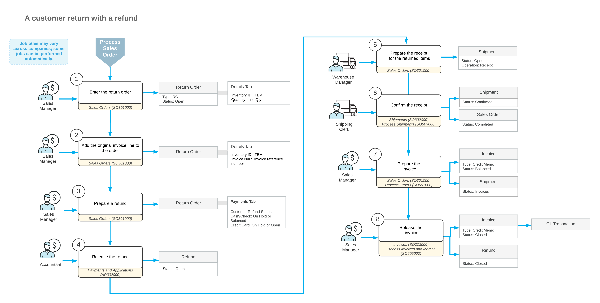

# Customer Returns with Refunds: General Information {#_93b237a8-6328-425e-beb6-d7446824b387 .concept}

A traceable refund for items returned by customers is an essential part of sales. In Acumatica ERP, you can create refunds directly in a return order on the [Sales Orders](SO_30_10_00.md) \(SO301000\) form or a credit memo on the [Invoices](SO_30_30_00.md) \(SO303000\) form. These refunds are automatically applied to the return order or credit memo.

## Learning Objectives { .section}

In this chapter, you will do the following:

-   Create a return order with goods that the customer returns
-   Process a refund applied to the return order
-   Process an incoming shipment \(receipt\) for goods that the customer returns
-   Process a credit memo for the return order

## Applicable Scenarios { .section}

You may need to create return orders or credit memos and apply a refund to them if your company sells goods, and customers pay for these goods but may later request a return. You need to refund the customers' payments and ensure that these refunds are applied to the related return orders or credit memos.

## Processing of a Refund for a Return Order { .section}

In general, the [Sales Orders](SO_30_10_00.md) \(SO301000\) form is the starting point for a customer return. On this form, you create a new return order for a customer and add the items to be returned.

To quickly add the items with links to the original sales invoice, you click **Add Invoice** on the table toolbar of the **Details** tab and select the invoice lines of returned items in the **Add Invoice Details** dialog box. You can also add items directly on the **Details** tab without the links to the initial sales invoice by clicking **Add Row** and selecting the returned items in the **Inventory ID** column.

After you have added the items to the return order and saved it, you click **Create Refund** on the table toolbar of the **Payments** tab. In the dialog box that opens, the system inserts the full amount of the return order; you can edit this amount, if required. When you click **OK** in this dialog box, the system creates a refund and applies it to the return order. To release the refund with the *Cash/Check* payment method, you open it on the [Payments and Applications](AR_30_20_00.md) \(AR302000\) form and click **Release** on the form toolbar. The refunds with the *Credit Card* payment method are released automatically.

The receipt of the items returned to inventory is processed in the system as a shipment with the *Receipt* operation type, which indicates an incoming shipment. After you have prepared and confirmed this shipment, you need to update the customer's balance in the amount of the items by preparing and releasing a credit memo. This credit memo is a financial document in the system that contains links to the applicable shipments and sales orders. You can review the prepared credit memo on the [Invoices](SO_30_30_00.md) \(SO303000\) form; then you release it. When the credit memo is released, it becomes visible on the [Invoices and Memos](AR_30_10_00.md) \(AR301000\) form as an AR credit memo. The AR credit memo does not contain the links to the shipments and sales orders.

When you create a credit memo for a return order, the application of the refund is automatically transferred from the sales order to this credit memo. When you release the credit memo, the application of the released refund is also released.

## Processing of a Refund for a Credit Memo { .section}

While refunds can be processed through return orders, you can create and process a refund for a credit memo instead. This method is commonly used when you can issue the refund only after the returned goods have been received to the inventory, meaning that the return order has already been completed. Another applicable scenario for refunds on credit memos is a direct sale, for which you do not create a sales order.

On the [Invoices](SO_30_30_00.md) \(SO303000\) form, you create a new invoice of the *Credit Memo* type and save it; then you add lines with items to be returned by clicking **Add Return Line** on the table toolbar of the **Details** tab. After you have added the items, you click **Create Refund** on the table toolbar of the **Application** tab. In the dialog box that opens, the system inserts the full amount of the credit memo; you can edit this amount, if required. When you click **OK** in this dialog box, the system creates a refund and applies it to the credit memo. To release the refund with the *Cash/Check* payment method, you open it on the [Payments and Applications](AR_30_20_00.md) \(AR302000\) form and click **Release** on the form toolbar. The refunds with the *Credit Card* payment method are released automatically.

After you have processed the refund, you release the credit memo on the [Invoices](SO_30_30_00.md) form; when you release it, the application of the released refund is also released.

## Settings of Return Documents for Processing a Refund { .section}

If a refund is created in a return order on the [Sales Orders](SO_30_10_00.md) \(SO301000\) form, the return order must have an order type for which settings have been specified as follows on the [Order Types](SO_20_10_00.md) \(SO201000\) form:

-   On the **General** tab, the **Allow Refund Before Return** check box is selected.
-   On the **Template** tab, the following settings have been specified:
    -   In the **Automation Behavior** box, the *RMA Order*, *Credit Memo*, or *Mixed Order* behavior is selected.
    -   In the **AR Document Type** box, any type except for *No Update* is selected.
    -   For order types with the *RMA Order* and *Credit Memo* behavior, in the **Operations** table, only one active operation is listed with *Receipt* selected in the **Operations** column.

In Acumatica ERP, the predefined *RC*, *CM*, and *MO* order types meet these criteria and can be used to create and process a refund.

On the [Invoices](SO_30_30_00.md) \(SO303000\) form, you create a refund for a credit memo, which is an invoice of the *Credit Memo* type.

## Workflow of Processing a Refund for a Return Order {#section_vv2_1y4_y4b .section}

The processing of a customer return with a refund involves the actions and generated documents shown in the following diagram.

**Parent topic:**[Processing Customer Returns with Refunds](../UserGuide/OrderMgmt_Customer_Returns_with_Refunds_Mapref.md)

