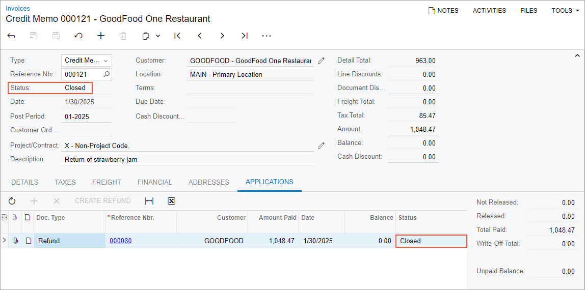

# Customer Returns with Refunds: Process Activity {#_80183fcf-ac01-4a9d-960b-30e6ba3f2c5c .task}

This activity will walk you through the process of creating and processing a return order with a refund.

**Attention:** This activity is based on the *U100* dataset. If you are using another dataset or if any system settings have been changed in *U100*, these changes can affect the workflow of the activity and the results of the processing. To avoid issues, restore the *U100* dataset to its initial state.

## Story { .section}

Suppose that on January 18, 2026, the GoodFood One Restaurant ordered jars of strawberry jam, which were delivered on that day. The customer paid for the jam, and the payment was applied to the original invoice. Then on January 30, 2026, a manager of the GoodFood One Restaurant discovered that some of the jars of the strawberry jam were damaged and decided to return all the jars. GoodFood One Restaurant requested a refund of their payment.

Acting as a sales manager, you will process the refund of the payment and the return of the items to SweetLife’s main warehouse.

## Configuration Overview {#section_tz4_djx_cnb .section}

In the *U100* dataset, the following configuration tasks have been performed to prepare the system for this activity to be performed:

-   The *Inventory* feature in the *Inventory and Order Management* group of features has been enabled on the [Enable/Disable Features](CS_10_00_00.md) \(CS100000\) form.
-   On the [Order Types](SO_20_10_00.md) \(SO201000\) form, the *RC* order type has been configured and activated.
-   On the [Customers](AR_30_30_00.md) \(AR303000\) form, the *GOODFOOD \(GoodFood One Restaurant\)* customer has been created.
-   On the [Stock Items](IN_20_25_00.md) \(SO202500\) form, the *APJAM96* item has been created.
-   The following sales documents, for which you will process a customer return, have been created in the system:
    -   A sales order on the [Sales Orders](SO_30_10_00.md) \(SO301000\), which has the *Completed* status.
    -   A shipment on the [Shipments](SO_30_20_00.md) \(SO302000\), which has the *Completed* status.
    -   A sales invoice on the [Invoices](SO_30_30_00.md) \(SO303000\) form, which has the *Closed* status.

## Process Overview { .section}

In this activity, you will first create a return order of the *RC* type on the [Sales Orders](SO_30_10_00.md) \(SO301000\) form. You will add to this order a line of a sales invoice. Then you will create a refund by clicking **Create Refund** on the table toolbar on the **Payments** tab.

On the [Payments and Applications](AR_30_20_00.md) \(AR302000\) form, you will release the refund you have created. After that, on the [Shipments](SO_30_20_00.md) \(SO302000\) form, you will record the receipt of the returned items to inventory by creating and confirming a shipment with the *Receipt* operation. As the final step, on the [Invoices](SO_30_30_00.md) \(SO303000\) form, you will create and release a credit memo to adjust the customer's balance in the system by the amount of the returned items.

## System Preparation { .section}

Do the following:

1.  Launch the Acumatica ERP website and sign in to a company with the *U100* dataset preloaded. You should sign in as a sales manager by using the *norman* username and the *123* password.
2.  In the info area at the upper-right corner of the top pane of the Acumatica ERP screen, make sure that the business date is set to *1/30/2026*. If a different date is displayed, click the Business Date menu button and select *1/30/2026* from the calendar. For simplicity, you'll create and process all documents in this activity using this business date.

## Step 1: Creating a Return Order { .section}

You create a return order as follows:

1.  On the [Sales Orders](SO_30_10_00.md) \(SO301000\) form, add a new record.

    **Tip:** To open the form for creating a new record, type the form ID in the Search box, and on the Search form, point at the form title and click **New** right of the title.

2.  Specify the following settings in the Summary area:
    -   **Order Type**: *RC*
    -   **Customer**: *GOODFOOD*
    -   **Date**: *1/30/2026*
    -   **Requested On**: *1/30/2026*
    -   **Description**: `Return of strawberry jam`
3.  On the form toolbar, click **Save**.

## Step 2: Adding the Item to Be Returned { .section}

Now you need to add a line of the sales invoice to the return order. Do the following:

1.  While you are still viewing the return order on the [Sales Orders](SO_30_10_00.md) \(SO301000\) form, on the table toolbar of the **Details** tab, click **Add Invoice**.
2.  In the **Add Invoice Details** dialog box, which opens, do the following:
    1.  In the **AR Doc. Type** box, select *Invoice*.
    2.  In the **AR Doc. Nbr.** box, select the reference number of the invoice to *GOODFOOD* in the amount of *1048.47* dated *1/18/2026*. The invoice lines appear in the table of the dialog box.
    3.  In the table, select the unlabeled check box in the *STRAWJAM96* line.
    4.  Click **Add &amp; Close**, which closes the dialog box and adds the line to the **Details** tab of the return order.
3.  On the form toolbar, click **Save**.

## Step 3: Creating a Refund { .section}

To create a refund, do the following:

1.  While you are still viewing the return order on the [Sales Orders](SO_30_10_00.md) \(SO301000\) form, on the table toolbar of the **Payments** tab, click **Create Refund**.
2.  In the **Create Refund** dialog box, which opens, make sure that *1048.47* is specified in the **Refund Amount** box. This is the amount of the payment in the original invoice.
3.  Make sure that *CHECK - Check Payment* is selected in the **Payment Method** box.
4.  Click **OK** to close the dialog box.

    The system creates a refund for the *GOODGOOD* customer and applies it to the return order.

5.  In the only line on the **Payments** tab, click the link in the **Reference Nbr.** column.

    The system opens the refund on the [Payments and Applications](AR_30_20_00.md) \(AR302000\) form in a new browser window.

6.  On the form toolbar, click **Remove Hold** and then click **Release**.
7.  Close the browser window with the [Payments and Applications](AR_30_20_00.md) form.

The refund has been created and released. Now you can process the incoming shipment.

## Step 4: Receiving the Returned Items { .section}

To receive the returned items, you process the incoming shipment as follows:

1.  While you are still viewing the return order on the [Sales Orders](SO_30_10_00.md) \(SO301000\) form, on the form toolbar, click **Create Receipt**.
2.  In the **Specify Shipment Parameters** dialog box, which opens, make sure that *1/30/2026* is selected as the **Shipment Date** and *WHOLESALE* is selected as the **Warehouse ID**.
3.  Click **OK**. The system closes the dialog box and opens the prepared shipment with the *Receipt* operation on the [Shipments](SO_30_20_00.md) \(SO302000\) form.
4.  On the form toolbar, click **Confirm Shipment**.

## Step 5: Processing a Credit Memo { .section}

Now that you have processed the return of the items to inventory, you need to prepare a credit memo for the customer to adjust the customer's balance and apply the refund to the credit memo. Do the following:

1.  While you are still viewing the shipment on the [Shipments](SO_30_20_00.md) \(SO302000\) form, on the form toolbar, click **Prepare Invoice**. The system creates a credit memo \(that is, a document with the *Credit Memo* type\) for the customer and opens it on the [Invoices](SO_30_30_00.md) \(SO303000\) form.
2.  On the form toolbar, click **Release** to release the credit memo.
3.  On the **Applications** tab of the [Invoices](SO_30_30_00.md) form, review the only line \(which has the refund\), as shown in the following screenshot. Notice that the credit memo and refund have the *Closed* status. This means that the refund has been applied to the credit memo and the customer return with the refund has been processed to completion.

    

**Parent topic:**[Processing Customer Returns with Refunds](../UserGuide/OrderMgmt_Customer_Returns_with_Refunds_Mapref.md)

