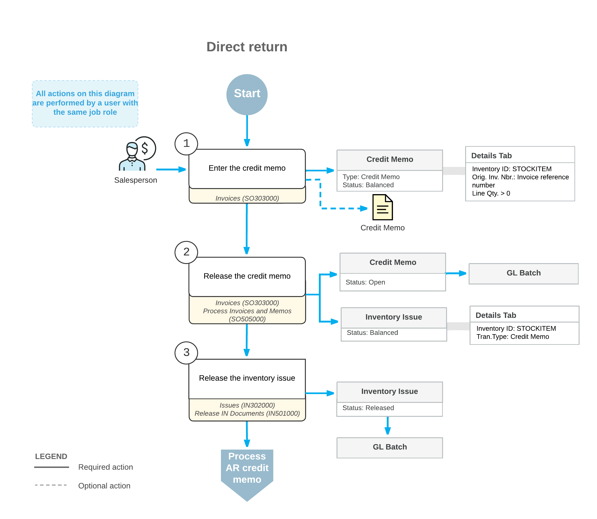

# Direct Returns: General Information {#_e1ab75e1-266f-46de-8fb1-43a75f5ce439 .concept}

A point-of-sale \(POS\) system is an electronic system that is used to record the sales, payment, and return transactions of a retail store. The POS system can be operated by a cashier or can be a self-service terminal where customers perform all operations. Your organization can integrate Acumatica ERP with an external POS system for simplified processing of direct returns if the *Advanced SO Invoices* feature is enabled on the [Enable/Disable Features](CS_10_00_00.md#) \(CS100000\) form.

With a *direct return*, a customer returns stock items directly to the retail store rather than shipping them. In the POS system, a direct return is processed through the creation of a credit memo—a sales-related document of the *Credit Memo* type created on the [Invoices](SO_30_30_00.md) \(SO303000\) form.

## Learning Objectives { .section}

In this chapter, you will do the following:

-   Create a credit memo \(an invoice of the *Credit Memo* type\) for a direct return
-   Add to the credit memo a return line with a link to an original sales document
-   Add to the credit memo a replacement line
-   Process the direct return to completion

## Applicable Scenarios { .section}

You may need to create and process a direct return in the following cases:

-   A customer returns goods directly at the store. In this case, you process a credit memo in the system.
-   A customer returns goods directly at the store and requests the replacement of returned items. In this case, you process either a credit memo or a sales invoice, and the document includes both return lines and replacement \(sales\) lines.

## Direct Return Process { .section}

You use the [Invoices](SO_30_30_00.md) \(SO303000\) form to enter a credit memo \(an invoice of the *Credit Memo* type\), and you add a line for each returned or replaced item. To add a line \(or multiple lines\) with a link to related sales invoice, you click **Add Return Line** on the table toolbar of the **Details** tab. In the dialog box that opens, you select the invoice line or lines to be added as return lines to the document you are creating. In the added line, you can correct the quantity to be returned if partial return of the item quantity is requested \(for example, if four units of the item were purchased and the customer is returning only two\). For serialized items, you should add a separate line with this item and a quantity of 1 for each serial number.

To release the credit memo, you click **Release** on the More menu. The system does the following:

-   Automatically generates a batch of general ledger transactions.
-   Automatically generates and releases an inventory issue for the stock items, which causes the system to increase the on-hand quantity with the quantity of the returned items. For return lines, the system adds lines with the *Credit Memo* transaction type to the inventory issue.
-   Makes the credit memo visible on the [Invoices and Memos](AR_30_10_00.md) \(AR301000\) form as an AR credit memo.

An AR credit memo on the [Invoices and Memos](AR_30_10_00.md) form is a financial document that does not contain links to the applicable shipments and sales orders, as the credit memo \(an invoice of the *Credit Memo* type\) does. The credit memos have the same reference number, which the system prints in the customer statement. On both the [Invoices](SO_30_30_00.md) form and the [Invoices and Memos](AR_30_10_00.md) form, you can view the link to the batch of the general ledger transactions that was generated when the credit memo was released.

## Workflow of a Direct Return { .section}

For a credit memo created for processing a direct return, the typical processing involves the actions and generated documents shown in the following diagram.

**Parent topic:**[Processing Direct Returns](../UserGuide/OrderMgmt_Direct_Returns_Mapref.md)

