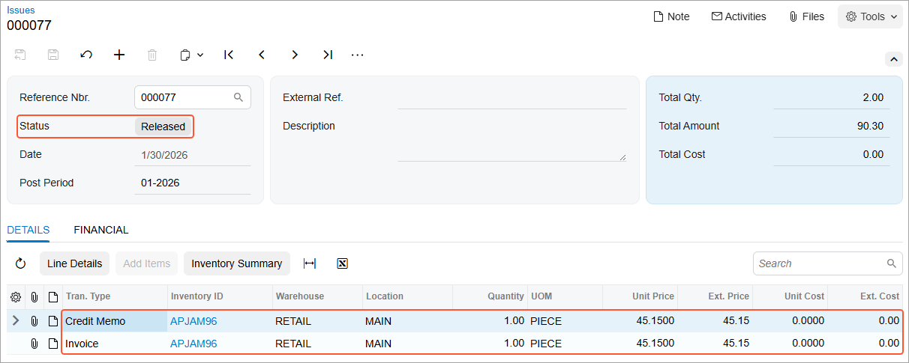

# Direct Returns: Process Activity {#_039666b3-671d-4af9-8659-9035ee0bab78 .task}

In this activity, you will learn how to process a direct return of stock items through a point-of-sale \(POS\) terminal, and how to process a replacement of the returned items.

**Attention:** This activity is based on the *U100* dataset. If you are using another dataset or if any system settings have been changed in *U100*, these changes can affect the workflow of the activity and the results of the processing. To avoid issues, restore the *U100* dataset to its initial state.

## Story { .section}

Suppose that on January 30, 2026, an employee of the small retail customer FourStar Coffee &amp; Sweets Shop came to the SweetLife store and asked for an exact replacement of a large jar of apple jam that is leaking. This jar is one of ten jars that were bought two days ago, on January 28, 2026.

Acting as the sales manager of the SweetLife company, you need to process the return of the jar and the sale of the new jar by using the POS terminal. The previous sale, dated January 28, 2026, was recorded through the sales invoice \(created automatically through the integration of the POS system and Acumatica ERP\), which was paid in full and now has the *Closed* status. You need to replace the inventory item with the same item at the same price, so that no payment needs to be processed.

## Configuration Overview { .section}

In the *U100* dataset, for the purposes of this activity, the following tasks have been performed:

-   On the [Enable/Disable Features](CS_10_00_00.md) \(CS100000\) form, the following features have been enabled:
    -   *Inventory and Order Management*, which provides the standard functionality of inventory and order management
    -   *Inventory*, which gives you the ability to maintain stock items by using forms related to the inventory functionality and to create and process sales and purchase documents that include stock items
    -   *Advanced SO invoices*, which provides support for direct sales and returns and integration with POS systems
-   In the SweetLife store, the integration between the store’s POS system and Acumatica ERP has been configured to work as follows:
    -   When the sales manager processes a return through the POS system, the POS system creates an invoice of the *Credit Memo* type with the item or items being returned on the [Invoices](SO_30_30_00.md) \(SO303000\) form.
    -   If any lines of a direct return relate to an existing sales order, the POS operator selects the needed order directly via the terminal when processing a return.

        **Tip:** In this activity, to simulate the POS functionality that occurs in a production system, you will add a return line with a link to the original sales invoice.

    -   To process a replacement, the sales manager adds to this credit memo a line with the same inventory item or items and a quantity with the opposite sign.
    -   When the sales manager releases the credit memo, Acumatica ERP creates an inventory issue that includes two lines with different operation types: one line adds the returned item or items to inventory, and another line issues the replacement item or items from inventory.
-   On the [Customers](AR_30_30_00.md) \(AR303000\) form, the *COFFEESHOP* customer has been created.
-   On the [Stock Items](IN_20_25_00.md) \(IN202500\) form, the *APJAM96* stock item has been created.
-   On the [Invoices](SO_30_30_00.md) \(SO303000\) form, the sales invoice for which you will process a return has been entered into the system.

## Process Overview { .section}

In this activity, to handle a direct return, you will create a credit memo on the [Invoices](SO_30_30_00.md) \(SO303000\) form. You will add the appropriate lines to the credit memo, some of which are linked to the original sales order and some of which are for replacement items and have a negative quantity. Then you will release the invoice to process both the receipt of returned items to inventory and the issue of replacement items from inventory.

## System Preparation { .section}

Before you start replacing the inventory item with the same item at the same price, do the following:

1.  Launch the Acumatica ERP website with the *U100* dataset preloaded, and sign in as sales manager Joseph Becher by using the *becher* username and the *123* password.
2.  In the info area at the upper-right corner of the top pane of the Acumatica ERP screen, make sure that the business date is set to *1/30/2026*. If a different date is displayed, click the Business Date menu button and select *1/30/2026* from the calendar. For simplicity, you'll create and process all documents in this activity using this business date.

## Step 1: Entering a Credit Memo { .section}

To enter a credit memo, do the following:

1.  On the [Invoices](SO_30_30_00.md) \(SO303000\) form, add a new record.
2.  In the Summary area, specify the following settings:
    -   **Type**: *Credit Memo*
    -   **Customer**: *COFFEESHOP*
    -   **Date**: *1/30/2026*
    -   **Post Period**: *01-2026*
    -   **Description**: `Replacement of the leaking jar`
3.  On the form toolbar, click **Remove Hold**. Notice that the credit memo has the *Balanced* status.

## Step 2: Adding the Return Line { .section}

To add a line with the item to be returned, do the following:

1.  While you are still viewing the credit memo on the [Invoices](SO_30_30_00.md) \(SO303000\) form, on the table toolbar of the **Details** tab, click **Add Return Line**.
2.  In the **Add Return Line** dialog box, which opens, select the unlabeled check box in the line dated *1/28/2026* with the *APJAM96* item, and click **Add &amp; Close**. The system adds the return line to the credit memo and closes the dialog box.
3.  In the line added to the credit memo, change the **Quantity** to `1` \(because only one of the jars is being returned\). In the **Orig. Inv. Nbr.** column in the line, notice that the system has inserted the reference number of the original invoice for which the return is being performed.
4.  On the form toolbar, click **Save**.

## Step 3: Adding the Replacement Line { .section}

To add the line with the replacement item the credit memo, do the following:

1.  While you are still viewing the credit memo on the [Invoices](SO_30_30_00.md) \(SO303000\) form, on the **Details** tab, add one more line \(for the replacement item\) with the following settings:
    -   **Inventory ID**: *APJAM96*
    -   **Warehouse**: *RETAIL*
    -   **Quantity**: `-1`

        The quantity is negative because the item is to be issued from inventory.

    -   **Unit Price**: `45.15` \(the same as in the line with the item being returned\)
2.  On the form toolbar, click **Save**.

## Step 4: Releasing the Credit Memo { .section}

To release the credit memo, do the following:

1.  While you are still viewing the credit memo on the [Invoices](SO_30_30_00.md) \(SO303000\) form, on the form toolbar, click **Release**.

    Notice that the status of the credit memo is now *Closed*. On release of the credit memo, the returned item has been received to inventory, and the replacement item has been issued from inventory. Because the price of the returned item was the same as the price of the replacement item, the credit memo balance is *0.00*; thus, no payment needs to be processed.

2.  On the **Details** tab, in either of the lines, click the link in the **Inventory Ref. Nbr.** column. On the [Issues](IN_30_20_00.md) \(IN302000\) form, the system opens the inventory issue that was generated on release of the credit memo.
3.  On this form, review the settings of the inventory issue, and make sure the inventory issue has the *Released* status, as shown in the following screenshot. Notice that the line with the returned item has the *Credit Memo* transaction type, while the line with the replacement item has the *Invoice* transaction type.

    

**Parent topic:**[Processing Direct Returns](../UserGuide/OrderMgmt_Direct_Returns_Mapref.md)

