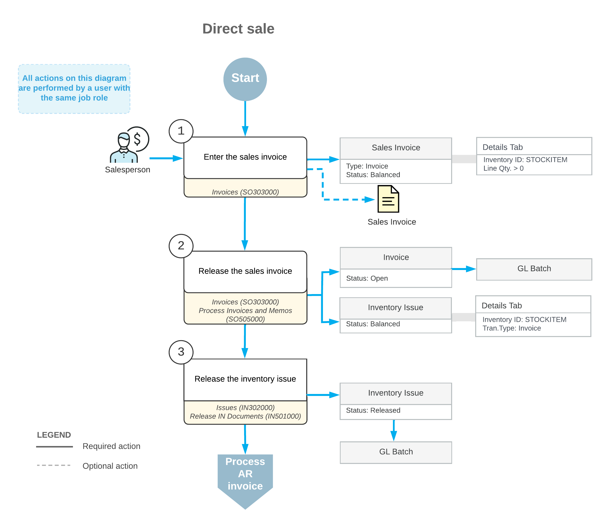

# Direct Sales: General Information {#_74a73f5b-0941-4e98-9cfe-463d49ecdfe0 .concept}

A point-of-sale \(POS\) system is an electronic system that is used to record the sales, payment, and return transactions of a retail store. The POS system can be operated by a cashier or can be a self-service terminal where customers perform all operations. Your organization can integrate Acumatica ERP with an external POS system for simplified processing of direct sales if the *Advanced SO Invoices* feature is enabled on the [Enable/Disable Features](CS_10_00_00.md#) \(CS100000\) form.

With a *direct sale*, a customer purchases and immediately procures goods and services in the retail store. These purchased items may or may not be linked to a sales order that the customer has placed previously. In the POS system, a direct sale is processed through the creation of a sales invoice on the [Invoices](SO_30_30_00.md) \(SO303000\) form. The processing of the sales invoice records the sale and updates inventory without a sales order and a shipment being processed.

## Learning Objectives { .section}

In this chapter, you will do the following:

-   Create a sales invoice for a direct sale
-   Add to the sales invoice a sale line not linked to a previously prepared sales order
-   Add to the sales invoice a line with a link to a previously prepared sales order
-   Process the direct sale to completion

## Applicable Scenarios { .section}

You may need to create and process a direct sale in the following cases:

-   A customer comes to the retail store, purchases goods, and directly procures the items, so that you need to process a direct sale through the POS system. In this case, you create and process only the sales invoice; there is no need to process a related shipment or sales order.
-   A customer picks up all or a part of items included in a sales order that has been added to the system based on a phone or online sale. In this case, you need to process a direct sale through the POS system by linking the sales invoice you create to the related sales order.

## Direct Sale Process { .section}

To process a direct sale, you create a sales invoice of the *Invoice* type on the [Invoices](SO_30_30_00.md) \(SO303000\) form. To the sales invoice, you add a line for each item included in the sale, and specify the quantity of items to be sold. For serialized items, you should add a separate invoice line with this item and a quantity of 1 for each serial number.

To release the sales invoice, you click **Release** on the More menu. The system does the following:

-   Automatically generates a batch of general ledger transactions.
-   Automatically generates and releases an inventory issue for the stock items, which causes the system to decrease the on-hand item quantity. For the lines in the sales invoice, the system adds to the inventory issue lines with the *Invoice* transaction type.
-   Makes the invoice visible on the [Invoices and Memos](AR_30_10_00.md) \(AR301000\) form as an AR invoice.

An AR invoice on the [Invoices and Memos](AR_30_10_00.md) form is a financial document that does not contain links to the applicable shipments and sales orders, as the sales invoice does. The AR invoice and sales invoice have the same reference number, which the system prints in the customer statement. On both the [Invoices](SO_30_30_00.md) form and the [Invoices and Memos](AR_30_10_00.md) form, you can view the link to the batch of the general ledger transactions that was generated when the invoice was released. For more information on processing AR invoices, see [Processing AR Invoices](Finance_ARInvoices_Mapref.md).

## Workflow of a Direct Sale { .section}

For a sales invoice created for processing a direct sale, the typical processing involves the actions and generated documents shown in the following diagram.

**Parent topic:**[Processing Direct Sales](../UserGuide/OrderMgmt_Direct_Sales_Mapref.md)

