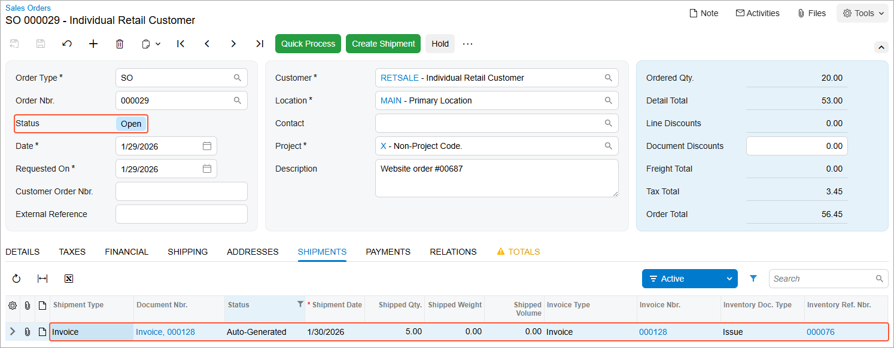

# Direct Sales: Process Activity {#_4ded85e9-f3f4-4360-8eb1-09e636b2eaf0 .task}

In this activity, you will learn how to process a direct sale through a point-of-sale \(POS\) terminal, and how to link an existing sales order to the direct sale.

**Attention:** This activity is based on the *U100* dataset. If you are using another dataset or if any system settings have been changed in *U100*, these changes can affect the workflow of the activity and the results of the processing. To avoid issues, restore the *U100* dataset to its initial state.

## Story { .section}

Suppose that on January 29, 2026, an individual customer \(that is, a customer purchasing items for personal use rather than for a company\) ordered five small jars of apple jam and 15 pounds of oranges on the company’s website, and selected the option to pick up the jars and pay for them in the SweetLife retail store. When the customer submitted the order on the website, a sales order was created in Acumatica ERP.

Then on January 30, 2026, the customer comes to SweetLife store and picks up ordered apple jam \(five small jars\) from the store shelves; the customer also picks up one small jar of orange jam \(which was not in the online sales order\). For the remainder of the website order, the customer asks to have the items shipped to the customer's address. The sales manager of the SweetLife store needs to scan the goods that the customer has picked up, enter them by using the POS terminal, and collect a payment from the customer. After the customer pays for the picked goods, sales manager Regina Wiley needs to give him a receipt. You will act as the sales manager in performing the needed actions in the system.

## Configuration Overview { .section}

In the *U100* dataset, for the purposes of this activity, the following tasks have been performed:

-   On the [Enable/Disable Features](CS_10_00_00.md) \(CS100000\) form, the following features have been enabled:
    -   *Inventory and Order Management*, which provides the standard functionality of inventory and order management
    -   *Inventory*, which gives you the ability to maintain stock items by using forms related to the inventory functionality and to create and process sales and purchase documents that include stock items
    -   *Advanced SO invoices*, which provides support for direct sales and returns and integration with POS systems
-   In the SweetLife store, the integration between the store’s POS system and Acumatica ERP has been configured to work as follows:
    -   When a sales manager processes a sale through the POS system, the POS system creates two documents in Acumatica ERP by using the API: a sales invoice on the [Invoices](SO_30_30_00.md) \(SO303000\) form with all the lines from the receipt given to the customer, and a released payment on the [Payments and Applications](AR_30_20_00.md) \(AR302000\) form that is linked to the sales invoice.
    -   If any lines of a direct sale relate to an existing sales order, the POS operator selects the needed lines directly via the POS terminal when processing a sale.

        **Tip:** In this activity, to simulate the POS functionality that occurs in a production system, you will link lines of an existing sales order to lines of the sales invoice.

    -   When the sales manager releases the sales invoice, Acumatica ERP creates an inventory issue that decreases the quantities of items in inventory by the quantity of the sold items.
-   On the [Customers](AR_30_30_00.md) \(AR303000\) form, the *RETSALE \(Individual Retail Customer\)* customer has been defined. This is the customer account used to represent any individual customer making a retail purchase in the store.
-   On the [Stock Items](IN_20_25_00.md) \(IN202500\) form, the *APJAM08* and *ORJAM08* stock items have been created.

## Process Overview { .section}

In this activity, to process a direct sale with a link to a sales order, you will create a payment on the [Payments and Applications](AR_30_20_00.md) \(AR302000\) form that will later be applied to a sales invoice used to record the direct sale. Then you will create this sales invoice on the [Invoices](SO_30_30_00.md) \(SO303000\) form. You will add the appropriate lines to the sales invoice. Then you will apply the payment to the sales invoice and release the sales invoice.

## System Preparation { .section}

Before you start processing a direct sale with a link to a sales order, you should do the following:

1.  Launch the Acumatica ERP website with the *U100* dataset preloaded, and sign in as sales manager Regina Wiley by using the *wiley* username and the *123* password.
2.  In the info area at the upper-right corner of the top pane of the Acumatica ERP screen, make sure that the business date is set to *1/30/2026*. If a different date is displayed, click the Business Date menu button and select *1/30/2026* from the calendar. For simplicity, you'll create and process all documents in this activity using this business date.
3.  On the Company and Branch Selection menu in the top pane of the Acumatica ERP screen, select the *SweetLife Store* branch.

## Step 1: Preparing a Payment { .section}

To prepare a payment document that represents the customer's payment for the direct sale, do the following:

1.  On the [Payments and Applications](AR_30_20_00.md) \(AR302000\) form, add a new record.
2.  In the Summary area, specify the following settings:
    -   **Type**: *Payment*
    -   **Customer**: *RETSALE*
    -   **Payment Method**: *CASH*
    -   **Cash Account**: *10100ST*
    -   **Application Date**: *1/30/2026* \(inserted by default\)
    -   **Application Period**: *01-2026* \(inserted by default\)
    -   **Description**: `Payment for retail sale`
    -   **Payment Amount**: `26.34`
3.  On the form toolbar, click **Remove Hold**.
4.  Click **Release**.

**Tip:** As an alternative to the workflow described in this activity, you can enter a sales invoice prior to entering a payment.

You have created and released the payment.

## Step 2: Entering a Sales Invoice { .section}

To enter a sales invoice to record the direct sale, do the following:

1.  On the [Invoices](SO_30_30_00.md) \(SO303000\) form, add a new record.
2.  In the Summary area specify the following settings:
    -   **Type**: *Invoice*
    -   **Customer**: *RETSALE*
    -   **Date**: *1/30/2026* \(inserted by default\)
    -   **Post Period**: *01-2026* \(inserted by default\)
    -   **Description**: `Retail sale, website order #00687 partial`
3.  On the **Details** tab, add a row for the jar of orange jam the customer picks up in the retail store, and specify the following settings:
    -   **Branch**: *RETAIL*
    -   **Inventory ID**: *ORJAM08*
    -   **Warehouse**: *RETAIL*
    -   **Quantity**: `1`
    -   **Unit Price**: `3.44`
4.  To add a line for the jars of apple jam in the already-entered sales order, on the table toolbar of the **Details** tab, click **Add SO Line**.
5.  In the **Add SO Line** dialog box, which opens, select the unlabeled check box in the line with *APJAM08* item, and click **Add &amp; Close**.

    The system adds the line to the sales invoice with a link to the sales order on which the item was added. Notice that in the **Order Type** and **Order Nbr.** columns in this line, the system has inserted the type of the related sales order and the link to the order. In the sales invoice line that you have added, these columns are empty thus indicating that this line is not related to a sales order.

6.  On the form toolbar, click **Remove Hold**; the invoice now has the *Balanced* status.
7.  On the form toolbar, click **Save**.

## Step 3: Applying the Payment to the Sales Invoice {#_1a4f2844-ef95-4cac-ab1b-e98f5fed907b .section}

To apply the payment to the sales invoice, do the following:

1.  While you are still viewing the invoice on the [Invoices](SO_30_30_00.md) \(SO303000\) form, on the table toolbar of the **Applications** tab, click **Load Documents**. The system adds a line with the payment that you have created in Step 1 of this activity.
2.  In the **Amount Paid** column, specify `26.34` \(which is the payment amount to be applied to the invoice\).
3.  On the form toolbar, click **Save**.

## Step 4: Releasing the Sales Invoice { .section}

To release the sales invoice, do the following:

1.  While you are still viewing the sales invoice on the [Invoices](SO_30_30_00.md) \(SO303000\) form, click **Release** on the form toolbar. Notice that the invoice now has the *Closed* status.
2.  On the **Details** tab, in either of the invoice lines, click the link in the **Inventory Ref. Nbr.** column.

    The system opens the [Issues](IN_30_20_00.md) \(IN302000\) form in a pop-up window with the inventory issue that was generated on release of the sales invoice.

3.  On this form, review the details of the inventory issue, and make sure that it includes both invoice lines, and it has a status of *Released*.
4.  Return to the [Invoices](SO_30_30_00.md) \(SO303000\) form with the sales invoice that you have processed, and on the **Details** tab, click the **Order Nbr.** link in the *APJAM08* line to open the related sales order.
5.  On the [Sales Orders](SO_30_10_00.md) \(SO301000\) form, which opens in a pop-up window, review its details. On the **Details** tab, in the *APJAM08* line, notice that **Qty. on Shipments** is 5 and the **Open Qty.** is 0, which means that the line was shipped in full.
6.  Review the **Shipments** tab. The processed sales invoice acts as a shipment for the related SO line with *APJAM08* item \(see the following screenshot\). On release of the sales invoice, the inventory issue that records the issuing of the items from inventory has been generated and released. The sales order retains a status of *Open*; the sales manager can process a shipment for the rest of the items to the customer's location.

    

**Parent topic:**[Processing Direct Sales](../UserGuide/OrderMgmt_Direct_Sales_Mapref.md)

