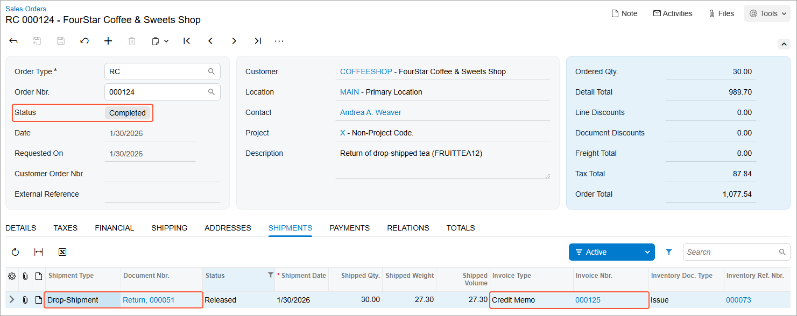

# Drop-Ship Vendor Returns: Process Activity {#_948311f9-ed62-42b2-ab6e-27f0332e9426 .task}

The following activity will walk you through the processing of a drop-ship vendor return.

**Attention:** This activity is based on the *U100* dataset. If you are using another dataset or if any system settings have been changed in *U100*, these changes can affect the workflow of the activity and the results of the processing. To avoid issues, restore the *U100* dataset to its initial state.

## Story { .section}

Suppose that SweetLife's retail store regularly drop-ships a variety of green, black, and fruit teas from the Tea &amp; Spices \(*TEACOMPANY*\) vendor to the FourStar Coffee &amp; Sweets Shop \(*COFFEESHOP*\) customer. Based on a customer satisfaction survey, a manager of the FourStar Coffee &amp; Sweets Shop has found out that the demand for the fruit tea is very low. Thus, the FourStar Coffee &amp; Sweets Shop has decided to stop buying the fruit tea from the SweetLife store. Also, the FourStar Coffee &amp; Sweets Shop wants to return the fruit tea from its last order.

To complete the customer’s request, acting as the sales and purchasing manager of the SweetLife store, you need to process the drop-ship vendor return for the Tea &amp; Spices \(*TEACOMPANY*\) vendor by creating and processing the needed documents in the system.

## Configuration Overview {#section_tz4_djx_cnb .section}

In the *U100* dataset, for the purposes of this activity, the following features have been enabled on the [Enable/Disable Features](CS_10_00_00.md) \(CS100000\) form:

-   *Inventory*, which provides the ability to create sales orders that include stock items
-   *Drop Shipments*, which provides the ability to create and process drop-shipped orders

Also, the following entities, which you will use in this activity, have been configured in the system:

-   The *COFFEESHOP* customer on the [Customers](AR_30_30_00.md) \(AP303000\) form.
-   The *TEACOMPANY* vendor on the [Vendors](AP_30_30_00.md) \(AP303000\) form.
-   The *GREENTEA6*, *BLACKTEA6*, and *FRUITTEA12* stock items on the [Stock Items](IN_20_25_00.md) \(IN202500\) form. For each of these items, the *TEACOMPANY* vendor has been added on the **Vendors** tab.

Additionally, the purchase documents for which you will process a drop-ship purchase return have been created and processed in the system.

## Process Overview { .section}

In this activity, to process a drop-ship vendor return, you will first create a sales order of the *RC* type \(that is, a return order\) on the [Sales Orders](SO_30_10_00.md) \(SO301000\) form; on the **Details** tab, you will add a line with *FRUITTEA12* stock item to be returned by selecting it from the invoice. Because you want the customer to return the item directly to the *TEACOMPANY* vendor without receiving it at your warehouse, you will select the check box in the **Mark for PO** column. You will create a purchase return—a purchase receipt of the *Return* type— for the vendor on the [Purchase Receipts](PO_30_20_00.md) \(PO302000\) form and then release it.

Then you will prepare a debit adjustment for the vendor on the [Bills and Adjustments](AP_30_10_00.md) \(AP301000\) form. When the vendor receives the returned items, you will release the debit adjustment. Finally, you will prepare a credit memo for the customer on the [Invoices](SO_30_30_00.md) \(SO303000\) form.

## System Preparation { .section}

Do the following:

1.  Launch the Acumatica ERP website, and sign in to a company with the *U100* dataset preloaded. To sign in as a sales and purchasing manager, use the *wiley* username and the *123* password.
2.  In the info area, in the upper-right corner of the top pane of the Acumatica ERP screen, make sure that the business date in your system is set to*1/30/2026*. If a different date is displayed, click the Business Date menu button, and select *1/30/2026* from the calendar. For simplicity, in this activity, you will create and process all documents in the system during this business date.
3.  On the Company and Branch Selection menu in the top pane of the Acumatica ERP screen, select the *SweetLife Store* branch.

## Step 1: Creating a Return Order { .section}

To create a return order \(a sales order of the *RC* type\), do the following:

1.  Open the [Sales Orders](SO_30_10_00.md) \(SO301000\) form, create a sales order, and specify the following settings in the Summary area:
    -   **Order Type**: *RC*
    -   **Customer**: *COFFEESHOP*
    -   **Description**: *Return of drop-shipped tea \(FRUITTEA12\)*
2.  On the table toolbar of the **Details** tab, click **Add Invoice**.
3.  In the **Add Invoice Details** dialog box, which opens, do the following:
    1.  In the **AR Doc. Type** box, make sure that *Invoice* is selected.
    2.  In the **AR Doc. Nbr.** box, select the reference number of the invoice to *COFFEESHOP* in the amount of *2612.02* dated *1/15/2026*. The invoice lines appear in the table of the dialog box.
    3.  In the table of the dialog box, select the unlabeled check box in the *FRUITTEA12* line.
    4.  Click **Add and Close** to add this line to the return order and close the dialog box.
4.  On the form toolbar, click **Save**.

## Step 2: Creating and Releasing a Direct Purchase Return { .section}

To create a direct purchase return for the vendor, do the following:

1.  While you are still viewing the return order on the [Sales Orders](SO_30_10_00.md) \(SO301000\) form, on the **Details** tab, select the **Mark for PO** check box for the only line to indicate that this item has been previously drop-shipped to the customer and should not be shipped to the warehouse of your company.

    For the line, the system automatically inserts the *Drop-Ship* value in the **PO Source** column.

2.  On the form toolbar, click **Save**.
3.  On the More menu, click **Create Vendor Return**.

    The system has created a corresponding direct purchase return for the vendor on the [Purchase Receipts](PO_30_20_00.md) \(PO302000\) form with line details copied from the sales order.

4.  On the **Shipments** tab of the [Sales Orders](SO_30_10_00.md) form, click the link in the **Document Nbr.** box, which the system has inserted upon creation of the direct purchase return.

    The system opens the purchase return on the [Purchase Receipts](PO_30_20_00.md) form in a pop-up window. In the Summary area, notice that the system has inserted *Return* in the **Type** box and *TEACOMPANY* in the **Vendor** box.

5.  On the **Details** tab, review the only line \(for which relevant settings have been copied from the sales order line\), and notice that it has the *Goods for Drop-Ship* value in the **Line Type** column.
6.  On the form toolbar, click **Release**.

## Step 3: Entering the Debit Adjustment { .section}

To process the debit adjustment for the items that have been returned to the vendor, do the following:

1.  While you are still viewing the purchase return on the [Purchase Receipts](PO_30_20_00.md) \(PO302000\) form, click **Enter AP Bill** on the form toolbar.

    The system opens the [Bills and Adjustments](AP_30_10_00.md) \(AP301000\) form and creates a debit adjustment for the vendor with the line details copied from the purchase return.

2.  On the form toolbar, click **Remove Hold**, and then click **Release**.
3.  Close the window with the current form.

## Step 4: Preparing and Releasing a Credit Memo for the Customer { .section}

To process the return of money to the customer, do the following:

1.  Return to the previously created sales order of the *RC* type on the [Sales Orders](SO_30_10_00.md) \(SO301000\) form and refresh the browser window.
2.  On the form toolbar, click **Prepare Invoice**.

    The system opens the [Invoices](SO_30_30_00.md) \(SO303000\) form and creates a credit memo.

3.  On the form toolbar, click **Release**.

    Return to the sales order of the *RC* type on the [Sales Orders](SO_30_10_00.md) form, and on the **Shipments** tab, review the only line, which has the shipment for the order. The following screenshot shows the resulting drop-ship return order, which has the *Completed* status.

    

**Parent topic:**[Processing Drop-Ship Vendor Returns](../UserGuide/OrderMgmt_Drop_Ship_Vendor_Returns_Mapref.md)

