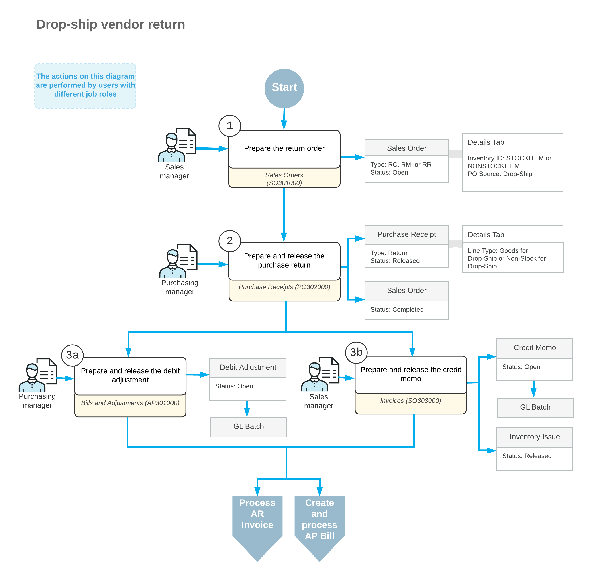

# Drop-Ship Vendor Returns: General Information {#_6385c4f9-6668-4018-b181-963ff9b2fc08 .concept}

In Acumatica ERP, you can process the return of the drop-shipped items directly from a customer to a vendor, without receiving the items to your inventory. You handle these vendor returns by creating and processing a return order \(that is, a sales order of an order type designated for returns\) with the drop-shipped items to be returned and a purchase return, as well as the needed documents to adjust the customer and vendor balances.

## Learning Objectives { .section}

In this chapter, you will learn how to do the following:

-   Create a return order and add the drop-shipped items to this order
-   Create a purchase return \(that is, a purchase order of the *Return* type\) for the drop-shipped items
-   Process the purchase return and the related documents

## Applicable Scenarios { .section}

In most cases, the drop-ship sales process is completed when the customer receives the items from the vendor and the corresponding accounts payable and receivable documents are released to adjust your balance with the vendor and customer. In some cases, however, items are delivered in an unsatisfactory condition or shipped by mistake and should be returned to the vendor for replacement or reimbursement.

## Drop-Ship Vendor Returns { .section}

The standard drop-ship vendor return process includes the creation of a return order \(which is a type of sales order document\), the specification of the returned items and their quantities in the return order, the return of the items to the vendor, and the adjustment to the vendor and customer balances in the system in the returned amount.

In Acumatica ERP, to begin processing a drop-ship vendor return, on the [Sales Orders](SO_30_10_00.md) \(SO301000\) form, the sales manager enters a return order—that is, an order whose type is based on a template with *RMA Order* automation behavior. Then the manager finds the invoice with the items to be returned by clicking **Add Invoice** on the **Details** tab of the [Sales Orders](SO_30_10_00.md) form; the manager selects the lines with the items to be returned and adds them to this tab of the return order. The manager selects the **Mark for PO** check box for each added line to indicate that the items will be returned by the customer and shipped directly to the vendor. Then the manager saves the return order.

**Attention:**

You cannot select **Mark for PO** in the sales order lines with the *Issue* operation if the return order type has the following settings on the **Template** tab of the [Order Types](SO_20_10_00.md) \(SO201000\) form:

-   *RMA Order* in the **Automation Behavior** box
-   *No Update* in the **AR Document Type** box

While still viewing the return order on the [Sales Orders](SO_30_10_00.md) form, the sales manager creates a direct purchase return from the customer to the vendor by clicking **Create Vendor Return** on the More menu. The system creates the purchase return on the [Purchase Receipts](PO_30_20_00.md) \(PO302000\) form with the line details copied from the sales order. On the **Shipments** tab of the [Sales Orders](SO_30_10_00.md) form, the system inserts a link to this purchase return in the **Document Nbr.** box. When the items are delivered to the vendor, the sales manager opens the purchase return \(by clicking the link in the **Document Nbr.** box or by navigating directly to the [Purchase Receipts](PO_30_20_00.md) form\) and releases it.

To process a debit adjustment for the items that have been returned to the vendor, the purchasing manager opens the purchase return on the [Purchase Receipts](PO_30_20_00.md) form and creates a debit adjustment by clicking **Enter AP Bill** on the More menu. The system opens the [Bills and Adjustments](AP_30_10_00.md) \(AP301000\) form with a debit adjustment for the vendor with line details copied.

To process the credit memo to the customer, the sales manager opens the previously created return order on the [Sales Orders](SO_30_10_00.md) form and creates an invoice by clicking **Prepare Invoice** on the form toolbar. The system opens the [Invoices](SO_30_30_00.md) \(SO303000\) form with a credit memo created. Then you release the credit memo by clicking **Release** on the form toolbar.

## Workflow of a Drop-Ship Vendor Return { .section}

For a drop-ship vendor return, the typical processing involves the actions and generated documents shown in the following diagram.

**Parent topic:**[Processing Drop-Ship Vendor Returns](../UserGuide/OrderMgmt_Drop_Ship_Vendor_Returns_Mapref.md)

