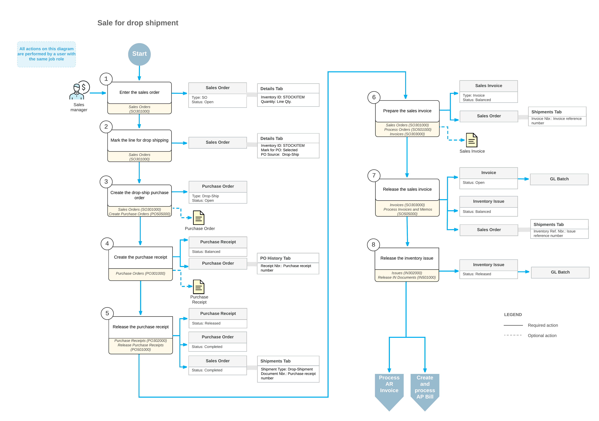

# Sales with Drop Shipping: General Information {#_fec5b398-0924-4435-8d50-5a381b77e9cd .concept}

In Acumatica ERP, you can create sales orders whose goods are intended for drop shipping. Drop shipping means that a customer orders the goods from your company, pays your company for the order, and receives the goods \(which your company has ordered\) directly from one of your vendors. With the *Drop Shipments* feature enabled on the [Enable/Disable Features](CS_10_00_00.md#) \(CS100000\) form, you can mark particular goods for drop shipping and create drop-ship orders for these goods.

## Learning Objectives { .section}

In this chapter, you will do the following:

-   Configure the processing of drop shipments in Acumatica ERP
-   Mark items for drop shipment in a sales order
-   Create a drop-ship purchase order for a sales order and process the drop shipment to completion
-   Mass-process drop shipments
-   Process the sales order and related purchase documents, inventory documents, and accounts payable documents
-   Find the information about documents related to drop shipment

## Applicable Scenario { .section}

You use drop shipment to fulfill a sales order with items that your company does not have in stock.

## Drop Shipment Process { .section}

To process a sale with drop shipment, you create a sales order of the *SO* order type on the [Sales Orders](SO_30_10_00.md) \(SO301000\) form, and add the stock items ordered by the customer. You mark items for drop shipping by selecting the check box in the **Mark for PO** column and selecting *Drop-Ship* in the **PO Source** column, which means that the items will be ordered from the vendor and shipped directly to the customer. The system does not allocate stock items in inventory based on the quantities of goods and the document amounts on sales orders for drop shipping.

When you mark items for drop shipping, the system creates purchase requests of the *Drop-Ship* plan type. You create drop-ship purchase orders by processing *Drop-Ship* purchase requests on the [Create Purchase Orders](PO_50_50_00.md) \(PO505000\) form. Each drop-ship purchase order generated from purchase requests has a reference number of the related sales order in the **Sales Order Nbr.** box on the **Shipping** tab of the [Purchase Orders](PO_30_10_00.md) \(PO301000\) form; you can create a separate purchase order for each sales order line that is marked for drop shipping but a drop-ship purchase order can only be linked to one sales order.

The items from the drop-ship purchase order are not shipped to the company's warehouse; rather, they are shipped directly to the customer. After you have received confirmation that the customer has received the goods from the vendor, you prepare and release the purchase receipt for the drop-ship purchase order. When you release the purchase receipt \(which functions as a shipment document for drop-ship lines of sales orders\), the status of the drop-ship purchase order is changed to *Completed*; the sales order is also assigned the *Completed* status, and then you prepare a sales invoice to the customer.

On release of a purchase receipt prepared for drop-ship purchase order, the system does not create an inventory receipt, because the items are not received to inventory and are instead delivered directly to the customer. The quantities of stock items on completed drop-ship orders are not included in the quantities available at any warehouse of your company.

## Workflow of a Sale with Drop Shipment { .section}

For a sales order that includes stock items intended for drop shipping, the typical processing involves the actions and generated documents shown in the following diagram.

**Parent topic:**[Processing Sales with Drop Shipping](../UserGuide/OrderMgmt_Drop_Shipment_Sale_Mapref.md)

