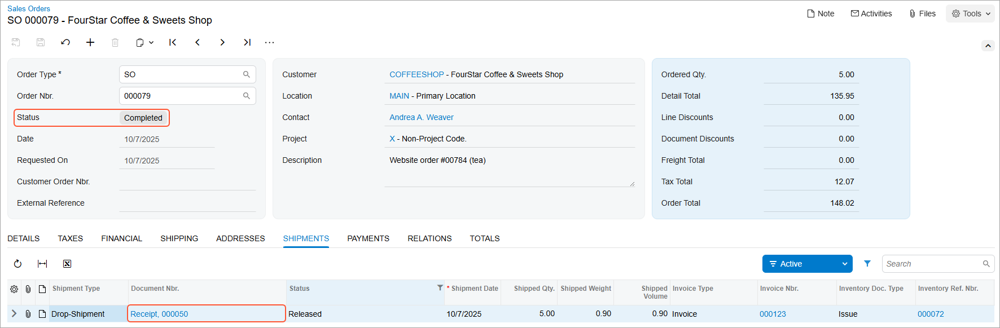

# Sales with Drop Shipping: Process Activity {#_0d8f1c4d-84b1-464b-822b-29acf963d27f .task}

In the following activity, you will learn how to prepare and process to completion a sales order with items marked for drop shipping.

**Attention:** This activity is based on the *U100* dataset. If you are using another dataset or if any system settings have been changed in *U100*, these changes can affect the workflow of the activity and the results of the processing. To avoid issues, restore the *U100* dataset to its initial state.

## Story { .section}

Suppose that the FourStar Coffee &amp; Sweets Shop \(*COFFEESHOP*\) customer ordered a variety of green, black, and fruit teas at the SweetLife’s retail store. Although the tea varieties are presented in SweetLife’s website catalog, the company does not keep tea in the wholesale or retail warehouse. When a customer orders tea, SweetLife drop-ships it from the Tea &amp; Spices \(*TEACOMPANY*\) vendor directly to the customer who ordered the tea. To complete the customer’s request, acting as the sales manager of the SweetLife store, you need to process a drop shipment.

## Configuration Overview { .section}

In the *U100* dataset, for the purposes of this activity, the following tasks have been performed:

-   On the [Enable/Disable Features](CS_10_00_00.md) \(CS100000\) form, the following features have been enabled:
    -   *Inventory and Order Management*, which provides the standard functionality of inventory and order management
    -   *Inventory*, which gives you the ability to maintain stock items by using forms related to the inventory functionality and to create and process sales and purchase documents that include stock items
    -   *Drop Shipments*, which provides the ability to create and process drop-shipped orders
-   On the [Customers](AR_30_30_00.md) \(AP303000\) form, the *COFFEESHOP* customer has been created.
-   On the [Vendors](AP_30_30_00.md) \(AP303000\) form, the *TEACOMPANY* vendor has been created.
-   On the [Stock Items](IN_20_25_00.md) \(IN202500\) form, the *GREENTEA06*, *BLACKTEA06*, and *FRUITTEA12* stock items have been created. For each of these items, the *TEACOMPANY* vendor has been added to the **Vendors** tab.

## Process Overview { .section}

In this activity, to process a sale with drop shipment, you will create a sales order of the *SO* order type on the [Sales Orders](SO_30_10_00.md) \(SO301000\) form; on the **Details** tab, you will add the inventory items ordered by the customer. Because the items are not in stock, you will mark each of them for drop shipping by selecting the check box in the **Mark for PO** column and selecting *Drop-Ship* in the **PO Source** column, which means that the items will be ordered from the vendor and shipped directly to the customer. You will create drop-ship purchase orders by processing *Drop-Ship* purchase requests on the [Create Purchase Orders](PO_50_50_00.md) \(PO505000\) form. Each drop-ship purchase order generated from purchase requests can be viewed and processed further on the [Purchase Orders](PO_30_10_00.md) \(PO301000\) form and contains links to the related sales order.

After you have received confirmation that the customer has received the goods from the vendor, on the [Purchase Receipts](PO_30_20_00.md) \(PO302000\) form, you will prepare and release the purchase receipt for the drop-ship purchase order. After drop shipping has completed, you will prepare an invoice for the customer by using the [Invoices](SO_30_30_00.md) \(SO303000\) form.

## System Preparation { .section}

Before you start processing a sale with drop shipping, you should do the following:

1.  Launch the Acumatica ERP website with the *U100* dataset preloaded, and sign in as purchasing manager Regina Wiley by using the *wiley* username and the *123* password.
2.  In the info area, in the upper-right corner of the top pane of the Acumatica ERP screen, make sure that the business date in your system is set to today’s date. For simplicity, in this activity, you will create and process all documents in the system on this business date.
3.  On the Company and Branch Selection menu in the top pane of the Acumatica ERP screen, select the *SweetLife Store* branch.

## Step 1: Creating a Sales Order { .section}

To create a sales order, do the following:

1.  On the [Sales Orders](SO_30_10_00.md) \(SO301000\) form, add a new record.
2.  In the Summary area, specify the following settings:
    -   **Order Type**: *SO*
    -   **Customer**: *COFFEESHOP*
    -   **Description**: `Website order #00784 (tea)`
3.  On the **Details** tab, add rows with the settings shown in the following table.

    |Branch|Inventory ID|Warehouse|Quantity|Unit Price|
    |------|------------|---------|--------|----------|
    |*RETAIL*|*GREENTEA06*|*RETAIL*|`2`|`22.99`|
    |*RETAIL*|*BLACKTEA06*|*RETAIL*|`1`|`23.99`|
    |*RETAIL*|*FRUITTEA12*|*RETAIL*|`2`|`32.99`|

    Notice that the system displays warnings in the **Quantity** column in each line on the **Details** tab indicating that the specified quantity is not available in the selected warehouse.

4.  On the form toolbar, click **Save**. The sales order is saved with the *Open* status.

## Step 2: Marking the Items for Drop Shipment { .section}

To mark items for drop shipment, do the following:

1.  While you are still viewing the sales order on the [Sales Orders](SO_30_10_00.md) \(SO301000\) form, for each of the lines on the **Details** tab, do the following:
    -   Select the **Mark for PO** check box.
    -   Select *Drop-Ship* in the **PO Source** column.
2.  On the form toolbar, click **Save**.

## Step 3: Creating a Drop-Ship Purchase Order { .section}

To create a drop-ship purchase order from purchase requests, do the following:

1.  While you are still viewing the sales order on the [Sales Orders](SO_30_10_00.md) \(SO301000\) form, on the More menu, click **Create Purchase Order**.
2.  On the [Create Purchase Orders](PO_50_50_00.md) \(PO505000\) form, which opens, select the unlabeled check boxes in the three lines with *SO to Drop-Ship* specified as the **Plan Type**. These are the lines that are related to the sales order that you have prepared earlier in this activity.
3.  In all of the lines, specify *TEACOMPANY* in the **Vendor** column.
4.  On the form toolbar, click **Process** to process the purchase requests you have selected.

    The system creates a drop-ship purchase order for the *TEACOMPANY* vendor and opens it on the [Purchase Orders](PO_30_10_00.md) \(PO301000\) form. On the **Details** tab, in the **Sales Order Nbr.** column, review the number of the sales order to which this purchase order lines are linked.

5.  In the **Description** box in the Summary area, type `Purchase for website order #00784`.
6.  On the form toolbar, click **Remove Hold**.

## Step 4: Processing the Drop-Ship Purchase Order { .section}

To process the drop-ship purchase order to completion, do the following:

1.  While you are still viewing the purchase order on the [Purchase Orders](PO_30_10_00.md) \(PO301000\) form, on the form toolbar, click **Enter PO Receipt**.
2.  On the [Purchase Receipts](PO_30_20_00.md) \(PO302000\) form, which the system opens with the created receipt, review the details of the prepared purchase receipt, and make sure that all purchase order lines have been added with the appropriate quantities.
3.  In the Summary area, select the **Create Bill** check box to make the system generate the bill automatically on release of the purchase receipt.
4.  On the form toolbar, click **Release** to release the purchase receipt.

    The system releases the purchase receipt and assigns it the *Released* status.

5.  On the **Billing** tab, review the only line in the table, which shows the generated bill, and make sure that the bill has the *Open* status.
6.  On the **Other** tab, notice that **IN Ref. Nbr.** is empty. No inventory documents need to be generated because the items are shipped directly from the vendor to the customer.

## Step 5: Processing the Sales Invoice for the Customer { .section}

To complete the processing of a sale with drop shipment, you need to generate an invoice to the customer. Do the following:

1.  On the [Sales Orders](SO_30_10_00.md) \(SO301000\) form, open the sales order for the *COFFEESHOP* customer that you have created earlier in this activity.
2.  On the form toolbar, click **Prepare Invoice**.
3.  On the [Invoices](SO_30_30_00.md) \(SO303000\) form, which opens, review the details of the invoice to make sure that all items have been included in the invoice.
4.  On the form toolbar, click **Release** to release the invoice.
5.  Return to the sales order on the [Sales Orders](SO_30_10_00.md) form, and on the **Shipments** tab, review the only line, which has the shipment for the order. Notice that the purchase receipt that you have processed acts as a shipment for this sales order, and the reference number link to this purchase receipt is shown in the **Document Nbr.** column in the only line in the table \(see the following screenshot\).

    

**Parent topic:**[Processing Sales with Drop Shipping](../UserGuide/OrderMgmt_Drop_Shipment_Sale_Mapref.md)

