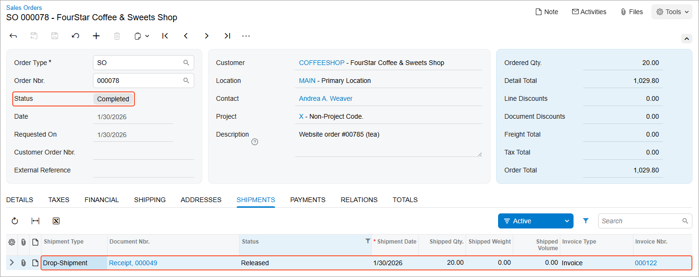

# Drop Shipments of Non-Stock Items: Process Activity {#_5c195d13-bfa7-4691-a2ec-22e6ad0e7193 .task}

In this activity, you will prepare a sales order with non-stock items marked for drop shipping and process this sales order to completion.

**Attention:** This activity is based on the *U100* dataset. If you are using another dataset or if any system settings have been changed in *U100*, these changes can affect the workflow of the activity and the results of the processing. To avoid issues, restore the *U100* dataset to its initial state.

## Story {#section_olw_wry_klb .section}

Suppose that the FourStar Coffee &amp; Sweets Shop \(*COFFEESHOP*\) customer has ordered two rare teas at SweetLife’s store. Although these teas are presented in SweetLife’s website catalog, the company does not keep them in the wholesale or retail warehouse; they are defined in Acumatica ERP as non-stock items.

When a customer orders these teas, SweetLife drop-ships them from the Tea &amp; Spices \(*TEACOMPANY*\) vendor, which regularly stocks these teas, directly to the customer who ordered the teas. To fulfill the customer’s request, acting as the sales manager of the SweetLife Store, you need to process a drop shipment.

## Configuration Overview {#section_plw_wry_klb .section}

In the *U100* dataset, the following tasks have been performed to support this activity:

-   On the [Enable/Disable Features](CS_10_00_00.md) \(CS101000\) form, the *Drop Shipments* feature, which provides the ability to create and process sales orders with drop shipment, has been enabled.
-   On the [Customers](AR_30_30_00.md) \(AP303000\) form, the *COFFEESHOP* customer has been created.
-   On the [Vendors](AP_30_30_00.md) \(AP303000\) form, the *TEACOMPANY* vendor has been created.
-   On the [Non-Stock Items](IN_20_20_00.md) \(IN202000\) form, the *EMPTEA* and *KINGTEA* non-stock items have been created. For each of these items, the *TEACOMPANY* vendor has been added to the **Vendors** tab. Also, the **Require Receipt** and **Require Shipment** check boxes have been selected for these items on the **General** tab. These settings are required to process drop-ship sales.

## Process Overview {#section_qlw_wry_klb .section}

In this activity, to process a sale with drop shipment, you will create a sales order of the *SO* order type on the [Sales Orders](SO_30_10_00.md) \(SO301000\) form; on the **Details** tab, you will add the items ordered by the customer. Because the items are not kept in stock, you will mark each of them for drop shipping by selecting the check box in the **Mark for PO** column and selecting *Drop-Ship* in the **PO Source** column, which means that the items will be ordered from the vendor and shipped directly to the customer.

You will then create a drop-ship purchase order by processing purchase requests of the *Drop-Ship* plan type on the [Create Purchase Orders](PO_50_50_00.md) \(PO505000\) form. The drop-ship purchase order generated from purchase requests, which can be viewed and processed further on the [Purchase Orders](PO_30_10_00.md) \(PO301000\) form, contains links to the related sales order.

After you have received confirmation that the customer has received the items from the vendor, on the [Purchase Receipts](PO_30_20_00.md) \(PO302000\) form, you will prepare and release the purchase receipt for the drop-ship purchase order. You will then prepare an invoice for the customer by using the [Invoices](SO_30_30_00.md) \(SO303000\) form.

## System Preparation {#section_rlw_wry_klb .section}

Before you start processing a sales order with non-stock items marked for drop shipping, do the following:

1.  Launch the Acumatica ERP website with the *U100* dataset preloaded and sign in to the system as a sales and purchasing manager. You should sign in by using the *wiley* username and the *123* password.
2.  In the info area at the upper-right corner of the top pane of the Acumatica ERP screen, make sure that the business date is set to *1/30/2026*. If a different date is displayed, click the Business Date menu button and select *1/30/2026* from the calendar. For simplicity, you'll create and process all documents in this activity using this business date.
3.  On the Company and Branch Selection menu in the top pane of the Acumatica ERP screen, select the *SweetLife Store* branch.

## Step 1: Creating a Sales Order {#section_slw_wry_klb .section}

To create a sales order, do the following:

1.  On the [Sales Orders](SO_30_10_00.md) \(SO301000\) form, add a new record.
2.  In the Summary area, specify the following settings:
    -   **Order Type**: *SO*
    -   **Customer**: *COFFEESHOP*
    -   **Description**: `Website order #00785 (tea)`
3.  On the table toolbar of the **Details** tab, click **Add Row**.
4.  Specify the following settings in the added row:
    -   **Branch**: *RETAIL*
    -   **Inventory ID**: *EMPTEA*
    -   **Warehouse**: *RETAIL*
    -   **Quantity**: `10`
    -   **Unit Price**: `47.99`
5.  On the table toolbar of the **Details** tab, click **Add Row**.
6.  Specify the following settings in the added row:
    -   **Branch**: *RETAIL*
    -   **Inventory ID**: *KINGTEA*
    -   **Warehouse**: *RETAIL*
    -   **Quantity**: `10`
    -   **Unit Price**: `54.99`
7.  On the form toolbar, click **Save**. Notice that the sales order is assigned the *Open* status.

## Step 2: Marking the Items for Drop Shipment {#section_tlw_wry_klb .section}

You mark the items for drop shipment as follows:

1.  While you are still viewing the sales order on the [Sales Orders](SO_30_10_00.md) \(SO301000\) form, for each line on the **Details** tab, do the following:
    1.  Select the **Mark for PO** check box.
    2.  In the **PO Source** column, select *Drop-Ship*.
2.  On the form toolbar, click **Save**.

## Step 3: Creating a Drop-Ship Purchase Order {#section_ulw_wry_klb .section}

To create a drop-ship purchase order from purchase requests, do the following:

1.  While you are still viewing the sales order on the [Sales Orders](SO_30_10_00.md) \(SO301000\) form, on the More menu, click **Create Purchase Order**.
2.  On the [Create Purchase Orders](PO_50_50_00.md) \(PO505000\) form, which opens, select the unlabeled check boxes in the two rows with *SO to Drop-Ship* specified as the **Plan Type** \(which are the lines that are related to the sales order that you have prepared\).
3.  In both of the rows, make sure that *TEACOMPANY* is specified in the **Vendor** column.
4.  On the form toolbar, click **Process** to process the purchase requests you have selected.

    The system creates a drop-ship purchase order for the *TEACOMPANY* vendor and opens it on the [Purchase Orders](PO_30_10_00.md) \(PO301000\) form.

5.  On the **Details** tab of this form, review the **Sales Order Nbr.** column, which shows the number of the sales order to which this purchase order lines are linked.
6.  In the **Description** box of the Summary area, type `Purchase for website order #00785`.
7.  On the form toolbar, click **Remove Hold**.

## Step 4: Processing the Drop-Ship Purchase Order {#section_vlw_wry_klb .section}

Suppose that you have been notified that the customer has received the ordered teas. To process the drop-ship purchase order to completion, do the following:

1.  While you are still viewing the purchase order on the [Purchase Orders](PO_30_10_00.md) \(PO301000\) form, click **Enter PO Receipt** on the form toolbar.
2.  On the [Purchase Receipts](PO_30_20_00.md) \(PO302000\) form, which the system opens with the created receipt, review the details of the prepared purchase receipt, and make sure that both purchase order lines have been added with the appropriate quantities.
3.  In the Summary area, select the **Create Bill** check box to make the system generate the bill automatically on release of the purchase receipt.
4.  On the form toolbar, click **Release**. Notice that the purchase receipt is assigned the *Released* status.
5.  On the **Billing** tab, review the only line in the table, which shows the generated bill, and make sure the bill has a status of *Open*.

## Step 5: Processing the Sales Invoice for the Customer {#section_wlw_wry_klb .section}

To complete the processing of a sale with drop shipment, you need to generate an invoice to the customer. Do the following:

1.  On the [Sales Orders](SO_30_10_00.md) \(SO301000\) form, open the sales order for the *COFFEESHOP* customer that you have created earlier in this activity.
2.  On the form toolbar, click **Prepare Invoice**.
3.  On the [Invoices](SO_30_30_00.md) \(SO303000\) form, which opens, make sure that both items have been included in the invoice.
4.  On the form toolbar, click **Release** to release the invoice.
5.  Return to the sales order on the [Sales Orders](SO_30_10_00.md) form, and notice the *Completed* status, which reflects that you have processed the sales order to completion. Then on the **Shipments** tab, review the only row, which indicates the shipment for the order. Notice that the purchase receipt that you have processed is listed as a shipment for this sales order and that the reference number of this purchase receipt is shown in the **Document Nbr.** column of the row. The following screenshot shows the *Completed* sales order with drop shipment.

    

**Parent topic:**[Processing Drop Shipments of Non-Stock Items](../UserGuide/OrderMgmt_Drop_Shipping_of_Non_Stock_Items_Mapref.md)

