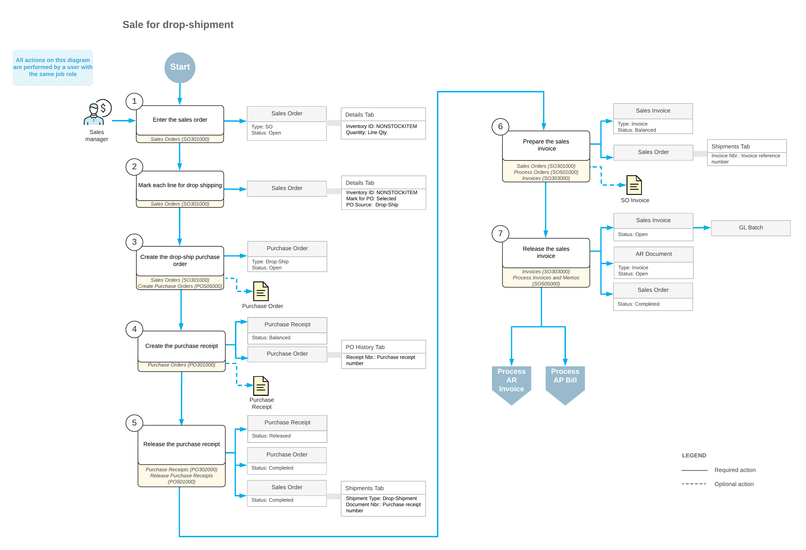

# Drop Shipments of Non-Stock Items: General Information {#_c02a64d3-b0dd-4791-b6d1-f49ff1f02589 .concept}

In Acumatica ERP, you can create sales orders whose goods are intended for drop shipping. Drop shipping means that a customer orders the goods from your company, pays your company for the order, and receives the goods \(which your company has ordered\) directly from one of your vendors. In the system, you define these goods as non-stock items because your company does not keep them in stock.

If the *Drop Shipments* feature is enabled on the [Enable/Disable Features](CS_10_00_00.md#) \(CS100000\) form, you can mark particular non-stock items for drop shipping and create drop-ship orders for these items.

## Learning Objectives {#section_j1t_try_klb .section}

In this chapter, you will do the following:

-   Process a sales order for non-stock items to be drop-shipped
-   Mark items for drop shipment in a sales order
-   Create a drop-ship purchase order for the sales order and process the drop shipment to completion

## Applicable Scenario {#section_k1t_try_klb .section}

You use a drop shipment to fulfill a sale of non-stock items that your company does not keep in its warehouses. Instead, your company processes the needed documents to have your vendor ship the items directly to the customer.

## Drop-Shipping Process {#section_l1t_try_klb .section}

To process a sale with drop shipment, you create a sales order of the *SO* order type on the [Sales Orders](SO_30_10_00.md) \(SO301000\) form, and add the non-stock items ordered by the customer. On the **Details** tab of the form, you mark the non-stock items for drop shipping by selecting the check box in the **Mark for PO** column and selecting *Drop-Ship* in the **PO Source** column, which means that the items will be ordered from the vendor and shipped directly to the customer.

When you mark items for drop shipping and save the sales order with the *Open* status, the system creates purchase requests of the *Drop-Ship* plan type. You then create a drop-ship purchase order by processing *Drop-Ship* purchase requests on the [Create Purchase Orders](PO_50_50_00.md) \(PO505000\) form. This drop-ship purchase order contains links to the related sales order.

The items from this purchase order are not shipped to the company's warehouse; rather, they are shipped directly to the customer. After you have received confirmation that the customer has received the items from the vendor, you prepare and release the purchase receipt for the drop-ship purchase order. When you release the purchase receipt \(which is listed as a shipment document for the sales order on the [Sales Orders](SO_30_10_00.md) form\), the status of the drop-ship purchase order and sales order is changed to *Completed*. You can then prepare a sales invoice for the customer.

## Workflow of a Sale with Drop Shipment {#section_m1t_try_klb .section}

For a sales order with non-stock items intended for drop shipment, the typical processing involves the actions and generated documents shown in the following diagram.

**Parent topic:**[Processing Drop Shipments of Non-Stock Items](../UserGuide/OrderMgmt_Drop_Shipping_of_Non_Stock_Items_Mapref.md)

