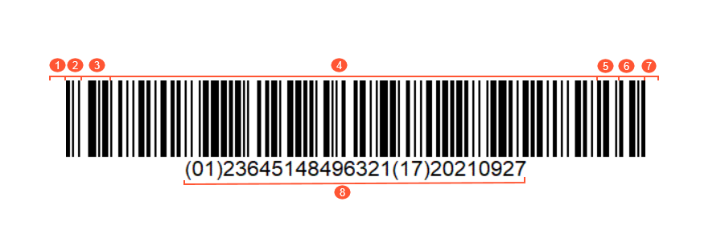

# GS1 Barcodes in Acumatica ERP {#_947c9182-7423-41db-8e2d-2472e5c38c79 .concept}

The barcodes of the GS1 family are widely used to handle the general distribution and logistics throughout the supply chain of companies. In Acumatica ERP, the GS1-128 \(previously known as UCC-128 and EAN-128\) and 2D GS1 DataMatrix barcodes from the GS1 family are supported.

## The Structure of the GS1-128 Barcode { .section}

A GS1-128 barcode is composed of the following elements, from left to right and shown in the following graphic:

1.  **Left Quiet Zone**: A blank space that precedes the start character of a barcode. Barcode scanners use this space to understand where the barcode begins so the code can be read as intended.
2.  **A start character \(A, B, or C\)**: The characters that define the corresponding code set to be used in the data.
3.  **The Function 1 Symbol Character \(FNC1\)**: A separator character. It is also used to indicate the end of the item-specific information for Application Identifiers \(AI\) with a variable character length.
4.  **Data**: The information about the item, which consists of one or more GS1 AIs represented in character set A, B, or C, and the item-specific information for each AI. For more information on AIs, see the [Application Identifiers](#_5509cab8-70e9-4b66-8eae-9f8f6fd8925e) section.
5.  **A symbol check character**: The character that is used to verify the barcode's data accuracy.
6.  **The stop character**: The character that is used to indicate the end of the readable data.
7.  **Right Quiet Zone**: A blank space that follows the stop character of a barcode. Barcode scanners use this space to define where the barcode ends so the code can be read as intended.
8.  **Human Readable Interpretation \(HRI\) characters**: The characters that ensure that the information encoded in the barcode can be read by humans. HRI characters can be useful if part of the barcode is missing or illegible so the barcode scanner cannot read the encoded data.

## Application Identifiers {#_5509cab8-70e9-4b66-8eae-9f8f6fd8925e .section}

The GS1 standard provides a method of defining the data meaning and format by using the list of AIs. In HRI characters, the AIs are numeric prefixes—for example, 01, which stands for Global Trade Item Number \(GTIN\). Each AI is succeeded by the item-specific data of a predefined character length and format. For example, the GTIN AI must contain 14 digits and does not require the FNC1 character. It may look as follows: *\(01\)12345678912345*.

A GS1 barcode can contain multiple AIs encoded in the data part. If the AI's character length varies, the FNC1 character is needed to indicate where the AI ends so that a barcode scanner can identify where another AI starts.

In Acumatica ERP, you can use AIs related to GTIN, lot/serial numbering, best-before date, or expiration date that are listed in the following table.

|AI|Data Content|Format|FNC1 Required|
|---|------------|------|-------------|
|*01*|Global Trade Item Number|14 digits|No|
|*02*|GTIN of the trade items contained in a logistic unit|14 digits|No|
|*10*|Batch or lot number|From 2 to 20 digits or letters|Yes|
|*21*|Serial number|From 2 to 20 digits or letters|Yes|
|*15*|Best before date \(YYMMDD\)|6 digits|No|
|*17*|Expiration date \(YYMMDD\)|6 digits|No|

You can also use the following AIs that are listed in the *GS1 Application Identifiers in numerical order* section of the [GS1 General Specifications](https://www.gs1.org/docs/barcodes/GS1_General_Specifications.pdf):

-   30 and 37 applications identifiers for quantities without specifying a UOM
-   Application identifiers from 310 to 369, which are dimension-, area-, volume-, and weight-related identifiers containing UOMs

Unlike other barcode types, a GS1 barcode can provide multiple item data at once when you scan a GS1 barcode on the automated warehouse operations forms. For example, if you need to scan a lot-tracked item with an expiration date and a particular quantity to process a receipt of this item on the [Scan and Receive](IN_30_10_20.md) \(IN301020\) form and you have a GS1 barcode that contains all AIs with this information, you scan once to specify the values of the **Inventory ID**, **Lot/Serial Nbr.**, **Expiration Date**, and **Quantity** columns simultaneously. With other barcodes, you would need to scan each value separately.

## Requirements for Scanning a GS1 Barcode { .section}

To scan a GS1 barcode, you need a barcode scanner that supports the Acumatica mobile application and the GS1 standard. For additional information about barcode scanners, see the [Acumatica ERP Knowledge Base](https://community.acumatica.com/inventory-and-order-management-124/warehouse-management-faqs-scanners-462).

## Manual Input of GS1 Barcodes { .section}

If you need to scan a GS1 barcode that is damaged and cannot be scanned, you can manually enter its HRI characters. To do this, enter these characters in the **Scan** box on any form related to automated warehouse management. You must enter the characters with all parentheses as they are shown in the barcode—for example, `(01)23645148496321(17)20210927`.

For the list of forms related to automated warehouse management, see [Working Modes and Supported Commands](WMS_Commands_List.md).

## UOM Mapping { .section}

If you are going to use GS1 barcodes that contain UOMs, on the **GS1 Units** tab of the [Inventory Preferences](IN_10_10_00.md) \(IN101000\), you need to map the units of measure coded in the GS1 barcode to the units of measure specified on the [Units of Measure](CS_20_35_00.md) \(CS203500\) form. When mapping is configured for a particular unit of measure and you scan a GS1 barcode that contains document lines with quantities in this unit of measure, the system converts the scanned value to the quantity and unit of measure specified on the [Units of Measure](CS_20_35_00.md) form.

## Use of GS1 Barcodes for Particular Stock Items { .section}

If you are going to use GS1 barcodes in automated warehouse operations in Acumatica ERP, you need to specify those barcodes as alternate IDs for stock items on the **Cross-References** tab of the [Stock Items](IN_20_25_00.md) \(IN202500\) form. Any number of alternate IDs can be entered for the stock item, each in a separate row of this tab. For each alternate ID of a stock item, you need to select the *Barcode* or *GTIN/EAN/UPC/ISBN* alternate type in the **Alternate Type** column, and in the **Alternate ID** column, specify the item-specific information part for the \(01\) or \(02\) AI coded in the barcode.

**Tip:** Note that the item-specific information part of the \(01\) or \(02\) AI should be numeric. That is, the alternate ID should contain only digits.

Suppose that you want to use a barcode with the \(01\)11111111111111\(10\)LREX15\(17\)231215 combination of AIs for a stock item. In the **Alternate ID** column, you need to enter the following value: `11111111111111`.

In the row, you should also specify the appropriate UOM, lot/serial class, and unit conversion, if required.

