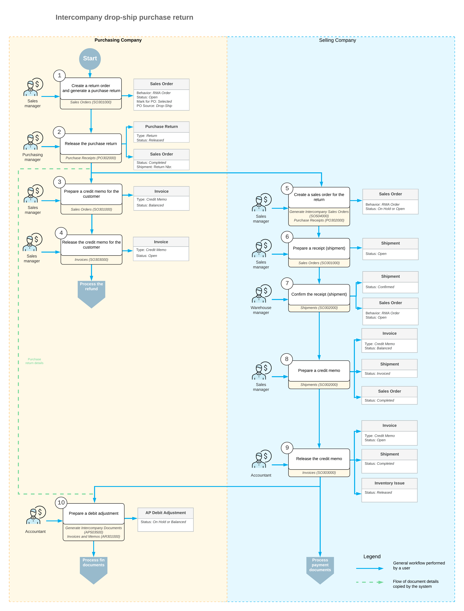

# Intercompany Purchases and Returns: Intercompany Drop-Ship Returns {#_ec4170e5-e5cb-4097-b406-7271ccbeae80 .concept}

An intercompany drop-ship return is used when goods delivered from a selling company to a customer need to be returned directly to the selling company's warehouse. The process coordinates actions between the purchasing and selling companies so that returns, shipments, and financial documents are properly recorded.

## Processing an Intercompany Drop-Ship Return { .section}

In Acumatica ERP, an intercompany drop-ship purchase return is typically processed as follows:

1.  **Purchasing Company**: The sales manager does the following:

    1.  Creates a return order for the external customer on the [Sales Orders](SO_30_10_00.md) \(SO301000\) form.
    2.  Adds a line with the required items.
    3.  Clicks **Create Vendor Return** on the More menu of the [Sales Orders](SO_30_10_00.md) form.

        The system generates a purchase receipt of the *Return* type with the selling company as the vendor on the [Purchase Receipts](PO_30_20_00.md) \(PO302000\) form.

    The purchasing manager releases the purchase return on the [Purchase Receipts](PO_30_20_00.md) form.

2.  **Selling company**: As soon as the purchase return is released, the sales manager does the following:

    1.  Opens the [Generate Intercompany Sales Orders](SO_50_40_00.md) \(SO504000\) form and generates a return order for the purchase return.
    2.  Creates a shipment with the **Receipt** operation by clicking **Create Receipt** on the [Sales Orders](SO_30_10_00.md) form.
    Next, the warehouse manager confirms the shipment on the [Shipments](SO_30_20_00.md) \(SO302000\) when the warehouse of the selling company receives the goods from the external customer.

    Finally, the sales manager prepares a credit memo for the purchasing company on the [Shipments](SO_30_20_00.md) form.

3.  **Purchasing company**: On confirmation of the goods receipt from the external customer, the sales manager prepares and releases a credit memo for the external customer on the [Sales Orders](SO_30_10_00.md) form.
4.  **Selling company**: The accountant releases the credit memo for the purchasing company on the [Invoices](SO_30_30_00.md) \(SO303000\) form.

    The system automatically creates and releases a credit memo on the [Invoices and Memos](AR_30_10_00.md) \(AR301000\) form.

5.  **Purchasing company**: As soon as the accountant of the selling company releases the credit memo, the accountant of the purchasing company does the following:
    1.  Opens the [Generate Intercompany Documents](AP_50_35_00.md) \(AP503500\) form and generates a debit adjustment based on this invoice.
    2.  Releases the debit adjustment on the [Bills and Adjustments](AP_30_10_00.md) \(AP301000\) form.

At this point, the intercompany drop-ship return is completed.

## Workflow of the Intercompany Drop-Ship Return { .section}

For an intercompany drop-ship return to the warehouse of the selling company, the typical process involves the actions and generated documents shown in the following diagram.

**Parent topic:**[Processing Intercompany Purchases and Returns](../UserGuide/OrderMgmt_Intercompany_Sales_and_Purchases_Mapref.md)

