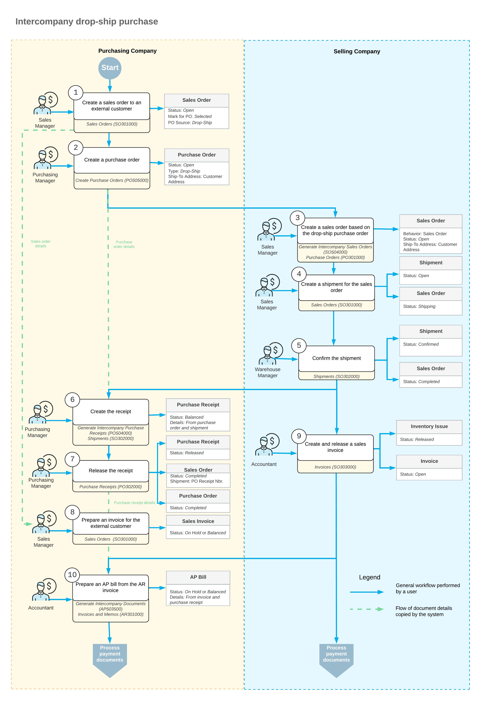

# Intercompany Purchases and Returns: Intercompany Drop-Ship Purchase {#_af23c868-e515-4111-b096-70b3aa8f6f67 .concept}

In Acumatica ERP, companies within the same tenant can collaborate to fulfill customer orders through intercompany drop-ship purchases. This functionality allows a purchasing company to cover shortages by ordering goods from a selling company, with the items shipped directly to the external customer.

## Applicable Scenarios { .section}

You may need to drop-ship goods through another company in the same tenant if one of the following conditions is met:

-   Your company has a shortage of the requested goods.
-   Another company is geographically closer to your customer, and drop shipping would reduce the shipping cost.

## Processing an Intercompany Drop-Ship Purchase { .section}

In Acumatica ERP, an intercompany drop-ship purchase order is typically processed as follows:

**Tip:** This process describes typical roles for each step. The roles in your environment may vary.

1.  **Purchasing Company**: The sales manager does the following:

    1.  Creates a sales order for the external customer on the [Sales Orders](SO_30_10_00.md) \(SO301000\) form.
    2.  Adds a line with the required items.
    3.  Selects the **Mark for PO** check box in the line, indicating that the order line was marked for purchasing, and selects *Drop-Ship* as the **PO Source**.
    The purchasing manager of the same company does the following:

    1.  Clicks **Create Purchase Orders** on the More menu of the [Sales Orders](SO_30_10_00.md) form.
    2.  Generates a purchase order with the selling company as the vendor on the [Create Purchase Orders](PO_50_50_00.md) \(PO505000\) form.
    3.  Removes the purchase order from hold on the [Purchase Orders](PO_30_10_00.md) \(PO301000\) form.
2.  **Selling company**: As soon as the purchase order is assigned the *Open* status, the manager of the selling company does the following:
    1.  Opens the [Generate Intercompany Sales Orders](SO_50_40_00.md) \(SO504000\) form and generates a sales order for the purchase order.

        On the **Addresses** tab of the [Sales Orders](SO_30_10_00.md) form, the system inserts the address of the external customer into the new sales order.

    2.  Creates a shipment for the intercompany sales order.
    3.  Confirms the shipment when the external customer receives the goods from warehouse of the selling company.
3.  **Purchasing company**: On confirmation of the shipment to the external customer, the purchasing manager does the following:

    1.  Opens the [Generate Intercompany Purchase Receipts](PO_50_40_00.md) \(PO504000\) form and generates a purchase receipt for this shipment.
    2.  Releases this purchase receipt on the [Purchase Receipts](PO_30_20_00.md) \(PO302000\) form.
    The sales manager of the same company prepares an invoice for the external customer on the [Invoices](SO_30_30_00.md) \(SO303000\) form.

4.  **Selling company**: The sales manager does the following:
    1.  Prepares a sales invoice for the purchasing company based on the intercompany sales order on the [Sales Orders](SO_30_10_00.md) form.
    2.  Releases a sales invoice on the [Invoices](SO_30_30_00.md) form.

        The AR invoice becomes available on the [Invoices and Memos](AR_30_10_00.md) \(AR301000\) form.

5.  **Purchasing company**: As soon as the AR invoice is available, the accountant does the following:
    1.  Opens the [Generate Intercompany Documents](AP_50_35_00.md) \(AP503500\) form and generates an AP bill based on this invoice.
    2.  Releases the AP bill on the [Bills and Adjustments](AP_30_10_00.md) \(AP301000\) form.

At this point, the intercompany drop-ship purchase is completed.

## Workflow of the Intercompany Drop-Ship Purchase { .section}

For an intercompany drop-ship purchase between the branches of two different companies, the typical process involves the actions and generated documents shown in the following diagram.

**Parent topic:**[Processing Intercompany Purchases and Returns](../UserGuide/OrderMgmt_Intercompany_Sales_and_Purchases_Mapref.md)

