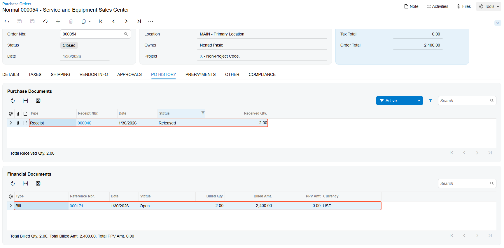

# Intercompany Purchases and Returns: To Process an Intercompany Purchase {#_ed558ba7-57e4-4478-a382-494c68db2c0f .task}

The following activity will walk you through the process of selling an item from one company to another company within the same tenant.

## Story { .section}

Suppose that the Head Office of the Muffins &amp; Cakes company has to purchase two new juicers from the Service and Equipment Sales Center of SweetLife Fruits &amp; Jams. The system administrator has set up the intercompany sales functionality to enable generation of sales orders based on purchase orders, purchase receipts based on shipments, and AP bills based on AR invoices.

Acting as a purchasing manager of Head Office of Muffins &amp; Cakes, you need to create a purchase order to the *SWEETEQIP* branch.

## Configuration Overview {#section_tz4_djx_cnb .section}

In the *U100* dataset, the following tasks have been performed to support this activity:

-   On the [Enable/Disable Features](CS_10_00_00.md#) \(CS100000\) form, the following features have been enabled:
    -   *Standard Financials*
    -   *Multibranch Support*
    -   *Multicompany Support*
    -   *Advanced Financials*
    -   *Inter-Branch Transactions*
    -   *Inventory and Order Management*
    -   *Inventory*
-   On the [Companies](CS_10_15_00.md) \(CS101500\) form, the *MUFFINS* and *SWEETLIFE* companies have been defined.
-   On the [Branches](CS_10_20_00.md) \(CS102000\) form, the *SWEETEQUIP* and *MHEAD* branches have been defined.
-   On the [Stock Items](IN_20_25_00.md) \(IN202500\) form, the *JUICER35* inventory item has been configured.
-   On the [Warehouses](IN_20_40_00.md) \(IN204000\) form, the *MHEADWH* warehouse has been created and specified for the *MAIN* location of the *MHEAD* branch.

## Process Overview { .section}

In this activity, you will first review the intercompany sales settings on the [Sales Orders Preferences](SO_10_10_00.md) \(SO101000\) form. On the [Vendors](AP_30_30_00.md) \(AP303000\) form, you will specify the warehouse of the Muffins &amp; Cakes company as the default one for the *SWEETEQUIP* vendor. On the [Purchase Orders](PO_30_10_00.md) \(PO301000\) form, you will create a purchase order from *Muffins Head Office &amp; Wholesale Center* to *Service and Equipment Sales Center*, specifying *SWEETEQUIP* as the vendor, and save the purchase order. You will then cause the system to generate a sales order based on the purchase order on the [Generate Intercompany Sales Orders](SO_50_40_00.md) \(SO504000\) form. When the sales order is generated, on the [Sales Orders](SO_30_10_00.md) \(SO301000\) form, you will create and confirm a shipment for this sales order, and then you will cause the system to generate a purchase receipt based on the shipment on the [Generate Intercompany Purchase Receipts](PO_50_40_00.md) \(PO504000\) form. You will then create a sales invoice by clicking **Prepare Invoice** on the form toolbar of the [Shipments](SO_30_20_00.md) \(SO302000\) form. You will release the sales invoice on the [Invoices](SO_30_30_00.md) \(SO303000\) form, and it will become visible on the [Invoices and Memos](AR_30_10_00.md) \(AR301000\) form as an AR invoice. You will cause the system to generate an AP bill on the [Generate Intercompany Documents](AP_50_35_00.md) \(AP503500\) form and release this bill on the [Bills and Adjustments](AP_30_10_00.md) \(AP301000\) form.

## System Preparation { .section}

Before you begin performing the steps of this activity, do the following:

1.  Launch the Acumatica ERP website with the *U100* dataset preloaded, and sign in as an accountant Nenad Pasic by using the *pasic* username and the *123* password.

    **Attention:** For simplicity, you perform all steps of this activity under the username which has access to both *Service and Equipment Sales Center* and *Muffins Head Office &amp; Wholesale Center* branches. However, in a production environment, the steps for different branches may be performed by different users.

2.  In the info area at the upper-right corner of the top pane of the Acumatica ERP screen, make sure that the business date is set to *1/30/2026*. If a different date is displayed, click the Business Date menu button and select *1/30/2026* from the calendar. For simplicity, you'll create and process all documents in this activity using this business date.
3.  On the Company and Branch Selection menu on the top pane of the Acumatica ERP screen, select the *Muffins Head Office &amp; Wholesale Center* branch.
4.  Make sure the *SWEETEQUIP* branch has been extended as a vendor and the *MHEAD* branch has been extended as a customer, as described in [Intercompany Sales Setup: Implementation Activity](../ImplementationGuide/Finance_Intercompany_SalesSetup_Implem_Activity.md).

## Step 1: Reviewing the Sales Order Preferences { .section}

To review the type of sales orders that will be used for intercompany sales, do the following:

1.  Open the [Sales Orders Preferences](SO_10_10_00.md) \(SO101000\) form.
2.  On the **General** tab, in the **Intercompany Order Settings** section, review the following settings:
    -   **Default Type for Intercompany Sales**: *SO - Sales Order*

        This is the type of sales order that the system will use by default when creating an intercompany sales order.

    -   **Default Type for Intercompany Returns**: *RC - Return for Credit*

        This is the type of an order that the system will use by default when creating an intercompany return.

## Step 2: Specifying the Default Warehouse for the Vendor { .section}

To specify the warehouse of the Muffins &amp; Cakes company as the default warehouse for the *SWEETEQUIP* vendor in the *MHEAD* branch to which you are currently signed in, do the following:

1.  Open the [Vendors](AP_30_30_00.md) \(AP303000\) form.
2.  In the **Vendor ID** box, select *SWEETEQUIP*.
3.  Go to the **Purchase Settings** tab.
4.  In the **Warehouse** box \(**Shipping Instructions** section\), select *MHEADWH*.
5.  On the form toolbar, click **Save** to save your changes.

## Step 3: Creating an Intercompany Purchase Order { .section}

To create an intercompany purchase order, do the following:

1.  Open the [Purchase Orders](PO_30_10_00.md) \(PO301000\) form.

    **Tip:** To open the form for creating a new record, type the form ID in the Search box, and on the Search form, point at the form title and click **New** right of the title.

2.  Click **Add New Record** on the form toolbar, and in the Summary area, specify the following settings:
    -   **Type**: *Normal*
    -   **Vendor**: *SWEETEQUIP*
    -   **Date**: *1/30/2026* \(inserted automatically\)
    -   **Description**: `Purchase of juicers`
3.  On the **Details** tab, click **Add Row** on the table toolbar and specify the following settings for the new row:
    -   **Branch**: *MHEAD*
    -   **Inventory ID**: *JUICER35*
    -   **Warehouse**: *MHEADWH* \(inserted automatically based on the selected vendor\)
    -   **Order Qty.**: `2`
    -   **Unit Cost**: `1200`
    -   **Ext. Cost**: *2,400* \(calculated automatically\)
4.  On the form toolbar, click **Remove Hold** to save the document with the *Open* status.

## Step 4: Generating an Intercompany Sales Order { .section}

To generate an intercompany sales order, do the following:

1.  Open the [Generate Intercompany Sales Orders](SO_50_40_00.md) \(SO504000\) form.
2.  In the only line, select the unlabeled check box and click **Process** on the form toolbar.

    The system generates a sales order with the *SO* type and *Open* status for the *MHEAD* customer and automatically copies the relevant settings and the line details of the originating purchase order.

3.  In the dialog box, which opens, click **Close**.
4.  On the [Purchase Orders](PO_30_10_00.md) \(PO301000\) form, open the purchase order that you have created in Step 3 \(the top record in the list on the Purchase Orders \(PO3010PL\) list of records\).
5.  On the **Other** tab, notice that the system inserted the number of the generated sales order into the **Related Order Nbr.** box. This number is a link to the sales order.
6.  Click the link in the **Related Order Nbr.** box. The system opens the sales order on the [Sales Orders](SO_30_10_00.md) \(SO301000\) form.
7.  Review the sales order.

    Notice that *MHEAD* is specified in the **Customer** box for this order. On the **Details** tab, *SWEETEQUIP* is specified in the **Branch** column and the order details have been copied from the originating purchase order. On the **Shipping** tab, notice that the system has inserted the number of the originating purchase order in the **Related Order Nbr.** box \(the **Intercompany Purchase** section\). This number is a link to the purchase order.

## Step 5: Creating a Shipment { .section}

To generate a shipment for the intercompany sales order, do the following:

1.  While you are still viewing the sales order for the *MHEAD* customer, on the form toolbar, click **Create Shipment**.
2.  In the **Specify Shipment Parameters** dialog box, which opens, make sure that *1/30/2026* is selected in the **Shipment Date** box and *EQUIPHOUSE* is selected in the **Warehouse ID** box, and click **OK**.
3.  The system creates a shipment for the sales order and opens it on the [Shipments](SO_30_20_00.md) \(SO302000\) form.
4.  On the form toolbar, click **Confirm Shipment**.

## Step 6: Creating a Purchase Receipt { .section}

To create a purchase receipt, do the following:

1.  Open the [Generate Intercompany Purchase Receipts](PO_50_40_00.md) \(PO504000\) form.
2.  In the only line, select the unlabeled check box and click **Process** on the form toolbar.

    The system generates a purchase receipt that contains the relevant settings and detail rows copied from the shipment.

3.  In the dialog box, which opens, click **Close**.
4.  On the [Shipments](SO_30_20_00.md) \(SO302000\) form, open the shipment that you have created in Step 5.
5.  On the **Shipping** tab, click the link in the **Related PO Receipt Nbr.** box.
6.  On the [Purchase Receipts](PO_30_20_00.md) \(PO302000\) form, which the system opens, review the purchase receipt with the *SWEETEQUIP* vendor and the *1/30/2026* date.
7.  On the form toolbar, click **Remove Hold** and then click **Release**.

## Step 7: Creating a Sales Invoice { .section}

To prepare a sales invoice for the shipment, do the following:

1.  On the [Shipments](SO_30_20_00.md) \(SO302000\) form, open the shipment that you created in Step 5.
2.  On the form toolbar, click **Prepare Invoice**.

    The system creates a sales invoice for the shipment and opens it on the [Invoices](SO_30_30_00.md) \(SO303000\) form.

3.  On the form toolbar, click **Release**.

    The system assigns the *Open* status to the sales invoice and makes it visible on the [Invoices and Memos](AR_30_10_00.md) \(AR301000\) form as an AR invoice.

## Step 8: Creating an AP Bill { .section}

To create an AP bill, do the following:

1.  Open the [Generate Intercompany Documents](AP_50_35_00.md) \(AP503500\) form.
2.  In the only line, select the unlabeled check box and click **Process** on the form toolbar.

    The system generates an AP bill. The line in the AP bill is linked to the lines of the purchase order and purchase receipt that you have created in Steps 3 and 6.

3.  In the dialog box, which opens, click **Close**.
4.  On the [Bills and Adjustments](AP_30_10_00.md) \(AP301000\) form, open the bill with the *SWEETEQUIP* vendor and the *1/30/2026* date.
5.  On the form toolbar, click **Remove Hold** and then click **Release** to release the bill.
6.  Return to the purchase order to *SWEETEQUIP* on the [Purchase Orders](PO_30_10_00.md) \(PO301000\) form, and review its details.

    Notice that the order now has a status of *Closed*, as shown in the screenshot below. On the **PO History** tab, notice that the information about the purchase receipt and AP bill that were prepared for the order is displayed. According to this information, the purchased items have been received to inventory of the *Muffins Head Office &amp; Wholesale Center* branch and billed in full, so the intercompany purchasing process is completed.

    

**Parent topic:**[Processing Intercompany Purchases and Returns](../UserGuide/OrderMgmt_Intercompany_Sales_and_Purchases_Mapref.md)

