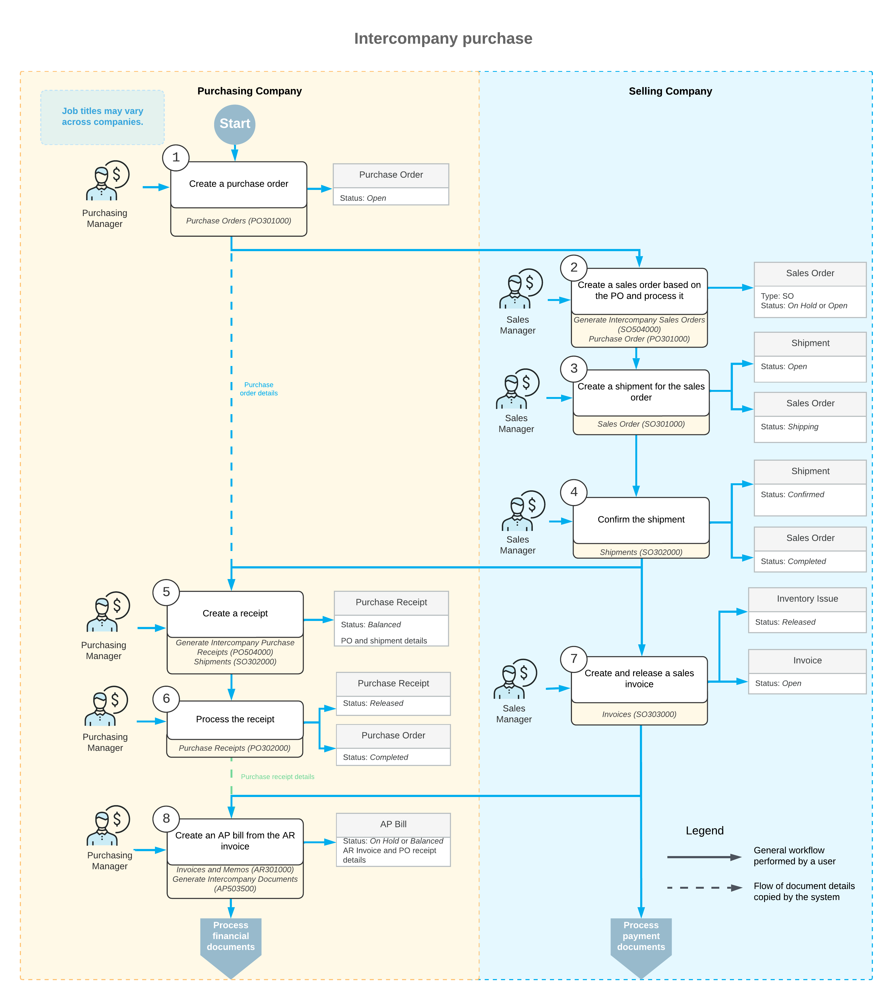

# Intercompany Purchases and Returns: General Information {#_38760818-c1d3-467a-bac1-256cbeb00ea9 .concept}

If the intercompany sales functionality is configured in Acumatica ERP, you can automatically generate a sales order for each purchase order from a company or branch within the same tenant to process a sale of stock or non-stock items.

## Learning Objectives { .section}

In this chapter, you will learn how to do the following:

-   Process an intercompany purchase of stock items
-   Process and intercompany return of stock items
-   Process an intercompany drop-ship purchase of stock items
-   Process and intercompany drop-ship return of stock items

## Applicable Scenarios { .section}

You use the intercompany sales functionality if there are multiple companies defined in the same tenant and one of the companies \(the purchasing company\) has ordered a service or purchased stock items from another company \(the selling company\).

## Processing an Intercompany Purchase { .section}

Once the intercompany sales functionality has been configured, as described in [Intercompany Sales Setup: Implementation Activity](../ImplementationGuide/Finance_Intercompany_SalesSetup_Implem_Activity.md), the sale and purchase documents between the selling and purchasing companies can be processed.

**Attention:** Intercompany documents can be created only one to one. That is, for an intercompany purchase order, only one sales order can be generated. Only one intercompany sales order can be added to one shipment. For one intercompany shipment, only one purchase receipt can be generated.

In Acumatica ERP, to begin processing an intercompany purchase, on the [Purchase Orders](PO_30_10_00.md) \(PO301000\) form, the manager of the purchasing company creates a purchase order of the *Normal* type to the selling company. The manager of the purchasing company adds the required items to the purchase order and removes the *On Hold* status from the order. Then the manager of the selling company opens the [Generate Intercompany Sales Orders](SO_50_40_00.md) \(SO504000\) form and generates a sales order for this purchase order by selecting the unlabeled check box in the line with the purchase order and clicking **Process**. The system generates a sales order with the *Open* status for the purchasing company and automatically copies the relevant settings and the line details of the originating purchase order.

Then the manager of the selling company creates a shipment by clicking **Create Shipment** on the form toolbar of the [Sales Orders](SO_30_10_00.md) \(SO301000\) form and confirms the shipment on the [Shipments](SO_30_20_00.md) \(SO302000\) form. When the shipment is confirmed, the manager of the purchasing company opens the [Generate Intercompany Purchase Receipts](PO_50_40_00.md) \(PO504000\) form and generates a purchase receipt based on the shipment's settings and line details by selecting the unlabeled check box in the line with the shipment and clicking **Process**. Then the manager of the purchasing company releases the generated purchase receipt on the [Purchase Receipts](PO_30_20_00.md) \(PO302000\) form.

The manager of the selling company bills the purchasing company for the shipped items by preparing a sales invoice, which is a financial document in the system that contains links to the applicable shipments and sales orders. The prepared sales invoice can be reviewed and released on the [Invoices](SO_30_30_00.md) \(SO303000\) form. When the sales invoice is released, the sales invoice becomes visible on the [Invoices and Memos](AR_30_10_00.md) \(AR301000\) form as an AR invoice.

When the AR invoice is released, the manager of the purchasing company opens the [Generate Intercompany Documents](AP_50_35_00.md) \(AP503500\) form and generates an AP bill by selecting the unlabeled check box in the line with the purchase receipt and clicking **Process**. Then the manager of the purchasing company releases the AP bill on the [Bills and Adjustments](AP_30_10_00.md) \(AP301000\) form.

## Workflow of the Intercompany Purchase {#section_vv2_1y4_y4b .section}

For an intercompany purchase between the branches of two different companies, the typical process involves the actions and generated documents shown in the following diagram.

**Parent topic:**[Processing Intercompany Purchases and Returns](../UserGuide/OrderMgmt_Intercompany_Sales_and_Purchases_Mapref.md)

