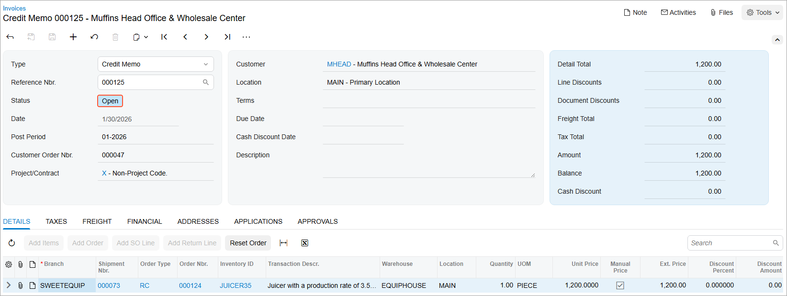
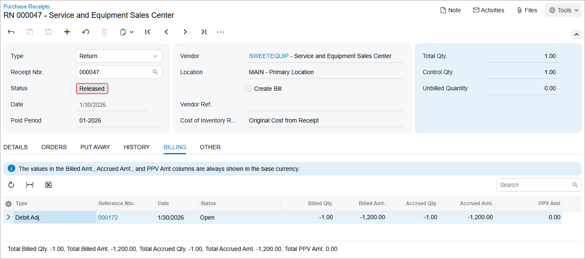

# Intercompany Purchases and Returns: To Process an Intercompany Return {#_16237572-810e-4fc8-b8ba-fa90ea7bf84c .task}

The following activity will walk you through the process of processing an intercompany return.

## Story { .section}

Suppose that the Head Office of the Muffins &amp; Cakes company has purchased two new juicers from the Service and Equipment Sales Center of SweetLife Fruits &amp; Jams and then the company discovered that one juicer was enough to produce the required amount of juice.

Acting as an accountant of Muffins &amp; Cakes, you need to process a purchase return of one juicer.

## Configuration Overview {#section_tz4_djx_cnb .section}

In the *U100* dataset, the following tasks have been performed to support this activity:

-   On the [Enable/Disable Features](CS_10_00_00.md#) \(CS100000\) form, the following features have been enabled:
    -   *Standard Financials*
    -   *Multibranch Support*
    -   *Multicompany Support*
    -   *Advanced Financials*
    -   *Inter-Branch Transactions*
    -   *Inventory and Order Management*
    -   *Inventory*
-   On the [Companies](CS_10_15_00.md) \(CS101500\) form, the *MUFFINS* and *SWEETLIFE* companies have been defined.
-   On the [Branches](CS_10_20_00.md) \(CS102000\) form, the *SWEETEQUIP* and *MHEAD* branches have been defined.
-   On the [Stock Items](IN_20_25_00.md) \(IN202500\) form, the *JUICER35* inventory item has been configured.
-   On the [Warehouses](IN_20_40_00.md) \(IN204000\) form, the *MHEADWH* warehouse has been created and specified for the *MAIN* location of the *MHEAD* branch.

## Process Overview { .section}

In this activity, on the [Order Types](SO_20_10_00.md) \(SO201000\) form, you will review the intercompany settings of the *RC* order type. On the [Vendors](AP_30_30_00.md) \(AP303000\) form, you will review the default warehouse of the *SWEETEQUIP* vendor. On the [Purchase Receipts](PO_30_20_00.md) \(PO302000\) form, you will create and release a purchase return. You will then cause the system to generate a sales return based on the purchase return on the [Generate Intercompany Sales Orders](SO_50_40_00.md) \(SO504000\) form. On the [Sales Orders](SO_30_10_00.md) \(SO301000\) form, you will create and release a receipt for the sales return. You will then process an SO credit memo on the [Invoices](SO_30_30_00.md) \(SO303000\) form and prepare a debit adjustment on the [Generate Intercompany Documents](AP_50_35_00.md) \(AP503500\) form. On the [Bills and Adjustments](AP_30_10_00.md) \(AP301000\) form, you will release the debit adjustment and finally, you will review the initial purchase return on the [Purchase Receipts](PO_30_20_00.md) form.

## System Preparation { .section}

Before you begin performing the steps of this activity, do the following:

1.  Launch the Acumatica ERP website with the *U100* dataset preloaded, and sign in as an accountant Nenad Pasic by using the *pasic* username and the *123* password.

    **Attention:** For simplicity, you perform all steps of this activity under the username which has access to both *Service and Equipment Sales Center* and *Muffins Head Office &amp; Wholesale Center* branches. However, in a production environment, the steps for different branches may be performed by different users.

2.  In the info area at the upper-right corner of the top pane of the Acumatica ERP screen, make sure that the business date is set to *1/30/2026*. If a different date is displayed, click the Business Date menu button and select *1/30/2026* from the calendar. For simplicity, you'll create and process all documents in this activity using this business date.
3.  On the Company and Branch Selection menu on the top pane of the Acumatica ERP screen, select the *Muffins Head Office &amp; Wholesale Center* branch.
4.  Make sure the *SWEETEQUIP* branch has been extended as a vendor and the *MHEAD* branch has been extended as a customer, as described in [Intercompany Sales Setup: Implementation Activity](../ImplementationGuide/Finance_Intercompany_SalesSetup_Implem_Activity.md).
5.  Make sure an intercompany purchase of juicers has been processed, as described in [Intercompany Purchases and Returns: To Process an Intercompany Purchase](OrderMgmt_Intercompany_Sales_and_Purchases_Activity.md).

## Step 1: Reviewing the Intercompany Sales Return Settings { .section}

To review the settings the system uses when processing intercompany sales returns, do the following:

1.  Open the [Order Types](SO_20_10_00.md) \(SO201000\) form.
2.  In the **Order Type** box, select *RC*.

    This is the order type that the system will use later when generating a sales return. This order type is specified in the **Default Type for Intercompany Returns** box on the [Sales Orders Preferences](SO_10_10_00.md) \(SO101000\) form.

3.  Review the settings specified in the **Intercompany Posting Settings** section on the **General** tab.

    In the **Use Sales Account From** and **Use COGS Account From** boxes, *Inventory Item* is selected. It means that the system will use the sales account and COGS account associated with the inventory item when creating an intercompany sales return.

4.  Open the [Vendors](AP_30_30_00.md) \(AP303000\) form.
5.  In the **Vendor ID** box, select *SWEETEQUIP*.
6.  On the **Purchase Settings** tab, in the **Warehouse** box, review the default warehouse of this vendor specified for the *MHEAD* branch to which you are signed in.

    This is the warehouse you specified in [Intercompany Purchases and Returns: To Process an Intercompany Purchase](OrderMgmt_Intercompany_Sales_and_Purchases_Activity.md). It is used by default in documents created for the *SWEETEQUIP* vendor in the *MHEAD* branch.

## Step 2: Creating an Intercompany Purchase Return { .section}

To create an intercompany purchase return, do the following:

1.  Open the [Purchase Receipts](PO_30_20_00.md) \(PO302000\) form.
2.  Open the purchase receipt with the *SWEETEQUIP* vendor, which you created in [Intercompany Purchases and Returns: To Process an Intercompany Purchase](OrderMgmt_Intercompany_Sales_and_Purchases_Activity.md).
3.  On the **Details** tab, select the unlabeled check box in the line of the purchase receipt with the *JUICER35* item.
4.  On the form toolbar, click **Return** to create a purchase return that corresponds to the purchase receipt and includes the selected line.

    The system creates a document with the *Return* type and with appropriate settings copied from the purchase receipt, and opens it on the same form.

## Step 3: Specifying the Settings of the Intercompany Purchase Return and Releasing the Return { .section}

To define the specific settings of the return document, do the following:

1.  While you are still viewing the purchase return that was created on the [Purchase Receipts](PO_30_20_00.md) \(PO302000\) form, in the Summary area, make sure that the *Original Cost from Receipt* option is selected in the **Cost of Inventory Return From** box. With this option selected, the item will be issued from inventory at the cost at which it was purchased.
2.  Make sure that the **Create Bill** check box is cleared. You will later generate a debit adjustment manually.
3.  In the only return line on the **Details** tab, change the **Receipt Qty.** to `1` \(which is the quantity of items to be returned\).
4.  In the line, clear the **Open PO Line** check box to indicate that no replacement is needed for the returned item.
5.  On the form toolbar, click **Save** to save the purchase return, which has the *Balanced* status and can thus be released.
6.  On the form toolbar, click **Release**.

## Step 4: Creating an Intercompany Sales Return { .section}

To generate an intercompany sales return, do the following:

1.  Open the [Generate Intercompany Sales Orders](SO_50_40_00.md) \(SO504000\) form.
2.  In the Summary area, select the *Purchase Returns* option in the **Purchase Doc. Type** box.
3.  In the only line, select the unlabeled check box and click **Process** on the form toolbar.

    The system generates a sales return of the *RC* type with the *Open* status and automatically copies the relevant settings and the line details of the originating purchase return.

4.  In the dialog box, which opens, click **Close**.
5.  On the [Sales Orders](SO_30_10_00.md) \(SO301000\) form, open the sales order of the *RC* type with the *MHEAD* customer and review its details.

## Step 5: Preparing and Releasing a Receipt { .section}

To create a receipt for the intercompany sales return, do the following:

1.  While you are still viewing the sales return on the [Sales Orders](SO_30_10_00.md) \(SO301000\) form, on the form toolbar, click **Create Receipt**.
2.  In the **Specify Shipment Parameters** dialog box, which opens, make sure that *1/30/2026* is selected in the **Shipment Date** box and *EQUIPHOUSE* is selected in the **Warehouse ID** box, and click **OK**.

    The system creates a shipment with the *Receipt* operation and *Open* status, and opens this shipment on the [Shipments](SO_30_20_00.md) \(SO302000\) form.

3.  On the form toolbar, click **Confirm Shipment**.

## Step 6: Processing an SO Credit Memo { .section}

Now that you have processed the return of the items to SweetLife's inventory, you need to prepare an SO credit memo to Muffins &amp; Cakes to adjust the customer's balance. To prepare the credit memo, do the following:

1.  While you are still viewing the shipment on the [Shipments](SO_30_20_00.md) \(SO302000\) form, on the form toolbar, click **Prepare Invoice**. The system creates a credit memo to the customer and opens it on the [Invoices](SO_30_30_00.md) \(SO303000\) form.
2.  On the form toolbar, click **Release** to release the credit memo, which is assigned the *Open* status, as shown in the following screenshot.

    

    When you release the SO credit memo, the system automatically generates a corresponding inventory receipt for the returned items on the [Receipts](IN_30_10_00.md) \(IN301000\) form; it also creates and releases a credit memo on the [Invoices and Memos](AR_30_10_00.md) \(AR301000\) form. In the AR credit memo, the *MHEAD* company is specified as the customer so that an intercompany AP debit adjustment can be created.

## Step 7: Preparing a Debit Adjustment { .section}

To prepare a debit adjustment, do the following:

1.  Open the [Generate Intercompany Documents](AP_50_35_00.md) \(AP503500\) form.
2.  In the only line, select the unlabeled check box and click **Process** on the form toolbar.

    The system generates a debit adjustment on the [Bills and Adjustments](AP_30_10_00.md) \(AP301000\) form.

3.  In the dialog box, which opens, click **Close**.
4.  On the [Bills and Adjustments](AP_30_10_00.md) form, open the generated debit adjustment, click **Remove Hold** on the form toolbar and then click **Release**.

    The system adds the details of the debit adjustment to the **Billing** tab of the [Purchase Receipts](PO_30_20_00.md) \(PO302000\) form for the initial purchase return as shown in the following screenshot.

    

**Parent topic:**[Processing Intercompany Purchases and Returns](../UserGuide/OrderMgmt_Intercompany_Sales_and_Purchases_Mapref.md)

