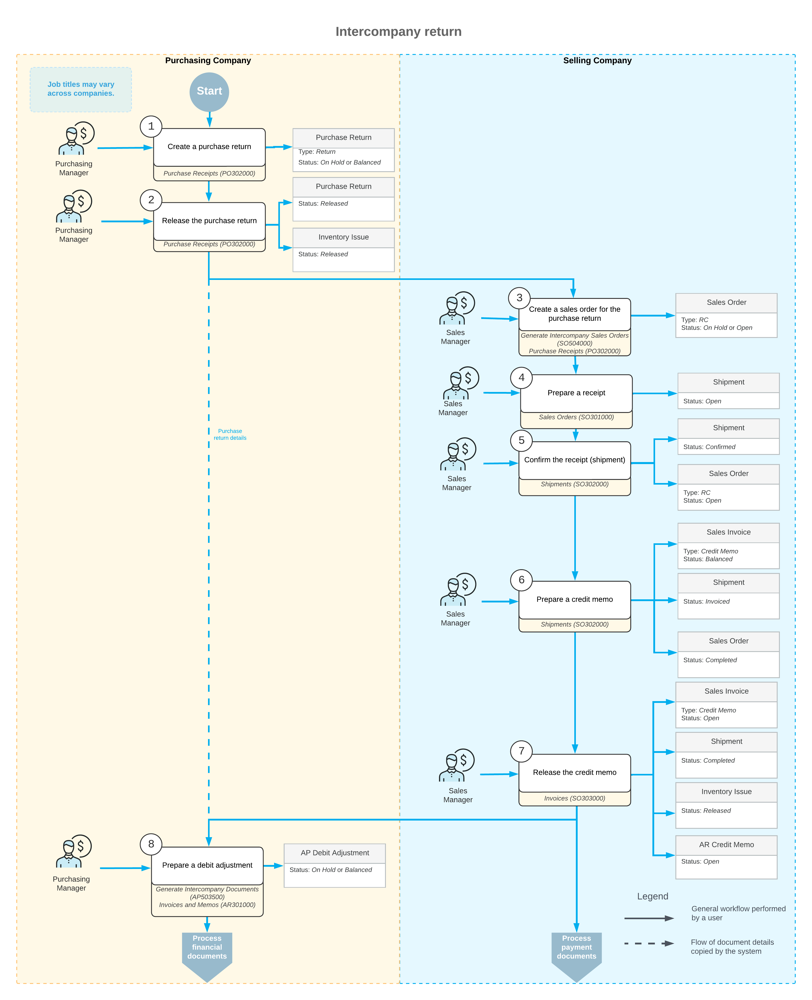

# Intercompany Purchases and Returns: Intercompany Returns {#_e2b118d2-17b9-4dca-b069-12d99a6c33f5 .concept}

For intercompany purchases, you can generate purchase returns.

## Learning Objectives { .section}

In this chapter, you will learn how to create a purchase return and automatically generate a sales return based on the purchase return.

## Applicable Scenarios { .section}

You use the intercompany returns functionality if there are multiple companies defined in the same tenant and one of the companies \(the purchasing company\) needs to make a return of a purchased item to another company \(the selling company\).

## Processing an Intercompany Return { .section}

In Acumatica ERP, to begin processing an intercompany return, on the [Purchase Receipts](PO_30_20_00.md) \(PO302000\) form, the manager of the purchasing company creates a purchase return, which is a document of the *Return* type, that includes a line for each item being returned. To create a purchase return, the manager of the purchasing company opens the purchase receipt with the items to be returned, select the unlabeled check boxes on the **Details** tab for the lines with these items, and clicks **Return** on the form toolbar. The system copies the relevant information from the purchase receipt to a new purchase return on the [Purchase Receipts](PO_30_20_00.md) form. In the copied lines, the purchasing manage specifies the quantity of items to be returned in the **Receipt Qty.** column. If no replacement required, the purchasing manager clears the **Open PO** check box in the lines of the purchase return. Then the manager saves the purchase return and releases the return by clicking **Release** on the form toolbar.

The manager of the selling company opens the [Generate Intercompany Sales Orders](SO_50_40_00.md) \(SO504000\), selects the *Purchase Return* option in the **Purchase Doc. Type** box in the Summary area of the form, selects the unlabeled check box in the line with the purchase return and clicks **Process** on the form toolbar. The system generates a return order with the *Open* status and automatically copies the relevant settings and the line details of the originating purchase return. The manager of the selling company opens sales return on the [Sales Orders](SO_30_10_00.md) \(SO301000\) form and creates a shipment with the **Receipt** operation by clicking **Create Receipt** on the form toolbar. Then the manager releases the shipment by clicking **Confirm Shipment** on the form toolbar.

To adjust the customer's balance, the manager of the selling company create an credit memo on the [Shipments](SO_30_20_00.md) form by clicking **Prepare Invoice** on the form toolbar while the manager is still viewing the shipment. The system creates a credit memo to the customer and opens it on the [Invoices](SO_30_30_00.md) \(SO303000\) form. On the form toolbar of the [Invoices](SO_30_30_00.md) form, the manager clicks **Release** to release the credit memo.

When the manager of the selling company releases the credit memo, the system automatically generates a corresponding inventory receipt for the returned items on the [Receipts](IN_30_10_00.md) \(IN301000\) form; it also creates and releases a credit memo on the [Invoices and Memos](AR_30_10_00.md) \(AR301000\) form. Then the manager of the purchasing company open the [Generate Intercompany Documents](AP_50_35_00.md) \(AP503500\) form, selects the unlabeled check box in the line with the credit memo and clicks **Process** on the form toolbar. The system generates a debit adjustment on the [Bills and Adjustments](AP_30_10_00.md) \(AP301000\) form. The manager of the purchasing company opens the generated debit adjustment on the [Bills and Adjustments](AP_30_10_00.md) form, clicks **Remove Hold** on the form toolbar and then clicks **Release**. The system adds the details of the debit adjustment to the **Billing History** tab of the [Purchase Receipts](PO_30_20_00.md) \(PO302000\) form for the initial purchase return.

## Workflow of an Intercompany Return { .section}

For an intercompany return between the branches of two different companies, the typical process involves the actions and generated documents shown in the following diagram.

**Parent topic:**[Processing Intercompany Purchases and Returns](../UserGuide/OrderMgmt_Intercompany_Sales_and_Purchases_Mapref.md)

