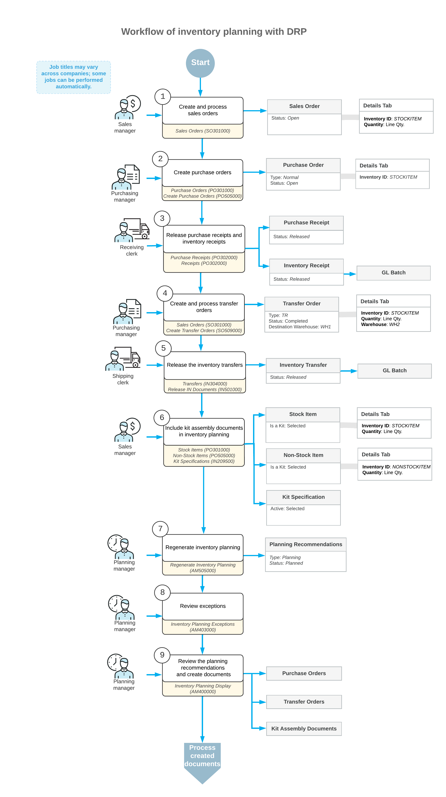

# Inventory Planning with DRP: General Information {#_e7313ef1-9d38-4f3c-a24a-943efb584da4 .concept}

In Acumatica ERP, you can take advantage of time-phased inventory planning and sales forecasting for handling orders within a supply chain. You can precisely plan your supply to arrive at the required time, minimizing the inventory stored in warehouses for orders placed long before the needed date. You can match supply to demand based on date-specific recommendations for unmet demand. The system can group supply and demand by time periods and generate exceptions for supply issues, such as late delivery dates in documents.

The inventory planning functionality is available only if one of the following features is enabled on the [Enable/Disable Features](CS_10_00_00.md) \(CS100000\) form: *Distribution Requirements Planning* \(DRP\) or *Material Requirements Planning* \(MRP\). This chapter describes how to perform inventory planning with DRP. For details about configuring inventory planning, see [Inventory Planning Configuration: General Information](../ImplementationGuide/config_Inventory_Planning_GeneralInfo.md).

Some facets of inventory planning depend on the features enabled in your system on the [Enable/Disable Features](CS_10_00_00.md) form:

-   You can specify planning requirements by warehouse and transfer stock items between warehouses if the *Multiple Warehouses* feature is enabled. For details, see [Inventory Planning with DRP: Transfers](OrderMgmt_Inventory_Planning_Transfers_in_DRP.md).
-   You can plan stock components needed to assemble a kit by using the inventory planning functionality if the *Kit Assembly* feature is enabled.

## Learning Objectives { .section}

In this chapter, you will learn how to do the following:

-   Run inventory planning and analyze the results
-   View the exceptions and take the needed actions
-   Create supply documents based on the results of the inventory planning analysis

## Applicable Scenarios { .section}

You may need to perform inventory planning in the following cases:

-   Your company has supply and demand orders spread out over a time period and wants to avoid stockouts on any particular date.
-   Your company has multiple warehouses, and you restock the inventory in a warehouse by transferring items from another warehouse where they are available.
-   Your company uses inventory kits and needs to ensure that it has the stock components needed to assemble the kits.

## General Steps of Inventory Planning { .section}

You can run the inventory planning process at any time, but the process may affect the performance of the Acumatica ERP instance. We recommend that you use an automation schedule to run the inventory planning process before each business day begins. The process should be run after all of the previous day's sales orders and purchase orders have been entered into the system, all transactions affecting inventory have been posted, and most or all users have signed out of the system. We recommend that you create any needed purchase orders by using the [Create Purchase Orders](PO_50_50_00.md) \(PO505000\) form and any needed transfer orders by using the [Create Transfer Orders](SO_50_90_00.md) \(SO509000\) form at the end of the business day. Also, because inventory planning is a very resource-dependent process, it should be run in a time frame that does not conflict with database maintenance processes.

**Attention:** On inventory planning forms, the system does not show allocation links between a sales order and the corresponding purchase order when it is matching supply and demand. \(The **PO Source** column on the [Sales Orders](SO_30_10_00.md) \(SO301000\) form for the sales order may contain *Purchase to Order* or any other option.\) The system only matches supply and demand based on dates.

Inventory planning consists of the following general steps:

1.  Before the end of a business day, processing and releasing all sales documents \(such as sales orders or sales invoices\), transfer orders, and transactions that affect inventory.
2.  Before the end of a business day, processing and releasing all purchase documents \(such as purchase receipts\) and transactions that affect inventory.
3.  Including kits in inventory planning \(if applicable\).
4.  Either manually or through the use of an automation schedule, regenerating inventory planning by using the [Regenerate Inventory Planning](AM_50_50_00.md) \(AM505000\) form.
5.  Reviewing the inventory planning exceptions on the [Inventory Planning Exceptions](AM_40_30_00.md) \(AM403000\) form. Depending on the exceptions, the planning manager should evaluate and take the needed recommended actions, such as contacting a vendor to expedite delivery. Then the planning manager should make the needed changes to the dates in the demand and supply documents.
6.  Reviewing the results of inventory planning regeneration by using the [Inventory Planning Display](AM_40_00_00.md) \(AM400000\) form and creating the required purchase orders or transfer orders by using the same form.

## Workflow of Inventory Planning with DRP {#section_vv2_1y4_y4b .section}

A general workflow of DRP—inventory planning that does not include production orders—involves the steps and generated documents shown in the following diagram.

**Parent topic:**[Performing Inventory Planning with DRP](../UserGuide/OrderMgmt_Inventory_Planning_DRP_Mapref.md)

