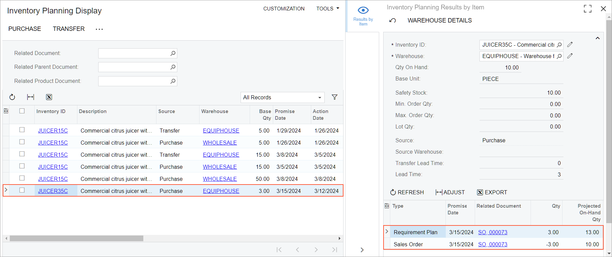

# Inventory Planning with DRP: Process Activity {#_2ed5fb00-63cc-4c6c-bda1-19e30567d45e .task}

The following activity demonstrates how to perform distribution requirements planning \(that is, inventory planning that does not include production orders\) and analyze the results in order to take the needed actions.

**Attention:** This activity is based on the *U100* dataset. If you are using another dataset or if any system settings have been changed in *U100*, these changes can affect the workflow of the activity and the results of the processing. To avoid issues, restore the *U100* dataset to its initial state.

## Story { .section}

Suppose that GoodFood One Restaurant ordered three citrus juicers from SweetLife Fruits &amp; Jams. The customer requested that the juicers be delivered a week from today's date. SweetLife has the juicers in stock, but not enough to maintain the safety stock. Thus, some juicers must be bought from the Squeezo vendor, which has a default lead time of three days. Further suppose that the customer decided that they need the juicers to be delivered at a later date; thus, you need to move back the promised date of the purchased juicers as well.

Acting as the sales manager, you need to create a sales order for the juicers. Acting as the purchasing manager, you need to create a purchase order for the juicers. Acting as the planning manager, you need to run inventory planning, analyze the results, and take the required actions to cause the juicers to be shipped to the customer by the requested date. For simplicity, you will perform the entire activity while signed in to the same user account.

## Configuration Overview {#section_tz4_djx_cnb .section}

In the *U100* dataset, the following tasks have been performed to support this activity:

-   On the [Customers](AR_30_30_00.md) \(AR303000\) form, the *GOODFOOD* customer has been created.
-   On the [Vendors](AP_30_30_00.md) \(AP303000\) form, the *SQUEEZO* vendor has been created.
-   On the [Stock Items](IN_20_25_00.md) \(IN202500\) form, the *JUICER35C* stock item has been created. On the **Vendors** tab, the *SQUEEZO* vendor has been specified.

## Process Overview { .section}

In this activity, you will do the following:

1.  On the [Sales Orders](SO_30_10_00.md) \(SO301000\) form, create a sales order.
2.  On the [Regenerate Inventory Planning](AM_50_50_00.md) \(AM505000\) form, regenerate inventory planning, and on the [Inventory Planning Exceptions](AM_40_30_00.md) \(AM403000\) form, check whether any exceptions are shown.
3.  On the [Inventory Planning Display](AM_40_00_00.md) \(AM400000\) form, review the planning recommendations for the *JUICER35C* stock item based on the last execution of inventory requirements planning.
4.  By using the [Inventory Planning Display](AM_40_00_00.md) form as a starting point, create a purchase order on the [Purchase Orders](PO_30_10_00.md) \(PO301000\) form.
5.  On the [Sales Orders](SO_30_10_00.md) form, change the **Requested On** date.
6.  On the [Regenerate Inventory Planning](AM_50_50_00.md) form, regenerate inventory planning, and on the [Inventory Planning Exceptions](AM_40_30_00.md) form, check whether any exceptions are shown.
7.  On the [Purchase Orders](PO_30_10_00.md) form, change the **Promised On** date.
8.  On the [Regenerate Inventory Planning](AM_50_50_00.md) form, regenerate inventory planning, and on the [Inventory Planning Exceptions](AM_40_30_00.md) form, make sure that no exceptions are shown.

## System Preparation { .section}

Before you start performing inventory planning, do the following:

1.  Launch the Acumatica ERP website with the *U100* dataset preloaded, and sign in to the system by using the *gibbs* username and the *123* password.
2.  In the info area, in the upper-right corner of the top pane of the Acumatica ERP screen, make sure that the business date in your system is set to today’s date. For simplicity, in this activity, you will create and process all documents in the system on this business date.
3.  Be sure that you have configured DRP, as described in the [Inventory Planning Configuration: To Implement DRP](../ImplementationGuide/config_Inventory_Planning_DRP_Implem_Activity.md) prerequisite activity.

## Step 1: Creating a Sales Order { .section}

To create a sales order with three citrus juicers for the GoodFood One Restaurant customer, do the following:

1.  On the [Sales Orders](SO_30_10_00.md) \(SO301000\) form, add a new record.
2.  In the Summary area, specify the following settings:
    -   **Customer**: *GOODFOOD*
    -   **Requested On**: The date that is one week after today's date
    -   **Description**: `Sale of 3 citrus juicers to GoodFood One Restaurant`
3.  On the **Details** tab, add a new row, and specify the following settings in the row:
    -   **Inventory ID**: *JUICER35C*
    -   **Quantity**: `3`
    -   **Unit Price**: *5000*
4.  On the form toolbar, click **Save**.

## Step 2: Regenerating Inventory Planning and Viewing Exceptions { .section}

To regenerate inventory planning and view exceptions, do the following:

1.  Open the [Regenerate Inventory Planning](AM_50_50_00.md) \(AM505000\) form.
2.  On the form toolbar, click **Process**. Wait for the system to complete the operation.
3.  Open the [Inventory Planning Exceptions](AM_40_30_00.md) \(AM403000\) form. Make sure that no exceptions are displayed in the table.

## Step 3: Reviewing Planning Recommendations for Supply Orders { .section}

To review planning recommendations for the juicers, do the following:

1.  Open the [Inventory Planning Display](AM_40_00_00.md) \(AM400000\) form. Among other rows, the table shows one row with the *JUICER35C* stock item. The row has the following settings:
    -   **Source**: *Purchase*
    -   **Base Qty.**: *3*
    -   **Promise Date**: The date that is a week from today
    -   **Type**: *Sales Order*
2.  Click the row with the *JUICER35C* stock item, and then click **Results by Item** in the side panel. On the [Inventory Planning Results by Item](AM_40_40_00.md) \(AM404000\) form, which opens in the side panel \(see the screenshot below\), review the following settings in the Selection area:

    -   **Qty. On Hand**: *10*
    -   **Safety Stock**: *10*
    -   **Lead Time**: *3*
    

    Review the table rows. In the row with the *Sales Order* type, notice that *-3* is specified in the **Qty.** column, meaning that 3 items will be sold to the customer. In the row with the *Requirement Plan* type, notice that *3* is specified in the **Qty.** column, meaning that *3* juicers should be received in the warehouse to meet a safety stock of *10*.

3.  Close the side panel.

## Step 4: Creating a Purchase Order { .section}

To create a purchase order for the juicers, do the following:

1.  While you are still viewing the planning recommendations on the [Inventory Planning Display](AM_40_00_00.md) \(AM400000\) form, do the following:
2.  Select the unlabeled check box in the row with the *JUICER35C* stock item.
3.  On the form toolbar, click **Purchase**.
4.  In the **Create Purchase Order** dialog box, which opens, do the following:
    1.  In the **Vendor** box, make sure that the *SQUEEZO* vendor is selected.
    2.  In the table, make sure that the row with *JUICER35C* is shown.
    3.  Click **Create**.

        The system closes this dialog box, creates the purchase order, and shows its type and reference number in the **Purchase Order Created** dialog box, which opens.

5.  Click **OK** to close the dialog box. Notice that the table no longer lists the row with the *JUICER35C* item.
6.  Open the created purchase order on the [Purchase Orders](PO_30_10_00.md) \(PO301000\) form.
7.  Make sure that the **Promised On** box contains today's date. This purchase order satisfies the demand of the sales order because the juicers will be delivered in time for the customer to receive them.

## Step 5: Changing the Requested On Date in the Sales Order { .section}

Suppose that a customer contacted you and said they want to receive the juicers at a later date, which is a month from today. To change the date in the sales order, do the following:

1.  On the [Sales Orders](SO_30_10_00.md) \(SO301000\) form, open the sales order that you created earlier in this activity.
2.  In the **Requested On** box of the Summary area, change the date to today's date plus one month.
3.  On the form toolbar, click **Save**.

## Step 6: Rerunning Inventory Planning and Viewing the Exceptions { .section}

To view how the changed date in the sales order has affected the exceptions, do the following:

1.  Open the [Regenerate Inventory Planning](AM_50_50_00.md) \(AM505000\) form.
2.  On the form toolbar, click **Process**, and wait until the system completes processing.
3.  Open the [Inventory Planning Exceptions](AM_40_30_00.md) \(AM403000\) form.

    Make sure that the exception of the *Defer* type for the *JUICER35C* item has appeared in the table. The **Promised Date** is next week, which means that the juicer will be in a warehouse at this time. The **Required Date** is a month from today, which means that the juicer will be stored at the warehouse for three extra weeks. To minimize the days when the juicer will be kept in the warehouse, you should negotiate a later purchase date with the vendor.

## Step 7: Changing the Promised On Date in the Purchase Order { .section}

Suppose that you have negotiated a later delivery date \(three weeks after today\) with the vendor for the juicer. To change the date in the purchase order, do the following:

1.  On the [Purchase Orders](PO_30_10_00.md) \(PO301000\) form, open the purchase order that you created earlier in this activity.
2.  In the **Promised On** box of the Summary area, change the date to three weeks after today's date.
3.  In the dialog box with the warning message that appears, click **Yes**.
4.  On the form toolbar, click **Save**.

## Step 8: Rerunning Inventory Planning and Viewing Exceptions { .section}

To rerun inventory planning and make sure that all exceptions have been processed, do the following:

1.  Open the [Regenerate Inventory Planning](AM_50_50_00.md) \(AM505000\) form.
2.  On the form toolbar, click **Process**, and wait until the system completes processing.
3.  Open the [Inventory Planning Exceptions](AM_40_30_00.md) \(AM403000\) form.
4.  Make sure that no exceptions are displayed in the list.

You have successfully planned the demand and supply for the juicer.

**Parent topic:**[Performing Inventory Planning with DRP](../UserGuide/OrderMgmt_Inventory_Planning_DRP_Mapref.md)

