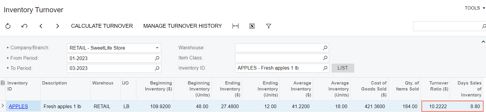

# Inventory Turnover: To Calculate Inventory Turnover {#_736372f2-287f-4c4a-8642-042f5ab67ac5 .task}

The following activity will walk you through the process of calculating the inventory turnover and filtering the results.

**Attention:** This activity is based on the *U100* dataset. If you are using another dataset or if any system settings have been changed in *U100*, these changes can affect the workflow of the activity and the results of the processing. To avoid issues, restore the *U100* dataset to its initial state.

## Story { .section}

Suppose that you are Regina Wiley, a purchasing manager in the SweetLife Fruits &amp; Jams company. In the first month of the current year, you started purchasing apples for sales in the retail store. By the end of the first quarter, you need to review the inventory turnover for the *APPLES* stock item.

## Configuration Overview {#section_tz4_djx_cnb .section}

In the *U100* dataset, the following tasks have been performed for the purposes of this activity:

-   On the [Enable/Disable Features](CS_10_00_00.md) \(CS100000\) form, the following features have been enabled:
    -   *Inventory and Order Management*, which provides the standard functionality of inventory and order management
    -   *Inventory*, which gives you the ability to maintain stock items using forms related to the inventory functionality and to create and process sales and purchase documents that include stock items
-   On the [Stock Items](IN_20_25_00.md) \(IN202500\) form, the *APPLES* stock item has been created.

## Process Overview { .section}

In the process of calculating the inventory turnover, you will open the [Inventory Turnover](IN_40_70_10.md) \(IN407010\) form and specify the values in the required **Company/Branch**, **From Period**, **To Period** boxes in the Selection area of the form. When the required values are specified, you will click **Calculate Turnover** on the form toolbar. The system will calculate the turnover for stock items that had been issued from the warehouses of the branch, company, or group of companies specified in the **Company/Branch** within the selected period range.

To narrow the results of the calculation, you will specify additional values in the **Warehouse**, **Item Class**, and **Inventory ID** boxes in the Selection are of the form. The system will filter the rows to displays the relevant results.

## System Preparation { .section}

Before you begin calculating the inventory turnover, do the following:

1.  Sign in to the system as purchasing manager by using the *wiley* username and the provided password..
2.  In the info area, in the upper-right corner of the top pane of the Acumatica ERP screen, make sure that the business date in your system is set to *3/30/2026*. If a different date is displayed, click the Business Date menu button, and select *3/30/2026* on the calendar. For simplicity, in this activity, you will create and process all documents in the system on this business date.

## Step 1: Calculating the Inventory Turnover { .section}

To calculate the inventory turnover in the retail warehouse of for the first quarter of the year, do the following:

1.  Open the [Inventory Turnover](IN_40_70_10.md) \(IN407010\) form.
2.  In the Company/Branch box in the Selection area, specify *RETAIL*.
3.  In the **From Period** box in the Selection area, specify *01-2026*.
4.  In the **To Period** box in the Selection area, specify *03-2026*.
5.  On the form toolbar, click **Calculate Turnover**.

The system calculates the turnover for the stock items in the *RETAIL* warehouse that have been received and sold within the selected range of periods.

## Step 2: Filtering the Calculation Results { .section}

To narrow the results of the calculation and view the row with the *APPLES* stock item only, do the following:

1.  In the Summary area, specify *APPLES* in the **Inventory ID** box.
2.  In the only line left, review the details of the inventory turnover for the *APPLES* item \(as shown in the following screenshot\). The value in the **Turnover Ratio \($\)** column is equal to *10.2222*, which is the value that shows how many times the average inventory has been sold within the selected period range in the Summary area. The value in the **Days Sales of Inventory** column shows the number of days required to sell the average inventory .

    

**Parent topic:**[Calculating Inventory Turnover](../UserGuide/Inventory_Turnover_Mapref.md)

