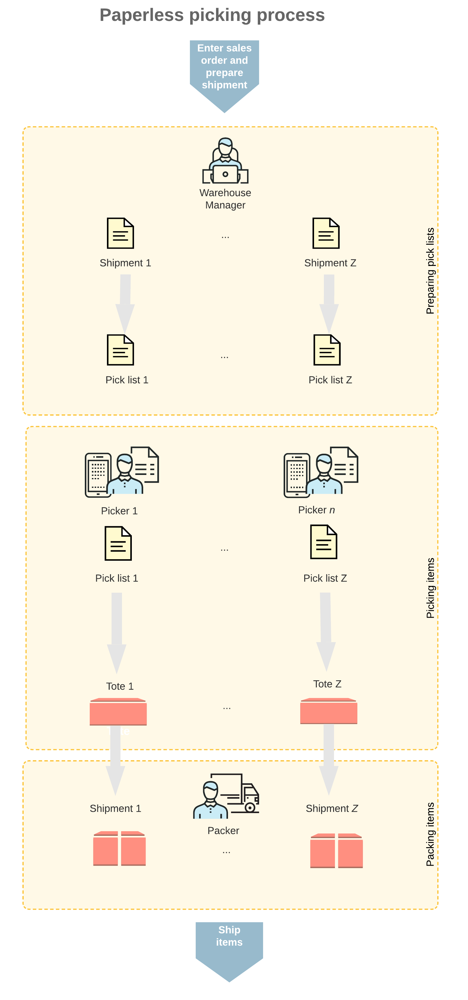
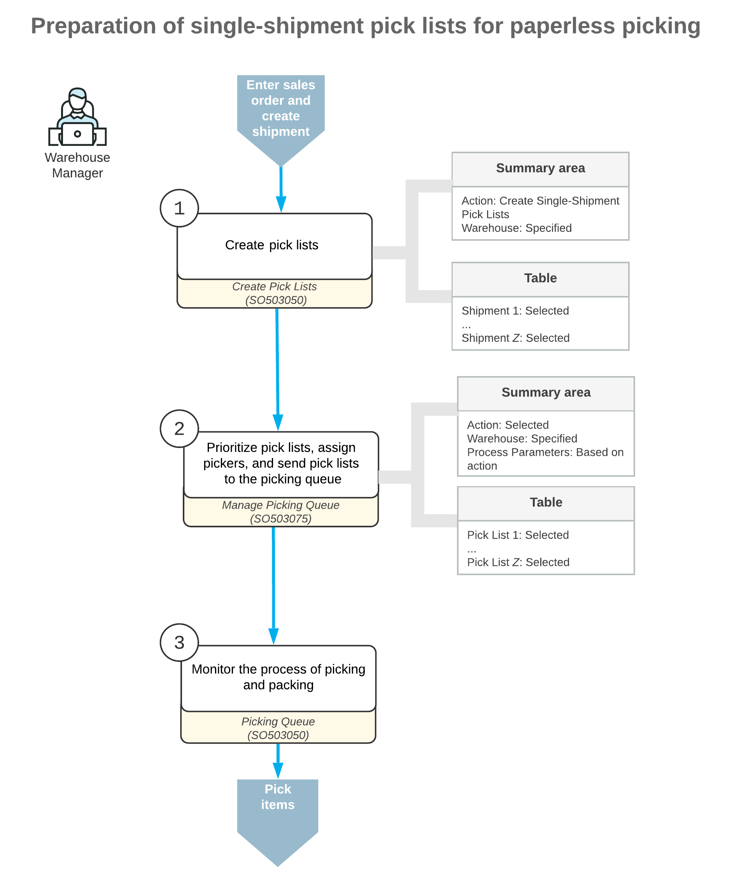
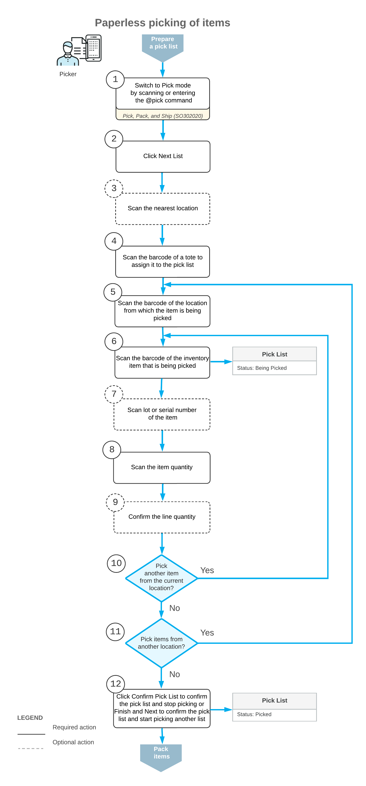
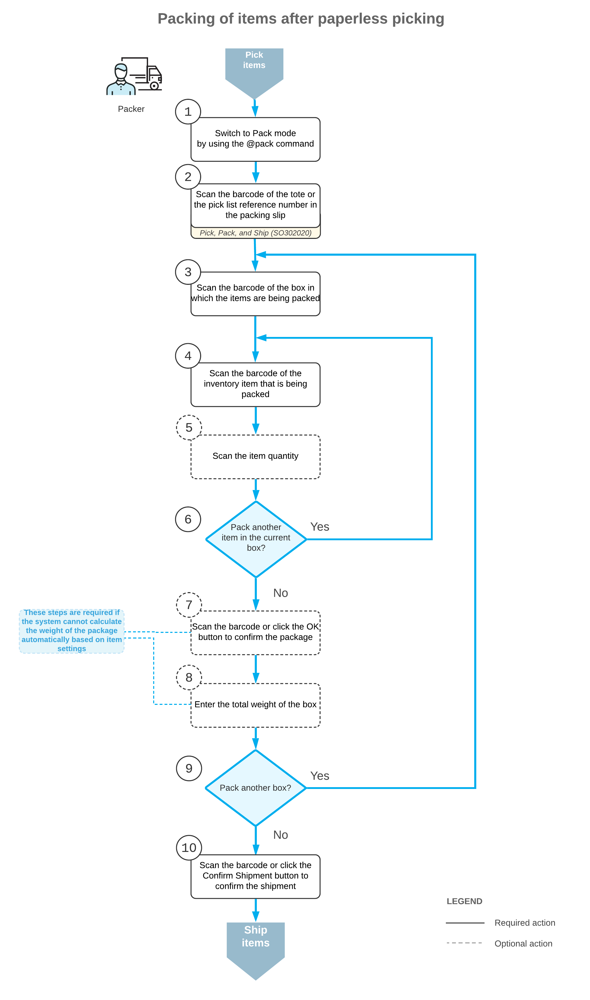

# Paperless Picking: General Information {#_c755d080-f470-4ed3-8d56-6dee4660fc26 .concept}

In this topic, you will read about the paperless picking workflow in Acumatica ERP. If the *Paperless Picking* feature is enabled on the [Enable/Disable Features](CS_10_00_00.md#) \(CS100000\) form, you can organize the warehouse picking jobs without printing paper pick lists. The process of picking must be prepared by a warehouse manager for the system to manage the picking queue, priorities, and direct assignments of the pick lists.

For simplicity, this topic will illustrate the workflow of paperless picking only for single-shipment pick lists. The paperless picking supports wave and batch pick lists too.

## Learning Objectives { .section}

In this chapter, you will do the following:

-   Create pick lists
-   Change the priority of pick lists
-   Assign pick lists to pickers
-   Pick and pack items without printing a pick list
-   Confirm the shipment after packing the items

## Applicable Scenario { .section}

You can use the paperless picking flow for processing daily picking jobs in your warehouse when you organization wants to save on paper. With a paperless picking flow, the warehouse manager prepares pick lists for orders to be shipped and does not print the pick lists. Pickers accept a pick list, collect the items, and organize them in the individual totes assigned to each pick list. When the items are brought to the packing location, the packer takes the items from each of the totes, verifies that the shipment is collected correctly, and packs the items into boxes.

## General Process of Paperless Picking { .section}

The workflow of fulfilling orders with the paperless picking workflow is shown in the following diagram.

The paperless picking workflow includes the following processes performed by the following persons:

1.  A warehouse manager opens the [Create Pick Lists](SO_50_30_50.md) \(SO503050\) form, selects the type of pick lists to be created and the shipments to be processed, specifies the process parameters, and creates the pick lists. Then on the [Manage Picking Queue](SO_50_30_75.md) \(SO503075\) form, the warehouse manager assigns pickers and changes the pick list priority if required, and then sends the pick lists to the picking queue. After that, the warehouse manager opens the [Picking Queue](SO_50_30_80.md) \(SO503080\) form and manages the process of picking and packing in live mode.
2.  A warehouse worker acting as a picker opens the [Pick, Pack, and Ship](SO_30_20_20.md) \(SO302020\) form \(or the corresponding screen in the Acumatica mobile app\), switches to Pick mode, and scans the reference number of a pick list or clicks **Next List** on the form toolbar to accept a pick list from the picking queue. The picker scans the location, then the barcode of the tote that will be used for picking items for a particular pick list. After the picker scans the tote, the system assigns the tote to the pick list. Then the picker goes through the warehouse, picks the items, scans items' barcodes and quantities, and puts the items in the tote.
3.  A warehouse worker acting as a packer opens the [Pick, Pack, and Ship](SO_30_20_20.md) form \(or the corresponding screen in the Acumatica mobile app\), switches to Pack mode and scans the reference number of the tote. Then the packer scans the barcode of the box to which the items are being packed, takes the items from the totes, scans the barcodes and the quantity of items being packed, and puts items in boxes. When all the items are packed, the packer confirms the shipment.

The following sections illustrate and describe the workflows for a warehouse manager, a picker, and a packer in detail. By understanding the workflow for each of these employees, you can better understand the paperless picking workflow in a warehouse.

## Workflow for a Warehouse Manager { .section}

The workflow of a warehouse manager involves the actions shown in the following diagram.

To prepare pick lists in a paperless picking flow, the warehouse manager performs the following steps:

1.  *Selects the type of pick lists to be prepared*.

    The warehouse manager opens the [Create Pick Lists](SO_50_30_50.md) \(SO503050\) form and selects the *Create Single-Shipment Pick Lists* action.

2.  Optional: *Specifies whether the pick lists will be printed*.

    In the Selection area of the [Create Pick Lists](SO_50_30_50.md) form, the manager selects the **Print Pick Lists** check box to specify that a printing version should be prepared for the pick list after the list is created.

3.  Optional: *Specifies whether the pick list will be added to the picking queue after creation*.

    In the Selection area of the [Create Pick Lists](SO_50_30_50.md) form, the manager selects the **Send to Picking Queue** check box to specify that the pick list should be added to the picking queue immediately after the list is created. With the check box selected, the system will assign the *Added to Queue* status to the list.

4.  Optional: *Specifies whether the shipment will be confirmed when the related pick list is confirmed*.

    In the Selection area of the [Create Pick Lists](SO_50_30_50.md) form, the manager selects the **Confirm Shipment on Pick List Confirmation** check box to specify that the system must confirm the shipment as soon as the pick list is confirmed.

5.  *Selects shipments.*

    In the table, the manager selects the unlabeled check boxes in the lines with the shipments, for which pick lists will be created.

6.  *Creates pick lists*.

    On the form toolbar of the [Create Pick Lists](SO_50_30_50.md) form, the manager clicks **Process** to create the pick lists for the selected shipments. By default, the system creates the pick lists with the *On Hold* status.

7.  Optional: *Changes the priority of the pick lists*.

    On the [Manage Picking Queue](SO_50_30_75.md) \(SO503075\) form, the manager selects the *Change Picking Priority* action, selects an option in the **Set Picking Priority to** box in the Selection area, selects the unlabeled check boxes in the lines with the pick lists, and clicks **Process** on the form toolbar. By default, the system creates all pick lists with the *Medium* priority.

8.  Optional: *Assigns pickers to pick lists*.

    On the [Manage Picking Queue](SO_50_30_75.md) form, the manager selects the *Assign Pick List* action, selects a picker in the **Assign to Picker** box in the Selection area, selects the unlabeled check boxes in the lines with the pick lists, and clicks **Process** on the form toolbar.

9.  *Sends pick lists to the picking queue*.

    On the [Manage Picking Queue](SO_50_30_75.md) form, the manager selects the *Send to Picking Queue* action, selects the unlabeled check boxes in the lines with the pick lists, and clicks **Process** on the form toolbar. The system assigns the *Added to Queue* status to the pick lists, and they appear on the [Picking Queue](SO_50_30_80.md) \(SO503080\) form.

10. Optional: *Monitors the picking and packing process*.

    On the form toolbar of the [Picking Queue](SO_50_30_80.md) form, the manager clicks **Start Watching** to make the system refresh the data in the table every 3-5 seconds.

11. Optional: *Changes the priority and assignees of pick lists*.

    In the table of the [Picking Queue](SO_50_30_80.md) form, the manager changes the priority or assignee of a pick list by selecting another value in the **Priority** or **Assigned Picker** columns for the line with the pick list. To change the priority or assignee of a pick list, the monitoring of the picking queue must be disabled by clicking **Cancel** in the **Executing** dialog box in the upper right of the form title bar.

## Workflow for a Picker { .section}

The workflow of a picker involves the actions shown in the following diagram.

To pick the items from a pick list, the picker performs the following steps:

1.  *Switches to Pick mode*.

    The picker opens the [Pick, Pack, and Ship](SO_30_20_20.md) \(SO302020\) form \(or the corresponding screen in the Acumatica mobile app\) and switches to Pick mode by scanning or entering *@pick* barcode.

2.  *Clicks Next List*.

    To start the automated processing, the picker clicks **Next List** on the form toolbar, and the system prompts the picker to enter the barcode of the current location of the picker. When the picker enters the location, the system suggests the pick list to the picker by using the following priority:

    1.  A pick list that has been assigned directly to the particular picker by the manager; if multiple pick lists assigned to this picker by the manager exist, the system selects the pick list to suggest as follows:
        1.  By the highest priority specified by the picking manager
        2.  By the nearest location
    2.  A pick list that is not assigned directly to the particular picker by the manager. If there are multiple pick lists without assignments, the system the system selects a pick list to suggest as follows:
        1.  By the highest priority specified by the picking manager
        2.  By the nearest location
3.  *Scans the barcode of the tote to be assigned to the pick list*.

    The picker scans the barcode of a tote that will be used for picking the pick list. The tote number is mandatory in the paperless picking workflow because the tote is required to identify the pick list when a packer receives the picked items. The picker does not have a printed version of the pick list anymore, and the packer will not be able to identify the shipment to which the items belong without the tote number.

    If totes are not used in your warehouse, and you want to continue printing paper pick lists, you can pick items in shipments without creating a pick list on the [Create Pick Lists](SO_50_30_50.md) \(SO503050\) form, or disable the *Paperless Picking* feature on the [Enable/Disable Features](CS_10_00_00.md) \(CS1000000\) form.

4.  *In each location from the pick list, picks the items as follows:*
    1.  *Scans the location barcode*.

        The system suggests the nearest location in the lines of the pick list that is currently selected. The picker goes to this location and scans its barcode.

    2.  *Scans the item barcode*.

        The system shows the first item to be scanned in the current location. The system displays the picked quantity in the **Picked Quantity** column and highlights the line \(in bold if the line has been picked partially, or in green if the line has been picked in full\). If the UOM defined by the barcode of the scanned item corresponds to a non-base unit of measure, the system converts the item quantity defined by this barcode to the picked quantity in the base unit of measure for this item.

    3.  Optional: *Scans the lot or serial number of the item*.

        If the item has a lot or serial number, the system shows the barcode of this lot or serial number to be scanned. The picker scans the lot or serial number of the item.

    4.  Optional: *Scans the item quantity*.

        To change the picked quantity in the line that is currently being processed, the picker switches to Quantity Editing mode by clicking the **Set Qty** button on the form toolbar \(or by scanning or entering the `*qty` barcode\) and manually enters the quantity in the UOM defined by the barcode of the scanned item.

        If the pick list contains lines of multiple sales orders with the same item and location, the picker can enter the consolidated quantity of these lines. The system will automatically distribute the entered quantity among the lines with this item.

    5.  Optional: *Scans another tote*

        If the items to be picked do not fit the tote or totes assigned to a pick list of the *Single-Shipment* or *Wave* type, the picker can click the **Add Tote** button on the form toolbar. The button becomes available if one of the following conditions is met:

        -   At least one item has been picked to a tote assigned to the single-shipment pick list.
        -   At least one item has been picked in each tote assigned to a wave pick list.
        If the picker scans an additional tote for the pick list, the system asks to scan the tote to which the items will be picked before picking each new item in the pick list.

    6.  Optional: *Confirms the line quantity*.

        If there are not enough units of the item, the picker can click the **Confirm Line Quantity** button with a short quantity. Depending on the **Short Shipment Confirmation** setting on the **Warehouse Management** tab of the [Sales Orders Preferences](SO_10_10_00.md) \(SO101000\) form, the picker may confirm the short shipment or return to the picking of the short line afterwards by selecting this line and clicking **Proceed Picking**.

    7.  *Picks another item*.

        If another item must be picked from the currently selected location, the system shows the barcode of this item. The picker repeats the process starting from the second substep of this step.

    8.  *Picks items from another location*.

        If items from another location must be picked according to the pick list, the system suggests scanning the barcode of the needed location. The picker repeats the process starting from the first substep of this step.

5.  *Completes the picking process*.

    When all items from the pick list are picked, the picker performs one of the following actions:

    -   The picker scans the `*confirm*pick` barcode or clicks the **Confirm Picking** button on the form toolbar to confirm that the picking process is finished.

        The system confirms the pick list—that is, it assigns the *Picked* status to the pick list and displays it on the **Pack** tab on the [Picking Queue](SO_50_30_80.md) \(SO503080\) form—and the system does not suggest the next pick list to pick.

    -   The picker scans the `*confirm*pick*and*next` barcode or clicks the **Finish and Next** button on the form toolbar to confirm that the picking process is finished.

        The system confirms the pick list and suggests the next pick list to be picked. The system uses the last scanned location as the current location of the picker to suggest the nearest pick list.

    After finishing the picking, the picker brings the totes with the items to the packing location.

## Workflow for a Packer { .section}

The workflow of a packer involves the actions shown in the following diagram.

To pack the items for a shipment, the packer performs the following steps:

1.  *Switches to Pack mode*.

    The packer opens the [Pick, Pack, and Ship](SO_30_20_20.md) \(SO302020\) form \(or the corresponding screen in the Acumatica mobile app\) and switches to Pack mode by scanning or entering *@pack* barcode.

2.  *Scans the pick list number or barcode of the tote or totes*.

    The packer scans the pick list number or the barcode of the tote or totes to start packing the items for shipping.

3.  For each box being packed for the selected pick list, the packer does the following:
    1.  *Scans the barcode of the box*.

        The packer scans the barcode of the box into which the items will be packed.

    2.  *Scans the item barcode*.

        When the packer scans the barcode of the packed item, the system searches for the item in the lines of the pick list that is currently selected. If the UOM defined by the barcode of the scanned item corresponds to a non-base unit of measure, the system converts the item quantity defined by this barcode to the packed quantity in the base unit of measure for this item. The system shows the packed quantity in the **Packed Quantity** column and highlights the line \(in bold if the line has been processed partially, or in green if the line has been processed in full\).

    3.  Optional: *Scans the item quantity*.

        To change the packed quantity in the line that is currently being processed, the packer switches to Quantity Editing mode by scanning or entering the `*qty` barcode, and manually enters the quantity in the UOM defined by the barcode of the scanned item.

    4.  *Packs another item*.

        If another item needs to be packed in the current box, the packer returns to scanning the item barcode \(that is, returns to the second substep of this step\) and repeats the process for the item, or proceeds to the next step if all items have been packed in the box.

    5.  *Confirms the box*.

        If all items have been packed in the box, the packer confirms the current box by scanning the `*ok` barcode or by clicking the **OK** button.

    6.  Optional: *Enters the box weight*.

        If the **Confirm Weight for Each Package** check box is selected on the **Warehouse Management** tab of the [Sales Orders Preferences](SO_10_10_00.md) \(SO101000\) form, the system requires the packer to confirm the weight of each box after the package is confirmed.

        If the packer wants to accept the automatically calculated weight of the box, they can do that by clicking **OK** on the form toolbar or by scanning the `*ok` command. If the packer wants to change the calculated weight of the box, they must enter the new value to continue to the next step.

    7.  Optional: *Enters the new package dimensions*.

        If the **Confirm Dimensions for Packages with Editable Dimensions** check box is selected on the **Warehouse Management** tab of the [Sales Orders Preferences](SO_10_10_00.md) \(SO101000\) form and the packer confirms a package that includes a box with the **Editable Dimensions** check box selected on the [Boxes](CS_20_76_00.md) \(CS207600\) form, the system requires the packer to confirm the existing dimensions or enter different dimensions for the box.

        If the packer wants to accept the default dimensions of the box, they can do that by clicking **OK** on the form toolbar or by scanning the `*ok` command. If the packer wants to change the dimensions of the box, they must enter the length, width, and height \(in this order\) in one string with a space as a separator to continue to the next step.

        The following example shows the entry of dimensions: `20 15 40`.

    8.  *Packs another box*.

        If more items need to be packed for the current shipment, the packer returns to scanning the barcode of the box \(returns to the first substep of this step\) and repeats the process for another box.

4.  *Completes the packing process*.

    If the packer has finished the packing operation and specifying shipping options is not needed, the packer scans the `*confirm*shipment` barcode or clicks the **Confirm Shipment** button on the form toolbar. The system confirms the shipment that is currently being processed, and prints labels for the packed boxes.

**Parent topic:**[Paperless Fulfillment of Orders](../UserGuide/WMS_Paperless_Picking_Mapref.md)

