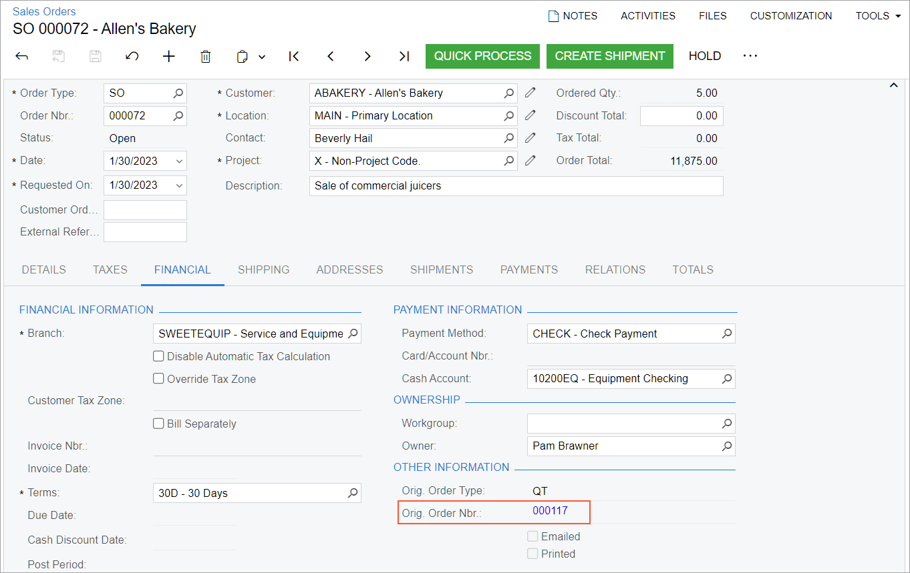
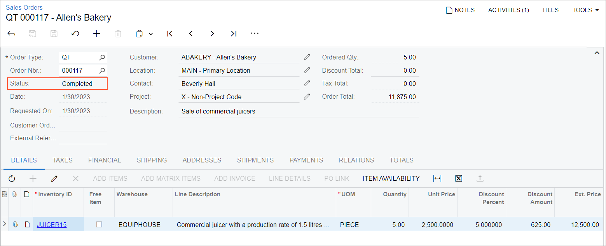

# Presales Quotes: Process Activity {#_b462a879-5662-4f9d-9358-4c8e79d71fac .task}

The following activity demonstrates how to process a quote.

**Attention:** This activity is based on the *U100* dataset. If you are using another dataset or if any system settings have been changed in *U100*, these changes can affect the workflow of the activity and the results of the processing. To avoid issues, restore the *U100* dataset to its initial state.

## Story { .section}

Suppose that you are Pam Brawner, a sales manager at the SweetLife Fruits &amp; Jams company. Your customer, Allen's Bakery, would like to purchase five juicers, and would like an quote to compare it with other vendors' quotes and choose the best one. You and the customer agreed on a 5% discount for the juicers. You need to prepare a quote and email it to the customer. Further suppose that the customer decided to choose SweetLife's offer. Now you need to create a sales order from the quote for the customer.

## Configuration Overview {#section_tz4_djx_cnb .section}

In the *U100* dataset, the following tasks have been performed to support this activity:

-   On the [Enable/Disable Features](CS_10_00_00.md) \(CS100000\) form, the following features have been enabled:
    -   *Inventory and Order Management*, which provides the standard functionality of inventory and order management
    -   *Inventory*, which gives you the ability to maintain stock items by using forms related to the inventory functionality and to create and process sales and purchase documents that include stock items
-   On the [Order Types](SO_20_10_00.md) \(SO201000\) form, the *QT* order type, which has the *Quote* automation behavior, has been created.
-   On the [Customers](AR_30_30_00.md) \(AR303000\) form, the *ABAKERY* \(Allen's Bakery\) customer has been created.
-   On the [Stock Items](IN_20_25_00.md) \(IN202500\) form, the *JUICER15* \(Commercial juicer with a production rate of 1.5 liters per minute\) stock item has been created.

## Process Overview { .section}

In this activity, you will create an order of the *QT* type on the [Sales Orders](SO_30_10_00.md) \(SO301000\) form. You will add the stock item to the quote. You will print the quote and email it to the customer. You will then create a sales order from the quote to the customer.

## System Preparation { .section}

Before you start processing a quote, do the following:

1.  Launch the Acumatica ERP website with the *U100* dataset preloaded, and sign in as sales manager Regina Wiley by using the *brawner* username and the *123* password.
2.  In the info area at the upper-right corner of the top pane of the Acumatica ERP screen, make sure that the business date is set to *1/30/2026*. If a different date is displayed, click the Business Date menu button and select *1/30/2026* from the calendar. For simplicity, you'll create and process all documents in this activity using this business date.
3.  In the company to which you are signed in, be sure that you have performed the [Sales Order Types: To Activate the QT Order Type](../ImplementationGuide/config_Sales_Order_Types_To_Activate_QT_Order_Type.md) prerequisite activity to activate the *QT* order type.

## Step 1: Creating a Quote { .section}

To create the quote for Allen's Bakery, do the following:

1.  On the [Sales Orders](SO_30_10_00.md) \(SO301000\) form, add a new record.
2.  In the Summary area, specify the following settings:
    -   **Order Type**: *QT*
    -   **Customer**: *ABAKERY*
    -   **Date**: *1/30/2026*
    -   **Description**: `Sale of commercial juicers`
3.  On the **Details** tab, do the following:
    1.  On the table toolbar, click **Add Row**.
    2.  Specify the following settings in this row:
        -   **Inventory ID**: *JUICER15*
        -   **Warehouse**: *EQUIPHOUSE*
        -   **Quantity**: `5`
        -   **Discount Percent**: `5`
4.  On the **Shipping** tab, notice that 2/13/2026 is inserted in the **Cancel By** box. Because on the [Order Types](SO_20_10_00.md) \(SO201000\) form, *14* days has been specified in the **Days To Keep** box, the expiration date has been calculated as 14 days after the business date that you specified in the system.
5.  On the form toolbar, click **Save**.

## Step 2: Printing and Emailing the Quote to the Customer { .section}

To email a ready-to-print version of the quote to Allen's Bakery, do the following:

1.  While you are still viewing the *Sale of commercial juicers* quote on the [Sales Orders](SO_30_10_00.md) \(SO301000\) form, on the More menu, under **Printing and Emailing**, click **Print Quote**.

    The system opens the [Quote](SO_64_10_00.md) \(SO641000\) report, which displays a ready-to-print version of the quote, in a new browser tab.

2.  On the report toolbar, click **Send**. The [Email Activity](CR_30_60_15.md) \(CR306015\) form opens with the quote attached to the email message. In the **To** box, the customer's email address is specified.
3.  On the form toolbar, click **Send**. The system adds an email activity associated with the quote to the outgoing mail. If a schedule has been configured in the system, the email will be sent automatically to the customer email address from the default system email account the next time this schedule is executed.
4.  Return to the [Sales Orders](SO_30_10_00.md) form with the quote open. You can view the email by clicking **Activities** on the form title bar and then clicking the link in the **Tasks &amp; Activities** dialog box, which opens.

## Step 3: Creating a Sales Order from the Quote { .section}

To create a sales order from the quote, do the following:

1.  While you are still viewing the *Sale of commercial juicers* quote on the [Sales Orders](SO_30_10_00.md) \(SO301000\) form, on the form toolbar, click **Copy Order**.
2.  In the **Copy To** dialog box, which opens, do the following:
    1.  In the **Order Type** box, make sure that *SO* is selected.
    2.  Clear the **Recalculate Unit Prices** check box. Because the quote and the sales order are created on the same date, the prices remain unchanged, and you do not need to recalculate them.
    3.  Click **OK**. The system closes the dialog box and opens the sales order on the [Sales Orders](SO_30_10_00.md) form with the settings copied from the quote. Make sure that the item quantity, the discount percent, and the discount amount are copied from the quote.
    4.  On the form toolbar, click **Save**.
3.  Open the **Financial** tab. Notice that the system has inserted the link to the quote in the **Orig. Order Nbr.** box \(**Other Information** section\), as shown in the following screenshot.

    

4.  Open the *Sale of commercial juicers* quote. Notice that now it has a status of *Completed*, as shown in the following screenshot.

    

**Parent topic:**[Processing Pre-Sale Quotes](../UserGuide/OrderMgmt_Pre-Sale_Quotes_Mapref.md)

