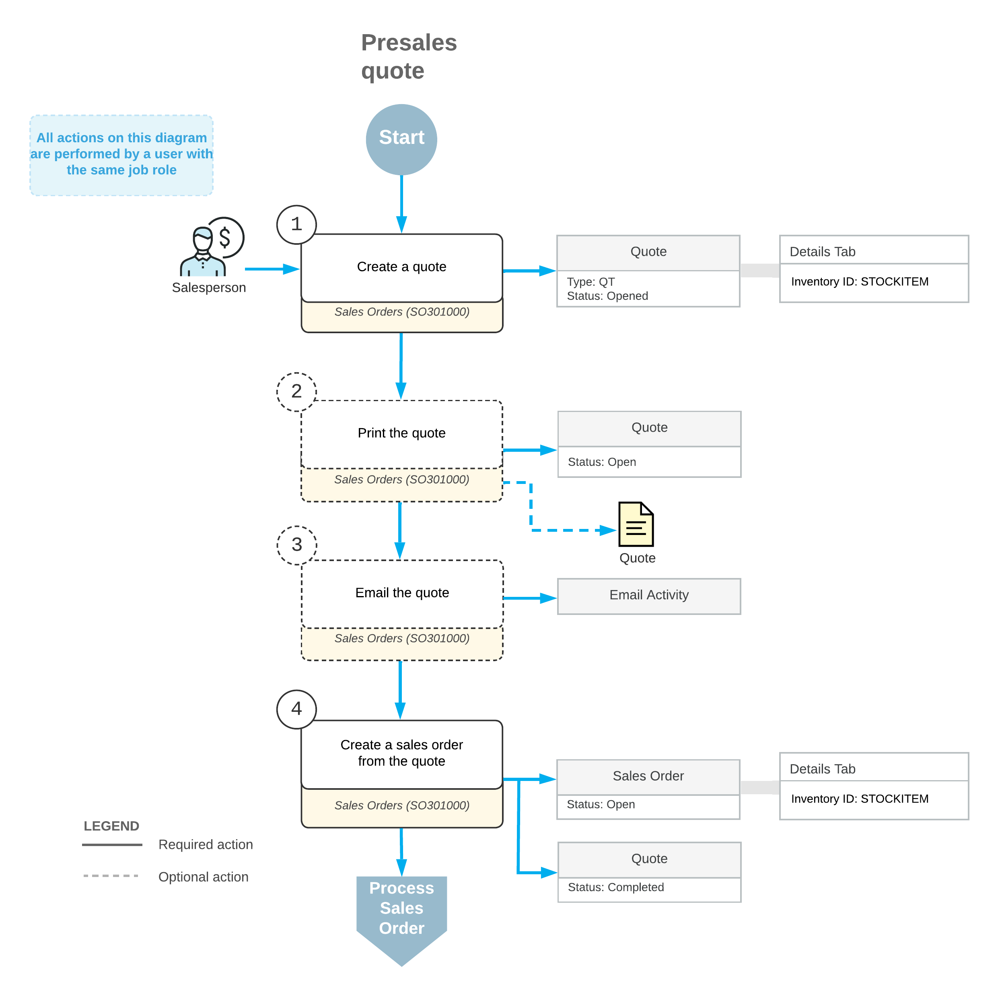

# Presales Quotes: General Information {#_12c2f6e9-c3fd-40de-af53-c6d0f6a80b7b .concept}

You can create a quote \(an order of the *QT* type\) on the [Sales Orders](SO_30_10_00.md) \(SO301000\) form to record a planned sale of products and services to a customer. You can use these quotes if your company does not use customer relationship management \(CRM\)—that is, if the *Customer Management* and *Sales Quotes* features are disabled on the [Enable/Disable Features](CS_10_00_00.md) \(CS100000\) form.

## Learning Objectives { .section}

In this chapter, you will learn how to do the following:

-   Create a quote
-   Print and email the quote to the customer
-   Create a sales order from the quote

## Applicable Scenario { .section}

You may need to create a quote to prepare an offer with a list of products, services, and prices to a customer if your company does not use the CRM functionality.

## Creation of a Quote { .section}

You create a sales order of the *QT* \(*Quote*\) type on the [Sales Orders](SO_30_10_00.md) \(SO301000\) form to represent a customer's interest in possibly purchasing goods in a specified quantity on a specified date. For a quote, you specify the customer and its location, the planned order date and requested date, and stock and non-stock items with their quantities, units of measure, unit prices, and tax categories.

You can also specify the following settings on the **Shipping** tab:

-   In the **Shipping Terms** box \(**Delivery Settings** section\), the shipping terms. These terms are copied from the customer's settings by default. For details, see [Freight Calculation](CS__con_Freight_Calculation.md).
-   In the **Shipping Rule** box \(**Order Shipping Settings** section\), the shipping rule for the order and for each order line. The shipping rules determine whether the goods in the sales order should be shipped in full or partially. This rule is copied from the customer's settings by default. For details, see [Shipping Rule Combinations](SO__con_Shipping_Rules.md).
-   In the **Cancel By** box \(**Order Shipping Settings** section\), the expiration date of the quote. For details, see the *Cancellation of a Quote* section below.

New orders of the *QT* type are saved with the *Open* status by default because by default, the **Hold Documents on Entry** check box is cleared for this order type on the [Order Types](SO_20_10_00.md) \(SO201000\) form. \(You can change this default setting for the type.\) The first time you save the new quote on the [Sales Orders](SO_30_10_00.md) form, the system generates a reference number for it according to the numbering sequence assigned to this order type on the [Order Types](SO_20_10_00.md) form.

## Creation of a Sales Order from a Quote { .section}

From the open quote on the [Sales Orders](SO_30_10_00.md) \(SO301000\) form, you can create an order of any of the following order behaviors: *Sales Order* , *Invoice*, *Transfer Order*, *Credit Memo*, *RMA Order*, and *Quote*. To begin the process of creating an order from a quote, you click **Copy Order** on the More menu. The system copies the details of the quote \(including the document lines and the specified accounts and subaccounts\) to the created order on the same form.

If the *Customer Discounts* feature is enabled on the [Enable/Disable Features](CS_10_00_00.md) \(CS100000\) form, when you are copying a quote, you can select whether to recalculate discounts in a sales order copied from a quote.

The quantities of items and the document amounts on open quotes do not cause the allocation of stock items in inventory and do not update accounts receivable. To be able to prepare an invoice for the quote to the customer and issue the included items from inventory, you need to create a sales order of the needed type based on that quote and process the sales order. After you have copied a quote to a sales order and saved the sales order \(even for a partial quantity of items\), the status of the quote changes to *Completed*. In the newly created sales order on the [Sales Orders](SO_30_10_00.md) form, the system inserts the link to the quote in the **Orig. Order Nbr.** box **\(Other Information** section\) on the **Financial** tab.

## Cancellation of a Quote { .section}

On the [Sales Orders](SO_30_10_00.md) \(SO301000\) from, for each newly created quote, you can specify an expiration date in the **Cancel By** box on the **Shipping** tab. By default, the system calculates the **Cancel By** date by adding the number of days specified in the **Days to Keep** box for the *QT* order type on the [Order Types](SO_20_10_00.md) form \(SO201000\) to the **Date** specified in the quote.

The system does not cancel expired quotes automatically. You cancel an expired quote on the [Sales Orders](SO_30_10_00.md) form or cancel multiple expired quotes by selecting the *Cancel Order* action on the [Process Orders](SO_50_10_00.md) \(SO501000\) form and processing the order. This changes the status of the order to *Canceled*. The status reflects in the system that the customer is no longer considering the particular quote or that your company is no longer offering the included item or items at the specified price or prices.

## Processing of a Quote { .section}

To process a quote, you perform the following general steps on the [Sales Orders](SO_30_10_00.md) \(SO301000\) form:

1.  You create a quote \(that is, an order of the *QT* type\).
2.  Optional: You print the quote by clicking **Print Quote** on the More menu.
3.  Optional: You email the quote to the customer by clicking **Email Quote** on the More menu.
4.  You create a sales order from the quote by clicking **Copy Order** on the form toolbar.

## Workflow of the Quote Processing {#section_vv2_1y4_y4b .section}

For a quote, the typical process involves the actions and generated documents shown in the following diagram.

**Parent topic:**[Processing Pre-Sale Quotes](../UserGuide/OrderMgmt_Pre-Sale_Quotes_Mapref.md)

