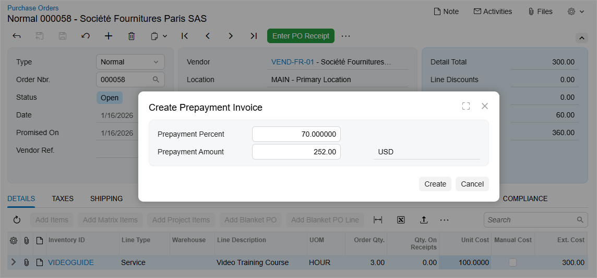

# Prepayment Invoices: Creation of a Prepayment Invoice {#_f786ecdb-183a-4602-a4ef-68428f0c5895 .concept}

This topic describes how to create a prepayment invoice from a purchase order.

## How to Create a Prepayment Invoice from a Purchase Order {#section_hwj_tqd_c3c .section}

**Important:** When the *VAT Recognition on AP Prepayments* feature is enabled, the **Create Prepayment Invoice** command replaces **Create Prepayment Request**. New prepayment requests can't be created; however, you can still process any existing prepayment requests.

You create a prepayment invoice on the [Purchase Orders](PO_30_10_00.md) \(PO301000\) form.

On the More menu, you click **Create Prepayment Invoice**. In the **Create Prepayment Invoice** dialog that opens, you specify the prepayment percent or the prepayment amount \(see below\).



The default prepayment percent is determined as follows:

-   For the **first prepayment invoice**:
    1.  If a prepayment percent is specified on the **Vendor Info** tab of the [Purchase Orders](PO_30_10_00.md) form, that value is used.
    2.  Otherwise, the system uses the prepayment percent specified in the vendor settings on the [Vendors](AP_30_30_00.md) \(AP303000\) form.
    3.  If no prepayment percent is specified in either place, the prepayment percent is set to *100*.
-   For a **subsequent prepayment invoice**:

    The prepayment percent is calculated based on the remaining balances of the purchase order as follows.

    ``` {#codeblock_hhs_bjl_13c}
    Prepayment Percent = (Remaining Unpaid Amount ÷ Remaining Unbilled Amount) × 100
    ```


You can modify the percent, if needed. Once the prepayment percent is specified, click **Create**.

## What the Created Prepayment Invoice Looks Like {#section_gnc_fsd_c3c .section}

When you click **Create** in the **Create Prepayment Invoice** dialog box, the [Bills and Adjustments](AP_30_10_00.md) \(AP301000\) form opens with a new document of the *Prepmt. Invoice* type. Its summary information—such as the vendor, document currency, location, and tax zone—is copied from the purchase order. The document date is set to the current business date.

The **Details** tab contains only detail lines that haven't yet been fully billed. The values of the following columns are copied from the purchase order: **Inventory ID**, **Trans. Description**, **Discount Percent**, **Discount Code**, **UOM**, **Account**, **Subaccount**, **Project Task**, **Cost Code**, and **Tax Category**.

On the **Taxes** tab, the taxes are transferred as well. If current tax rates differ from the rates calculated for the purchase order on its document date, taxes are recalculated.

**Important:** Group and document discounts from the purchase order are not automatically applied to a prepayment invoice created from the purchase order. You can apply these discounts manually, if needed.

**Parent topic:**[Processing Prepayment Invoices in Purchase Orders](../UserGuide/OrderMgmt_Prepayment_Invoices_in_PO_Mapref.md)

