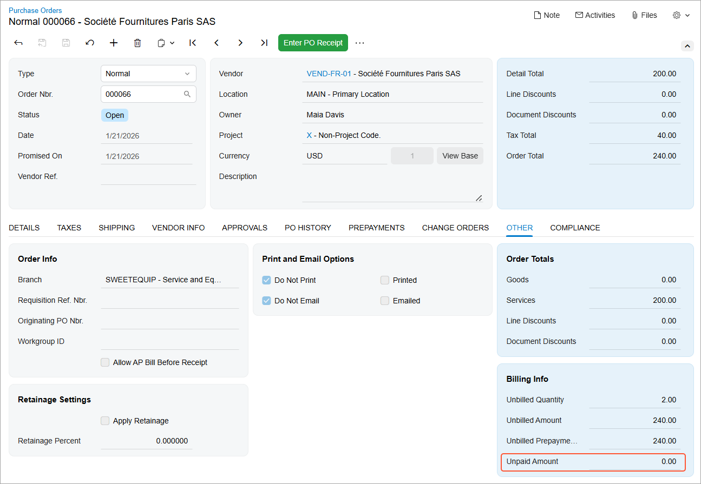
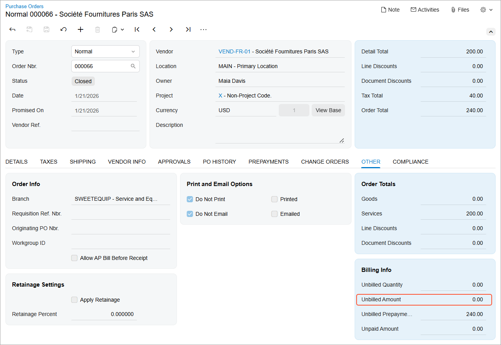
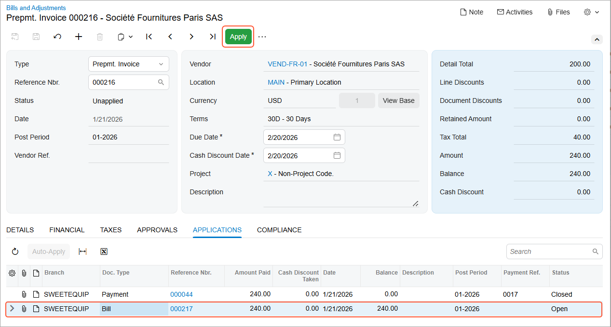
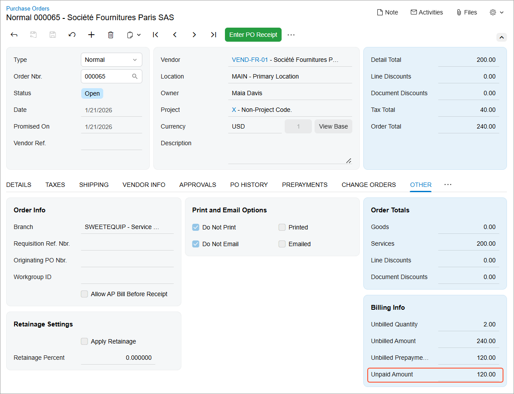
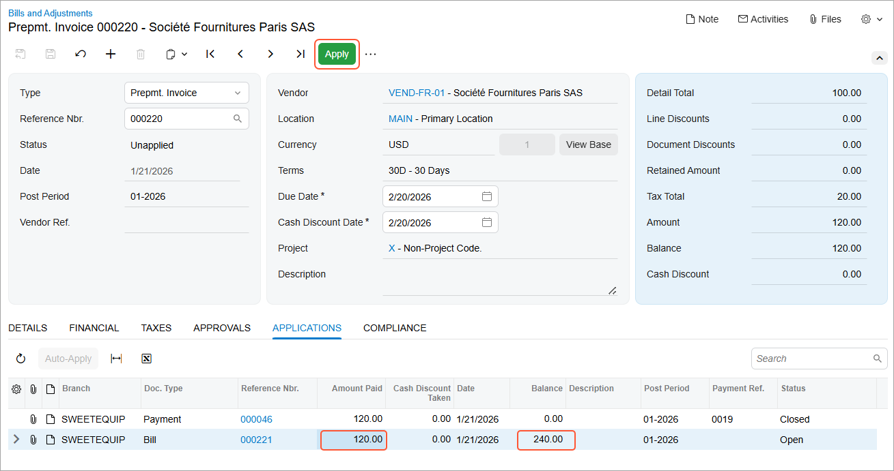

# Prepayment Invoices: Processing Workflow {#_4efa8b8e-e3ef-4837-9b6e-707233173395 .concept}

This topic outlines the workflow for creating, paying, and applying prepayment invoices.

## Processing Purchase Orders with Prepayment Invoices {#section_ojy_h2f_13c .section}

When the prepayment invoice is released, it appears with the *Pending Payment* status on the **Prepayments** of the [Purchase Orders](PO_30_10_00.md) \(PO301000\) form.

**Prepayment for the Full Purchase Order Total Amount**

If a prepayment invoice is created for the total purchase order amount and released, the **Unpaid Amount** on the **Other** tab of the purchase order is set to *0* \(see below\).

When the AP bill for the purchase order is created and released, the linked released prepayment invoice is automatically associated with the AP bill and added to the **Applications** tab of the [Bills and Adjustments](AP_30_10_00.md) \(AP301000\) form. The purchase order is assigned the *Closed* status, and its unbilled balance is set to *0* \(see below\).

If the prepayment invoice is paid after the AP bill has been created, you apply it to the linked AP bill. To do this, while viewing the prepayment invoice on the [Bills and Adjustments](AP_30_10_00.md) form, select the bill on the **Applications** tab \(see below\).

You can also open the prepayment invoice on the [Checks and Payments](AP_30_20_00.md) \(AP302000\) form. On the **Documents to Apply** tab, the associated AP bill is listed. To apply the prepayment invoice to the AP bill, click **Release** on the form toolbar.

After the application is released, both the prepayment invoice and the bill are closed.

**Tip:** If the prepayment invoice is **paid before the AP bill is created**, it is automatically applied to the AP bill when the bill is released, and the application is released at the same time. As a result, the purchase order, the prepayment invoice, and the AP bill are closed.

This behavior applies **only when** the prepayment invoice and the AP bill are created for the full purchase order amount.

**Prepayment for a Partial Purchase Order Amount**

If a prepayment invoice is created for a partial purchase order amount and released, the **Unpaid Amount** on the **Other** tab of the purchase order is reduced by the prepayment amount \(see below\). Below you can see a purchase order with a 50% prepayment applied.

When a subsequent prepayment invoice is created for the remaining purchase order amount and released, the **Unpaid Amount** is set to *0*. The **Unbilled Prepayment Total** is set to the full purchase order amount until an AP bill is created.

When the AP bill is created for the full purchase order amount and released, all linked released prepayment invoices are automatically associated with the AP bill and appear on the **Applications** tab of the [Bills and Adjustments](AP_30_10_00.md) form. The purchase order is assigned the *Closed* status, and its unbilled balance is set to *0*.

Once the prepayment invoice is paid, you can apply it to the AP bill. Because the prepayment invoice covers only part of the purchase order amount, the **Amount Paid** column shows the prepayment amount. The **Balance** column shows the total balance of the AP bill.

When the application is released, the prepayment invoice is closed. The purchase order is also closed because the AP bill has already been created. The AP bill remains open until the remaining balance is paid

**Tip:** If the prepayment invoice was paid before the AP bill was created, then when the AP bill is created and released, the prepayment invoice is automatically applied to it, and this application is released. As a result, the balance of the AP bill is reduced by the prepayment amount. The prepayment invoice is closed, and the AP bill remains open.

You can create any number of prepayment invoices for a purchase order until an AP bill is created for the purchase order.

**Parent topic:**[Processing Prepayment Invoices in Purchase Orders](../UserGuide/OrderMgmt_Prepayment_Invoices_in_PO_Mapref.md)

