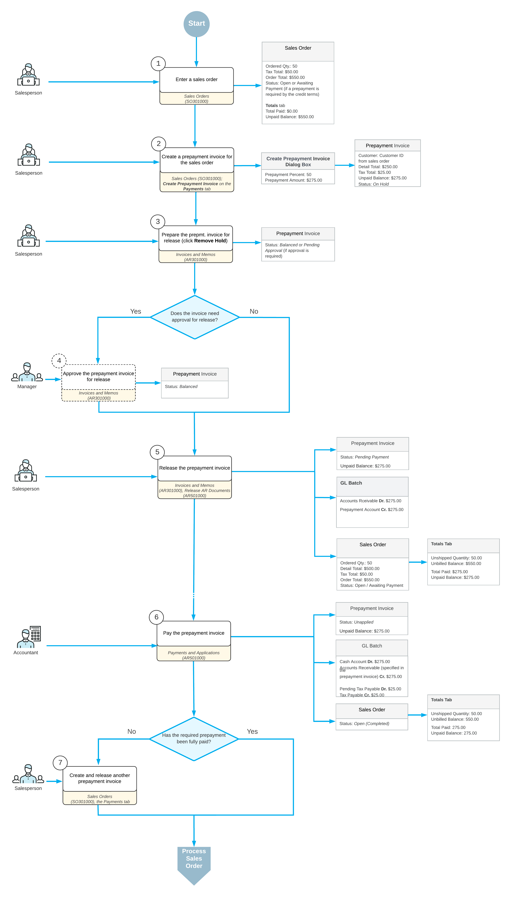

# Prepayment Invoices: General Information {#_161934f0-e997-4d41-a6eb-4e9136382821 .concept}

If prepayments are subject to tax reporting in the country where your company is operating, you can create prepayment invoices, when your company requires prepayments for sales orders.

In Acumatica ERP, you can create any number of prepayment invoices for a sales order with the tax and taxable amounts stated in the prepayment invoice.

To avoid manual entry of a prepayment invoice on the [Invoices and Memos](AR_30_10_00.md) \(AR301000\) form, you can create a prepayment invoice from the sales order. This prepayment invoice will include the same items as the sales order has, with taxes calculated based on the specified prepayment amount.

**Important:** The functionality is available only if the *VAT Recognition on Prepayments* feature is enabled on the [Enable/Disable Features](CS_10_00_00.md) \(CS100000\) form.

For details on manually entering a prepayment invoice, see [AR Prepayment Invoices: General Information](Finance_Prepayment_Invoices_GeneralInfo.md).

## Applicable Scenarios { .section}

You create a prepayment invoice in such cases as the following:

**Tip:** All percentages in these scenarios are given as examples. Your company may specify any percentage in prepayment invoices.

-   Your company produces goods and requires a deposit that is typically 50% of the order amount before starting the production job. In this case, your company sends a prepayment invoice to the customer for 50% of the order amount; the invoice includes a detailed list of the items to be produced along with their quantities and prices. Upon receipt of the payment for this prepayment invoice, your company initiates work on the order. The remaining payment is settled upon shipment of the order.
-   Your company distributes goods and typically requests a 20% prepayment before delivery, with the remaining 80% due upon receipt of the shipment. Goods are not dispatched without prepayment. Your company creates a prepayment invoice for 20% of the order amount and sends it to the customer. Upon receiving the prepayment, the order is delivered to the customer.
-   A customer placed an order, and your company sent a prepayment invoice for 20% of the total order amount. Later, the customer requested that additional items be added to the order. In response, your company issued another prepayment invoice, covering 20% of the updated total amount.
-   Your company requires a full prepayment before shipping the ordered goods to a customer. When multiple shipments are expected for an order, you need to create a separate prepayment invoice for each shipment.

## Workflow of a Prepayment Invoice Created from a Sales Order { .section}

The processing of a prepayment invoice created from a sales order typically involves the actions shown in the following diagram.

**Tip:** The amounts mentioned in the diagram are provided as examples based on the following assumptions:

-   The tax total is calculated based on tax settings that define the calculation of the tax amount on a per-document basis when the tax is not included in the document amount.
-   The company requires a prepayment of 50% of the order total.

In the next sections of this topic, the main steps of the process are described in detail.

## Refunding Prepayment Invoices {#section_dbq_mbb_2gc .section}

You can issue full or partial refunds for unapplied prepayment invoices. For details, see [AR Prepayment Invoices: Effortless Refunds](Finance_Prepayment_Invoices_Refunds.md).

**Parent topic:**[Processing Prepayment Invoices for Sales Orders](../UserGuide/OrderMgmt_Prepayment_Invoices_Mapref.md)

