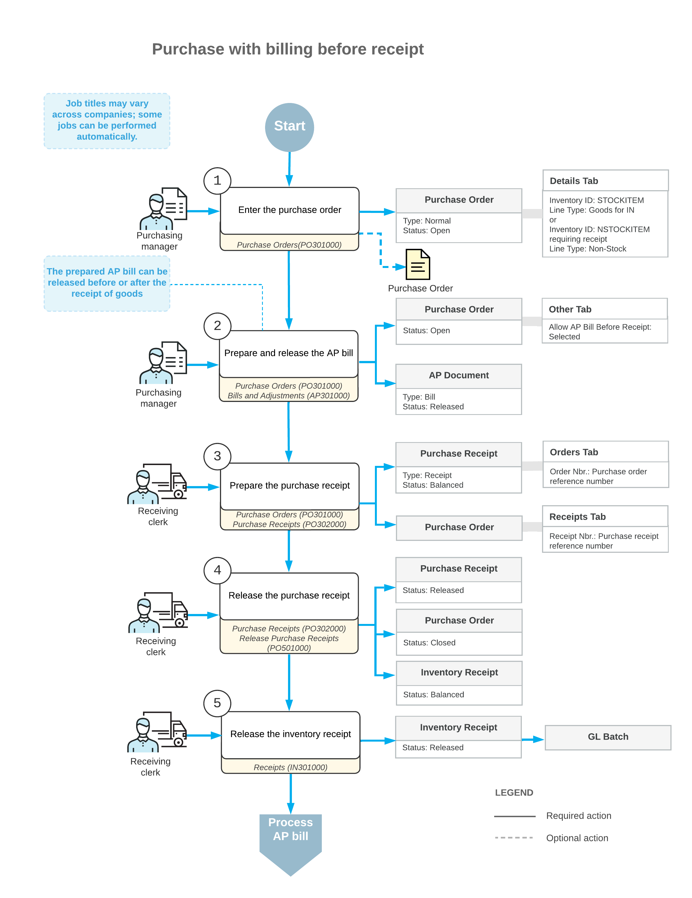

# Purchases with Billing Before Receipt: General Information {#_010e5819-5c59-4d60-a3e9-ddee17268a2b .concept}

In Acumatica ERP, you can process purchases in which the bills are received and need to be paid before the vendor ships the ordered goods.

## Learning Objectives { .section}

In this chapter, you will do the following:

-   Create a purchase order with stock items
-   Prepare an accounts payable bill for the purchase order
-   Prepare and release a purchase receipt and the related inventory documents

## Applicable Scenario { .section}

In your organization, if bills are received from some vendors and entered into the system before the purchased goods arrive or if bills are imported from a third-party system, you can establish a workflow in which an accounts payable bill can be processed before the ordered items have been received. In this case, the purchasing process typically includes entering a purchase order, preparing a bill for the vendor, and then, when the purchased items are received to inventory, processing the purchase receipt.

## Purchasing Process with Billing Before Receipt { .section}

In general, the [Purchase Orders](PO_30_10_00.md) \(PO301000\) form is the starting point for creating a purchase order. In Acumatica ERP, purchase orders of the *Normal* type are used for the processing of purchases of inventory items with billing before receipt.

In a new purchase order created on the [Purchase Orders](PO_30_10_00.md) form, you first select the vendor. Then on the **Details** tab, you list the stock items to be purchased from the vendor. You can add stock items by clicking the **Add Items** button on the table toolbar of this tab and selecting from only the vendor's items or from the entire list of stock items.

Then you need to create a bill on the [Bills and Adjustments](AP_30_10_00.md) \(AP301000\) form to increase the vendor's balance in the system by the amount to be paid for the goods. You can release the prepared bill at any time—before or after the processing of the receipt of the ordered items. Once the purchased items have been received to inventory, you create a purchase receipt \(or multiple partial receipts\) on the [Purchase Receipts](PO_30_20_00.md) \(PO302000\) form. When a purchase receipt is released, the system automatically generates a corresponding inventory receipt on the [Receipts](IN_30_10_00.md) \(IN301000\) form, with the date and posting period copied from the purchase receipt. On release of the inventory receipt, the system updates the inventory on hand with the quantity and cost of the received goods, and generates a batch of GL transactions to update account balances in the general ledger. If all the lines in the purchase order have been received and billed in full, the system assigns the purchase order the *Closed* status. For more information on the rules that affect line closing and completion, see [Stock Item Lines in Purchase Orders](PO__con_Purchase_of_Stock.md), [Non-Stock Lines in Purchase Orders](PO__con_Purchase_of_NStock_w_Receipt.md), and [Service Lines in Purchase Orders](PO__con_Purchase_of_Services.md).

## Vendor Setting for Billing Before Receipt { .section}

You can create an AP bill before the corresponding purchase receipt for a purchase order in both of the following cases:

-   If on the [Vendors](AP_30_30_00.md) \(AP303000\) form, the **Allow AP Bill Before Receipt** check box is selected for the vendor specified in the purchase order
-   If on the [Vendor Locations](AP_30_30_10.md) \(AP303010\) form, the **Allow AP Bill Before Receipt** check box is selected for the vendor location selected in the purchase order

When a purchase order is created on the [Purchase Orders](PO_30_10_00.md) \(PO301000\) form and this vendor or vendor location is selected, the state of this check box is copied to the check box of the same name on the **Other** tab of the form.

**Tip:** If the **Allow AP Bill Before Receipt** check box is selected for a purchase order, you can also use the inventory purchase workflow in which the purchase receipt is processed and then the AP bill is prepared; the check box merely determines whether it is permissible to create the AP bill before the corresponding purchase receipt is created. For a description of the workflow with the receipt processed before the related bill, see [Purchases of Stock Items: General Information](OrderMgmt_Standard_Inventory_Purchase_GeneralInfo.md).

## Workflow of a Purchase with Billing Before Receipt { .section}

The following diagram represents the general workflow of the processing of a purchase order in Acumatica ERP, in which a bill is processed before the purchased items are received to inventory.

**Parent topic:**[Processing Purchases with Billing Before Receipt](../UserGuide/OrderMgmt_Purchase_Bill_Before_Receipt_Mapref.md)

