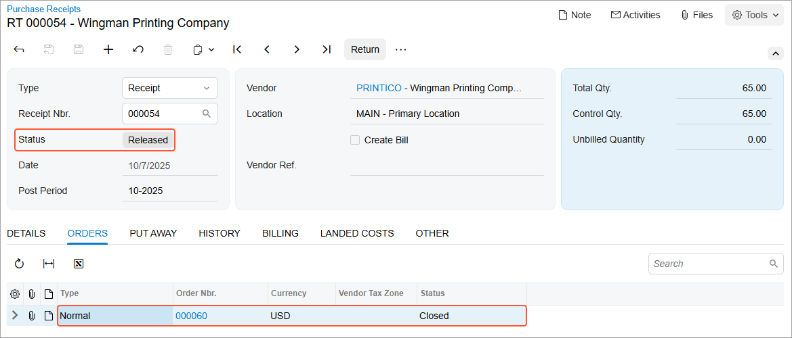

# Purchases with Billing Before Receipt: Process Activity {#_90c6e3c5-6512-479e-91e6-417d3c4300d2 .task}

In this activity, you will learn how to process a purchase of stock items if the accounts payable bill from the vendor is received before the goods have been delivered.

**Attention:** This activity is based on the *U100* dataset. If you are using another dataset or if any system settings have been changed in *U100*, these changes can affect the workflow of the activity and the results of the processing. To avoid issues, restore the *U100* dataset to its initial state.

## Story { .section}

Suppose that you, acting as purchasing manager Regina Wiley, order a large quantity of labeled paper bags and jar labels for SweetLife’s needs. The Wingman Printing Company vendor, from which these goods were purchased, sent a bill to SweetLife, which received the original paper bill before the goods were delivered to the warehouse of the company's main office. You need to enter the purchase order, enter the accounts payable bill for the purchase order, and later, when the goods arrive to the wholesale warehouse, create and process a purchase receipt related to the purchase order.

## Configuration Overview { .section}

In the *U100* dataset, for the purposes of this activity, the following tasks have been performed:

-   On the [Enable/Disable Features](CS_10_00_00.md) \(CS100000\) form, the following features have been enabled:
    -   *Inventory and Order Management*, which provides the standard functionality of inventory and order management
    -   *Inventory*, which gives you the ability to maintain stock items by using forms related to the inventory functionality and to create and process sales and purchase documents that include stock items
-   On the [Vendors](AP_30_30_00.md) \(AP303000\) form, the *PRINTICO \(Wingman Printing Company\)* vendor has been created. The **Allow AP Bill Before Receipt** check box has been selected for the vendor on the **Purchase Settings** tab.
-   On the [Vendor Locations](AP_30_30_10.md) \(AP303010\), for the *MAIN* location of the *PRINTICO* vendor, the **Allow AP Bill Before Receipt** check box has been selected on the **Purchase Settings** tab.
-   On the [Stock Items](IN_20_25_00.md) \(IN202500\) form, the *PAPERBAG* and *LABELS* stock items have been created.

## Process Overview { .section}

In this activity, to process a purchase order with billing before the items have been received, you will first create the purchase order on the [Purchase Orders](PO_30_10_00.md) \(PO301000\) form and add the purchased items to it. You will then create an accounts payable bill for the vendor on the [Bills and Adjustments](AP_30_10_00.md) \(AP301000\) form and release the bill. When the ordered items are received, you will create a purchase receipt for them on the [Purchase Receipts](PO_30_20_00.md) \(PO302000\) form. On release of the purchase receipt, the system generates a corresponding inventory receipt to reflect the receipt of the items to inventory, which you will review on the [Receipts](IN_30_10_00.md) \(IN301000\) form.

## System Preparation { .section}

Before you start processing a purchase order with billing before the items have been received, you should do the following:

1.  Launch the Acumatica ERP website with the *U100* dataset preloaded, and sign in as purchasing manager Regina Wiley by using the *wiley* username and the *123* password.
2.  In the info area, in the upper-right corner of the top pane of the Acumatica ERP screen, make sure that the business date in your system is set to today’s date. For simplicity, in this activity, you will create and process all documents in the system on this business date.
3.  On the Company and Branch Selection menu, in the top pane of the Acumatica ERP screen, make sure the *SweetLife Head Office and Wholesale Center* branch is selected.

## Step 1: Creating the Purchase Order { .section}

To create a purchase order, which includes labeled paper bags and jar labels, for the Wingman Printing Company, do the following:

1.  On the [Purchase Orders](PO_30_10_00.md) \(PO301000\) form, add a new record.
2.  In the Summary area, specify the following settings:
    -   **Type**: *Normal*
    -   **Vendor**: *PRINTICO*
    -   **Description**: `Order of labels and paper bags`
3.  On the **Details** tab, add rows with the settings listed in the following table.

    |Branch|Inventory ID|Warehouse|Order Qty.|Unit Cost|
    |------|------------|---------|----------|---------|
    |*HEADOFFICE*|*LABELS*|*WHOLESALE*|`40`|`7.49`|
    |*HEADOFFICE*|*PAPERBAG*|*WHOLESALE*|`25`|`16.70`|

4.  Review the **Other** tab, and notice that the **Allow AP Bill Before Receipt** check box is selected. This setting, which was specified for the *PRINTICO* vendor on the [Vendors](AP_30_30_00.md) \(AP303000\) form, means that you can create the accounts payable bill for the purchase order even though the purchase receipt has not yet been entered for the purchase order.
5.  On the form toolbar, click **Remove Hold**. The system saves the purchase order.

## Step 2: Processing the Accounts Payable Bill { .section}

To create an accounts payable bill for the purchase order, do the following:

1.  While you are still viewing the purchase order on the [Purchase Orders](PO_30_10_00.md) \(PO301000\) form, click **Enter AP Bill** on the More menu. The system generates an accounts payable bill \(to which it copies the vendor of goods, the details, and other relevant information\) and opens the created document on the [Bills and Adjustments](AP_30_10_00.md) \(AP301000\) form.
2.  Review the details of the created bill. In a production environment, you would make sure that the details of the bill created in the system correspond to the details of the paper document that was received from the vendor.
3.  On the form toolbar, click **Remove Hold**.
4.  Click **Release**.

## Step 3: Processing the Purchase Receipt { .section}

To create the purchase receipt for the purchase order, do the following:

1.  Return to the purchase order for *PRINTICO* on the [Purchase Orders](PO_30_10_00.md) \(PO301000\) form, which still has the *Open* status, and review the **PO History** tab. Notice that the details of the bill are shown in the **Financial Documents** table.
2.  On the form toolbar, click **Enter PO Receipt**. The system prepares the purchase receipt for the selected purchase order, with all lines and other relevant settings copied, and opens it on the [Purchase Receipts](PO_30_20_00.md) \(PO302000\) form.
3.  Make sure that the purchase receipt has the *Balanced* status, save the purchase receipt, and review its details. Notice that on the **Billing** tab, the bill that you have created is listed.
4.  In the Summary area, make sure that the **Create Bill** check box is cleared \(because you have already created a bill for the entire quantity\).
5.  On the form toolbar, click **Release**.
6.  On the **Other** tab, click the **IN Ref. Nbr.** link, and review the details of the generated inventory receipt, which the system opens on the [Receipts](IN_30_10_00.md) \(IN301000\) form in a pop-up window. Make sure that the inventory receipt has the *Released* status.
7.  Return to the purchase receipt on the [Purchase Receipts](PO_30_20_00.md) form, and on the **Orders** tab, review the information about the related purchase order, and make sure it now has the *Closed* status, as shown in the following screenshot.

    

**Parent topic:**[Processing Purchases with Billing Before Receipt](../UserGuide/OrderMgmt_Purchase_Bill_Before_Receipt_Mapref.md)

