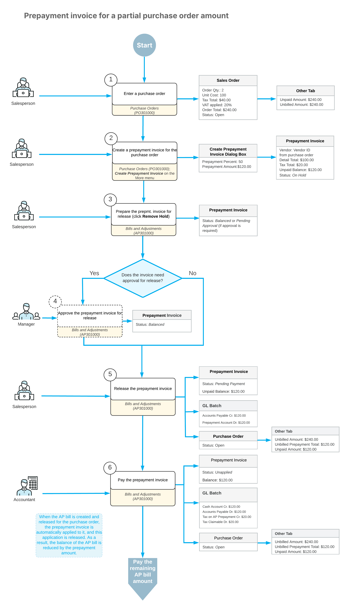

# Prepayment Invoices: General Information {#_b7d2ff2d-e00b-4f31-a328-8b07a2eb9461 .concept}

This topic provides general information about prepayment invoices in purchase orders and includes a business scenario and a workflow diagram.

**Attention:** This functionality is available only if the *VAT Recognition on AP Prepayments* feature is enabled on the [Enable/Disable Features](CS_10_00_00.md) \(CS100000\) form.

## Applicable Scenarios { .section}

A company purchases equipment from a vendor and is required to pay a 50% deposit before the vendor ships the items. The purchase is recorded by creating a purchase order for the full amount.

Because local tax regulations require VAT to be recognized when a prepayment is paid, the company creates a prepayment invoice directly from the purchase order. The prepayment invoice includes VAT calculated on the prepaid amount. When the company pays the prepayment invoice, the VAT is recognized and included in the tax report for the corresponding tax reporting period.

Later, when the vendor issues the final bill, the prepayment invoice is applied to the released bill to reduce the balance. In the bill, the system recalculates taxes based on the current tax rate and reposts the VAT previously recognized at prepayment to the tax reporting period of the AP bill.

## Workflow of a Prepayment Invoice for a Partial Purchase Order Amount {#section_vv2_1y4_y4b .section}

The following diagram shows the workflow in which a prepayment invoice is created for a partial purchase order amount, paid, and automatically applied to a created and released AP bill. The application is then automatically released, the AP bill balance is reduced by the prepayment amount, and the remaining balance is paid.

**Tip:** You can create a prepayment invoice for the full purchase order amount. This section describes the scenario in which a prepayment invoice is created for a partial purchase order amount.

To process a vendor prepayment for which taxes must be recognized and posted at the time of prepayment, you create and process a prepayment invoice.

The [Purchase Orders](PO_30_10_00.md) \(PO301000\) form is the starting point for creating a prepayment invoice for a particular purchase order. On the More menu of the form, you click **Create Prepayment Invoice**. In the dialog box that opens, you specify the prepayment percent or prepayment amount. The system opens the [Bills and Adjustments](AP_30_10_00.md) \(AP301000\) form with a prepayment invoice created based on the purchase order details. The total amount of prepayment invoices created for a purchase order cannot exceed the unpaid amount of the purchase order.

After you review the prepayment invoice details, you remove the hold and, if approval is required in your system, approve the prepayment invoice before releasing it. When the prepayment invoice is released, the system generates general ledger transactions and updates the purchase order totals, but does not change the vendor balance until the prepayment invoice is paid. The prepayment invoice is assigned the *Pending Payment* status.

To pay the prepayment invoice, you click **Pay** on the [Bills and Adjustments](AP_30_10_00.md) form. When the prepayment invoice is paid, the system recognizes taxes on the prepayment and assigns the prepayment invoice the *Unapplied* status.

When an accounts payable bill is created and released for the purchase order, the system automatically applies the paid prepayment invoice to the bill, and the application is automatically released. The balance of the AP bill is reduced by the amount of the applied prepayment invoice.

On release of the application of the prepayment invoice to the bill, a batch of general ledger transactions is posted. The remaining balance of the AP bill can then be paid as usual.

**Parent topic:**[Processing Prepayment Invoices in Purchase Orders](../UserGuide/OrderMgmt_Prepayment_Invoices_in_PO_Mapref.md)

