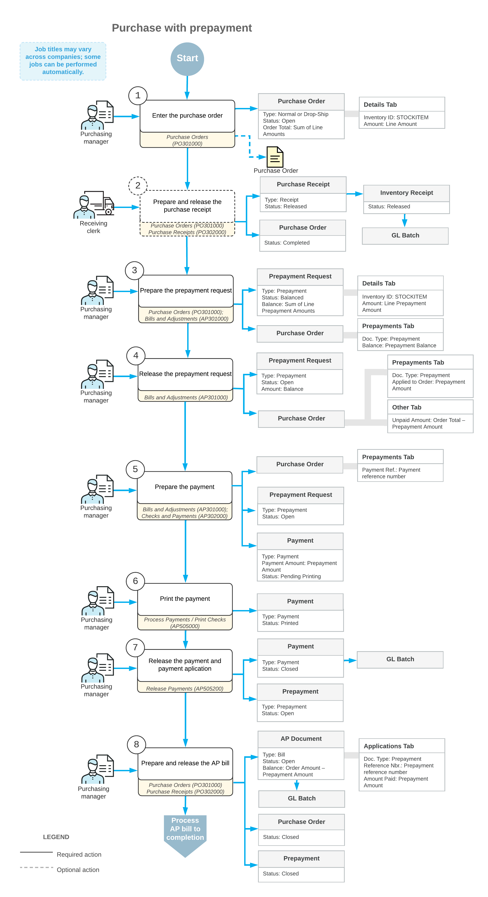

# Prepayments for Purchase Orders: General Information {#_4360e662-e10b-4107-98fc-ca1c8cc62ab5 .concept}

Different vendors have different conditions for supplying goods and services. A vendor may request that your company pay a part of the order amount in advance before those goods or services are provided. To support this process in Acumatica ERP, you can process a prepayment for the purchase order; this prepayment is later automatically applied to the AP bill prepared for the vendor of goods or services.

## Learning Objectives { .section}

In this chapter, you will do the following:

-   Change the default prepayment amount for a vendor
-   Create a prepayment request for a purchase order
-   Create a prepayment from a prepayment request
-   Apply a prepayment to an accounts payable bill created for a purchase order
-   Process a single prepayment for a purchase order
-   Process multiple prepayments for a purchase order

## Applicable Scenarios { .section}

You may want to create and process a prepayment in the following cases:

-   You are processing a new purchase order for the vendor that requires a partial payment in advance before the ordered items will be sent.
-   You have corrected the details of an existing purchase order that was already prepaid, so that an extra prepayment amount needs to be processed.

## Prepayments for Purchase Orders { .section}

To process a prepayment in the system, you have to first create and release the prepayment request, which denotes the vendor's request for prepayment in the system. A prepayment request is not a financial document; it is an internal document that can be approved \(if required in your system\) before the prepayment is actually paid to the vendor.

In general, the [Purchase Orders](PO_30_10_00.md) \(PO301000\) form is the starting point for creating a prepayment request for a particular purchase order. You can create prepayment requests for purchase orders of the *Normal* and *Drop-Ship* types.

On the More menu of the [Purchase Orders](PO_30_10_00.md) form, you click **Create Prepayment Request**. On the [Bills and Adjustments](AP_30_10_00.md) \(AP301000\) form, which opens, you specify the quantity and extended cost in each of the prepayment request lines. The total amount of prepayments prepared for a purchase order cannot exceed the total amount of the purchase order. After you have specified the details, you release the prepayment request. A prepayment request does not generate general ledger transactions and does not change the vendor balance.

**Tip:** If approval is required in your system, the prepayment request must be approved on the [Approve Bills for Payment](AP_50_20_00.md) \(AP502000\) form before it can be paid. For details on approval configuration, see [Approval Configuration: Approval Maps](../ImplementationGuide/config_Approvals_Create_Approval_Maps.md).

To create a prepayment document from a prepayment request, you need to pay the prepayment. A prepayment request is always paid in the full amount; you cannot pay it partially. To pay the prepayment, you prepare an accounts payable payment on the [Checks and Payments](AP_30_20_00.md) \(AP302000\) form, apply it to the prepayment request, and release the payment along with the application; depending on the system settings, processing a payment may require you to print it before releasing it. After you apply the AP payment to the prepayment request, the system changes the status of this payment to *Closed* and changes the status of the original prepayment to *Open*. Also, a document with the *Prepayment* type and the same reference number as that of the original prepayment request becomes available on the [Checks and Payments](AP_30_20_00.md) form. Then you can apply this prepayment to bills and credit adjustments prepared for the vendor of the goods.

Once the purchased items have been received to inventory, you create a purchase receipt on the [Purchase Receipts](PO_30_20_00.md) \(PO302000\) form and an accounts payable bill on the [Bills and Adjustments](AP_30_10_00.md) form.

**Tip:** Depending on the vendor's settings, you may need to process the bill before the receipt or the receipt before the bill. The prepared prepayment document is automatically applied to the accounts payable bill; on release of the AP bill, the prepayment is applied to the bill.

On release of the prepayment application to the bill, a batch of general ledger transactions is posted. The open balance of the bill is decreased by the balance of the applied prepayment.

## Workflow of Purchase with Prepayment { .section}

The following diagram illustrates the workflow of processing a purchase with prepayment.

**Parent topic:**[Processing Prepayments for Purchase Orders](../UserGuide/OrderMgmt_Purchase_Order_Prepayments_Mapref.md)

